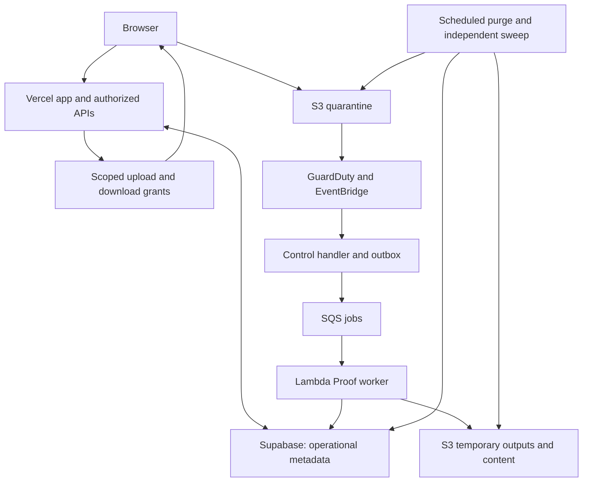
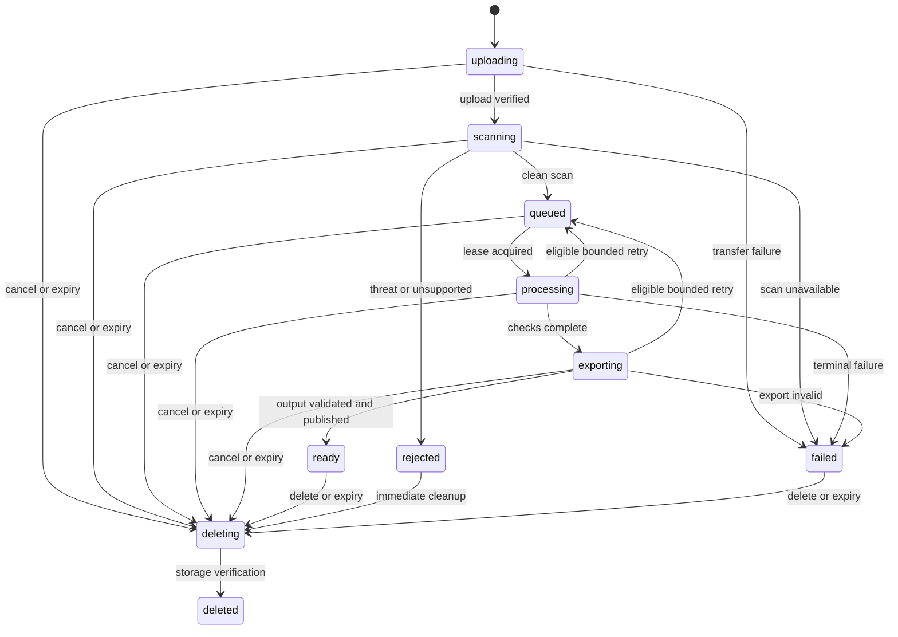

# Agmt platform and Proof launch specification

Version: 1.0 | Prepared: 5 September 2026

Status: Implementation handoff. This is a specification, not a claim that the product is implemented, deployed or verified.

Repository inspected: `Daaktor0/AgmtAgent`, `main` at `18f13fdeae935bd85796d5e80d481acb8bff42fb`.

Intended repository destination: `docs/AGMT_PLATFORM_PROOF_SPEC.md`.

Navigation: sections 1–3 define the product; 4–7 define hosting, retention and APIs; 8–10 define proofreading and Word markup; 11–14 define code boundaries, tests and release; 15 contains the ordered tasks; 16 contains the implementation and resume prompts. Start with T00. For each subsequent task, load its referenced sections and nearby source rather than attempting the entire specification in one code change.

## 1. Read this first

Build Agmt as a platform for agreement utilities. Ship Proof first. The first useful outcome is a downloadable Word document containing proofreading markup. An on-screen findings list, an architecture diagram, a successful build or a landing page does not satisfy this specification.

The founder's requirements are:

1. A person uploads an agreement and downloads a proofread, marked-up document.
2. Proof handles documents temporarily. Uploaded documents and their content must be deleted within two hours of upload. Processing, retries and downloads do not restart that clock.
3. The implementation must be finite, reviewable and executable in small tasks by a smaller coding model.

**North-star acceptance test:** an invited lawyer opens Agmt, signs in once if necessary, uploads a supported `.docx`, clicks **Proofread document**, downloads `filename_Proofread.docx`, opens it in Microsoft Word, reviews Agmt's tracked changes and comments, and can delete the server-side files immediately. Otherwise, all document content is purged within the original two-hour window.

For a document with no findings, the output can be unchanged. Do not manufacture markup to demonstrate activity. For an unsupported document, explain the limitation and refuse misleading output.

### 1.1 Decisions fixed for this release

| Decision | Requirement |
|---|---|
| Brand | Agmt is the platform; Proof is the first product. |
| First supported input | One native, unencrypted English `.docx` per run, up to 25 MiB. |
| Primary output | A valid `.docx` with genuine Word tracked changes for eligible corrections and Word comments for issues requiring judgment. |
| Processing | Deterministic rules. Zero language-model calls in Proof. |
| Main interaction | Upload → proofread → download. No mandatory Matter creation, mandate form, identifier-confirmation wizard or issue-by-issue acceptance in the browser. |
| Access for first beta | Preserve the existing verified-account authentication boundary. No new guest, preview or test-workspace bypass. This is a beta implementation default, not an explicit founder requirement for permanent sign-in. |
| Retention | Maximum two hours from server-authorized upload start, including originals, derivatives and extracted content. |
| Optional early deletion | **Delete files now** on processing and result screens. |
| Platform scope | Shared shell, product registry, authenticated ownership, job lifecycle, storage, deletion and output delivery. |
| Deferred products | Review, executed-copy compiler, signature-pack extraction and creation. Registry entries are allowed; their engines are not part of this release. |
| Billing | Free, invite-limited Proof beta with quotas. No checkout or subscriptions in this release. |
| Stack | Keep TanStack Start/React/TypeScript, Better Auth, PostgreSQL and existing tested seams. Vercel hosts the app; Supabase hosts Postgres; AWS handles temporary files and workers. |

The upload screen MUST explain the output before the user starts: **“Safe corrections appear as tracked changes. Items that need your judgment appear as comments.”**

“Proofread” does not mean comprehensive legal review, rewriting, every possible grammar error, or certification that an agreement is ready to sign. Describe the actual supported checks in the UI. Do not add an LLM to make a broad marketing claim true.

### 1.2 Precedence and reconciliation with older documents

This specification records the founder's newer product requirements. Apply those requirements over older product specifications where they conflict. Preserve unrelated repository rules and security controls. Do not edit instructions merely to bypass an approval or access boundary.

| Older requirement or assumption | Treatment for the new Proof release |
|---|---|
| A Matter is the compulsory first step | Superseded for Proof. The unit of interaction is a temporary product run. |
| Upload → canonicalisation confirmation → results | Superseded for Proof's user flow. Parse and index internally without a user wizard. |
| Proof results are enough for the first usable slice | Superseded. Downloadable marked-up DOCX is a launch gate. |
| Review, Mail and lineage in v1 | Deferred until Proof is launched and independently usable. |
| Store document text, quotations and identifiers in Postgres | Superseded for new temporary Proof runs. Content belongs only in expiring object storage or bounded process memory. |
| Backup or archive the legal documents | Superseded for new temporary Proof content. No content backups, object versions, replication, archives or legal holds. |
| Long-lived encrypted document vault and historical key migration | Not a prerequisite for the new temporary Proof path. Do not migrate or delete historical data without authorization. |
| Exact source evidence, tenant isolation, safe ZIP parsing, transactional publication | Retained. |
| No deployed anonymous/test access in `web/AGENTS.md` | Retained for accounts, matters, stored resources, server document endpoints and any future R2 mode. iLovePDF is the interaction/retention reference, not authorization to bypass authentication. **Founder exception (2026-09-10):** browser-only local Proof at `/proof` is temporarily usable signed-out and must not wait on session lookup. This does not authorise anonymous server storage, processing or document access. |
| General platform support for future signature utilities | Record as future capability. This does not authorize building or exposing them now. |

Keep the historical specification and blueprint for context. Add a clear supersession note for the affected Proof scope when integrating this file. Update the existing implementation ledger instead of creating competing progress documents. Do not treat every historical backlog item as a prerequisite for this narrower release.

## 2. What already exists and what to reuse

The following observations are based on a pinned repository read, not execution of its tests or inspection of a live deployment. Recheck the current branch before implementation.

| Existing path | Observed purpose | Required action |
|---|---|---|
| `web/AGENTS.md` | Web security and engineering instructions | Read before edits. |
| `web/package.json` | TanStack/React app, Better Auth, `pg`, XML/ZIP tools and test scripts | Keep the framework; use the lockfile. |
| `web/src/lib/agmt/docx-v2.ts` | OOXML extraction and capability inventory | Extend the supported parser rather than create another document parser. |
| `web/src/lib/agmt/zip-safety.ts` | ZIP central-directory preflight and limits | Keep and test before decompression. |
| `web/src/lib/agmt/numbering.ts` | Numbering evaluation | Reuse; distinguish automatic numbering from literal text. |
| `web/src/lib/agmt/types.ts` | Document, provision, capability and finding types | Adapt through explicit interfaces; keep existing callers working. |
| `web/src/lib/agmt/proof/{registry,checks,runner,product}.ts` | Versioned deterministic rules, execution outcomes and UI summary | Reuse, but repair source evidence and explicitly select the launch registry. |
| `web/src/lib/server/object-store.ts` | Memory/S3 object-store boundary | A concrete S3 client must be wired. The existing runtime fails closed without an installed provider. |
| `web/src/lib/server/direct-upload.ts` | Multipart plan and completion contracts | Wire live S3; separate upload-grant expiry from retention expiry. |
| `web/src/lib/fn/document-upload.ts` | Upload server functions | Adapt for temporary product runs without accepting client-selected ownership. |
| `web/src/lib/server/{jobs,worker-contract,malware-gate}.ts` | Jobs, outbox, leases, strict worker messages and scan decisions | Reuse states and validation, add run deadline and cancellation fencing. |
| `web/src/lib/server/object-reconciliation.ts` | External publication reconciliation | Extend for failed writes, deletion and expiring runs. |
| `web/src/lib/db-context.server.ts`, `db-transaction.ts` | Server-derived tenant context and transactions | Retain. |
| `web/migrations/0005_job_object_plane.sql` and preceding migrations | Job/object schema, integrity and RLS foundations | Add forward-only changes. Do not rewrite previously applied migrations. |
| `web/src/lib/auth/` | Existing authentication | Preserve; verify one real sign-in method for beta. |
| `web/src/routes/`, existing components/styles | Current user interface | Reuse the design system and add product routes. |
| `docs/AGMT_PROOF_IMPLEMENTATION_STATUS.md` | Existing package ledger | Update with current evidence and map tasks in section 15 to old packages. |
| `docs/brand/README.md` and existing brand assets | Brand guidance | Preserve current design language; no unrelated rebrand. |
| `.github/workflows/web-proof-corpus.yml`, `web-migrate.yml` | Tests and separated database migrations | Extend existing release checks. |
| Root `agent/`, `addin/`, Cloudflare container files | Legacy Word/add-in surfaces | Do not use these as a reason to deploy a second Proof backend. |

Known problems visible in the sampled code include some findings anchored to the first or last body paragraph despite referring to a different source, and a validator that confirms a substring exists without proving that it supports the finding. These patterns MUST NOT reach the marked-up output. See section 8.

The implementation ledger describes several tested repository contracts but still marks live S3, malware, worker integration, export and other launch work as unfinished. It is evidence to investigate, not a current completion certificate.

## 3. Platform structure and user experience

### 3.1 Routes and product registry

Use the existing TanStack routing conventions. The routes below are logical contracts; let the installed router generate its own route tree.

| Route | User outcome |
|---|---|
| `/` | Agmt home: concise platform description and Proof as the available utility. |
| `/proof` | Upload, output explanation, limits and deletion explanation. |
| `/proof/runs/:runId` | Processing state, result download, coverage and deletion. |
| `/privacy` | Plain-language explanation of temporary content, retained account/operational data and processors. |
| `/terms` | Product terms and actual supported scope. |
| Existing login route | Verified sign-in, with a safe relative return path to Proof. |

Implement a small typed product registry, not a runtime plugin system:

```ts
type ProductId = 'proof' | 'review' | 'executed-copy' | 'signature-pack';
type ProductDescriptor = {
  id: ProductId;
  name: string;
  description: string;
  availability: 'available' | 'planned';
  route: string | null;
  inputKinds: readonly string[];
  outputKinds: readonly string[];
  retentionPolicy: 'temporary_2h' | 'not_configured';
};
```

Only Proof is executable. Planned products may appear as small non-interactive items below Proof, with no fake buttons, invented launch dates or extra waitlist system. Alternatively keep them off the public home until useful. The registry, shared shell and job contracts establish the platform.

Add a server-side handler map for available products. An unregistered, planned or disabled product ID must fail before an upload grant or job is created. Future products use the common run/artifact lifecycle through a documented adapter; they do not inherit permission to retain Proof files.

### 3.2 Required journey

1. The user opens `/proof`. Selecting a file happens locally. If sign-in is needed, complete it before creating an upload grant; do not store the file for later sign-in. If navigation loses the browser file selection, ask for reselection.
2. Show one selected file, its locally displayed name and size, and **Proofread document**. There is no matter, client, represented-party or deal-stage form.
3. On clicking the button, create the run and upload grant. Return the server clock and immutable deadlines. Begin uploading directly to the private quarantine bucket.
4. Upload completion is independently validated by the server. The system scans, checks, creates and validates the marked-up DOCX automatically.
5. The result screen prioritizes **Download proofread Word document**. Show the number of suggested corrections and comments, any coverage limitations and the exact download deadline.
6. **Delete files now** is available before and after download. Do not delete on the first download automatically: a failed transfer should be retryable within the deadline.
7. Once access ends, remove file-related UI data from memory and show **“This file is no longer available. Upload it again to run Proof.”** Never offer recovery or restore for a deleted Proof run.

### 3.3 UI states and copy

| State | Primary message | Action |
|---|---|---|
| Empty | “Proofread your agreement.” | Choose Word document |
| Selected | File name and size; markup explanation | Proofread document |
| Uploading | “Uploading your document…” with measured bytes | Cancel and delete |
| Scanning | “Checking the uploaded file…” | Delete files now |
| Queued | “Your document is waiting to be checked.” | Delete files now |
| Processing | “Checking your agreement…” | Delete files now |
| Exporting | “Preparing your marked-up Word document…” | Delete files now |
| Ready, findings | “Your proofread document is ready.” | Download proofread Word document |
| Ready, zero findings | “No issues found by the completed checks.” | Download checked Word document |
| Ready, limited coverage | “Your document is ready with some checks incomplete.” | Download with a persistent coverage notice |
| Rejected | Specific safe reason, such as password protection or unsupported content | Choose another document |
| Failed | “We couldn’t complete Proof for this file.” plus safe error code | Retry if eligible; delete |
| Deleting | “Deleting your files…” | Disable processing and download |
| Deleted/expired | “This file is no longer available.” | Upload another document |

Show the deadline in the user's local time using server-provided timestamps. State **“Files are kept for no more than two hours from upload. Download availability ends at [time]. You can delete them earlier.”** The download deadline may be a few minutes before the two-hour purge deadline; section 5 fixes the precise values.

No fake percentage for scanning or analysis. Percentages are allowed only for measured upload/download bytes. Use accessible status announcements, keyboard-operable controls, visible focus and layouts usable on phone and desktop. Do not embed third-party session replay, advertising or chat widgets on upload/result routes.

The primary download must work without opening the findings detail panel or accepting suggestions in the browser. Users accept or reject Agmt's proposed changes in Word. Comments must identify issues rather than make unsupported legal choices.

### 3.4 Scope boundary

Do not build an in-browser Word editor, chat, full deal room, team workspaces, multi-file comparison, billing, OCR, PDF proofing, a plugin marketplace, mobile app or e-signature flow. Do not rewrite the landing page solely to demonstrate progress. Preserve its useful design and change only availability/navigation/copy needed for the launched product.

## 4. System architecture and deployment inventory

One application codebase, one shared processing package and a few managed runtime roles. Product modules are code boundaries, not separately deployed microservices.



The API controls authorization and status. It does not parse DOCX, base64-encode documents into API bodies, or keep a request open while proofreading. All private file transfers bypass ordinary Vercel request/response payloads.

### 4.1 Concrete resources

Names below are proposed resource labels, not claims that accounts/resources already exist. Add environment/account suffixes where uniqueness requires them. Place the document data plane in AWS `ap-south-1` and Supabase Mumbai. Prefer Vercel `bom1` for regional server execution and verify the actual deployment adapter supports the setting.

| Resource | Initial configuration and responsibility |
|---|---|
| GitHub repository | Existing `Daaktor0/AgmtAgent`; protect production release and run affected checks. |
| Vercel project | Deploy `web/` using the existing framework adapter and lockfile. Pro for commercial deployment. Keep previews separate from production data. |
| Supabase project | Existing compatible project if suitable; standard Postgres via `pg`. App, auth, worker, deletion and migration roles remain least-privileged and separate where required. |
| S3 `agmt-proof-quarantine-<env>` | Private, SSE-KMS, Block Public Access, no ACLs, no versioning history, no replication, no Object Lock, no backup plan. Original upload bytes only. |
| S3 `agmt-proof-temporary-<env>` | Same protections; checked originals if a copy is necessary, parsed content, evidence JSON, export plans and output DOCX. All inherit the run deadline. |
| KMS key | One environment-scoped customer-managed symmetric key initially. Grant only necessary roles; avoid a key per document. |
| GuardDuty Malware Protection for S3 | Scan quarantine only. Read permission for that bucket/key. Only authoritative `NO_THREATS_FOUND` unlocks processing. |
| EventBridge rules | Deliver trusted scan results to the control handler. Restrict source account, service and bucket. |
| SQS `agmt-proof-jobs-<env>` + DLQ | Standard queue; batch size 1 initially; max receive count 3; metadata-only messages. Visibility timeout at least six times the 300-second worker timeout, plus any batch window. |
| ECR repository | Versioned worker images pinned by digest; no uploaded documents, fixtures from users or secrets in images. |
| Lambda `agmt-proof-control-<env>` | Scan-result validation, outbox dispatch and reconciliation. Trusted control code; no document parsing. |
| Lambda `agmt-proof-process-<env>` | Parse, deterministic Proof, markup and export validation. Start with 2 GiB memory, 300-second timeout and reserved concurrency 2. Benchmark before increasing. |
| Lambda `agmt-proof-purge-<env>` | Independently deletes every object/partial upload for expired or cancelled runs. Separate reserved concurrency so proofreading cannot starve deletion. |
| EventBridge Scheduler | One per-run purge schedule at access deadline; every-minute independent sweep; outbox/stuck-job cadence. Flexible time windows off for purge. Automatically delete completed one-time schedules. |
| Secrets Manager | Worker database credentials and runtime secrets. Do not put per-file encryption keys or content in secret versions. |
| IAM/OIDC | GitHub and Vercel obtain short-lived AWS access. Runtime roles cannot administer infrastructure. Narrow role/resource permissions and job deadlines; no wildcard document access in parsing code. |
| Resend | Existing Better Auth email verification/sign-in delivery if that is the chosen beta login method. Verified domain; no agreement attachments or file links in email. |
| CloudWatch | Worker/control/purge logs, metrics, alarms and deletion health. Metadata allowlist only. |
| Sentry | Browser/application exceptions with default integrations reviewed; no bodies, file names, cookies, attachments or replay. Optional if equivalent sanitized app error capture already exists. |
| DNS | Use the existing domain provider. Point the application domain at Vercel; configure only email records needed for the chosen login method. No domain migration prerequisite. |

Proof does not use Supabase Auth, Storage, Realtime or vector features merely because they are available. No separate Redis, queue vendor, Render worker, Kubernetes cluster, vector database, API gateway product or orchestration framework is needed for this implementation.

### 4.2 Encryption and resource policy decisions

Use TLS and S3 SSE-KMS for the temporary Proof object path. Do not place application-encrypted ciphertext in quarantine and assume GuardDuty scanned the enclosed DOCX; scanning must operate on readable file contents through authorized SSE-KMS access. This temporary path replaces the old durable-vault envelope-encryption prerequisite; it does not weaken storage privacy or authorize touching legacy ciphertext. [GuardDuty encryption support](https://docs.aws.amazon.com/guardduty/latest/ug/supported-s3-features-malware-protection-s3.html)

Use private object storage with no application-managed persistent plaintext staging files. Parse bounded input in memory. If a dependency requires disk, it needs an explicit reviewed implementation for encrypted scratch, cleanup, failure handling and the same deadline; otherwise choose a memory-based implementation. Lambda warm `/tmp` is not an automatic deletion mechanism.

The processing supervisor supplies one job's bounded bytes to a parsing subprocess with no credentials, no network and no writable persistent filesystem. The supervisor alone reads/writes the approved objects. Kill the child on timeout, cancellation or deadline. Do not pass the entire Lambda environment to the child. If the runtime cannot enforce the intended subprocess restrictions, record that as an implementation gap and choose a proven isolation method before real-user files.

Pin the actual Node/container runtime and prove supported restrictions with a small hostile-capability probe before building the worker around them. Node's permission model can help restrict trusted code but is not a security sandbox against malicious code; do not claim otherwise. No user-supplied scripts, macros or document instructions are ever executed. A network stub in a unit test alone does not establish runtime isolation. [Node permissions](https://nodejs.org/api/permissions.html)

### 4.3 Indicative cost and environments

Vercel Pro and Supabase Pro were listed at starting prices of $20 and $25 per month when checked. Budget roughly $70–150/month for a small beta as a planning allowance, excluding taxes, unusual usage and always-on duplicate environments. This is not a quote. [Vercel pricing](https://vercel.com/pricing), [Supabase pricing](https://supabase.com/pricing)

Use local synthetic tests, a synthetic-only staging environment and production. Every environment has separate buckets, queues, IAM roles, secrets and database ownership boundaries. Do not connect preview deployments to production document storage. Local PGlite/memory storage remains synthetic-only. Document exact provider spending controls and the application upload/concurrency caps; billing alerts alone do not stop spending.

## 5. Two-hour retention: binding contract

### 5.1 Clock and deadlines

The founder asked for two hours **from upload**, not two hours after processing. Use server-authorized upload start as a conservative, observable clock origin. Create it just before granting upload access, never on opening the page. It can precede receipt of the first byte and therefore never grants more than two hours after actual upload.

```ts
const PROOF_RETENTION_SECONDS = 7_200;
const PURGE_SAFETY_SECONDS = 300;
const PROCESSING_GUARD_SECONDS = 600;

uploadStartedAt = databaseNow();
retentionDeadline = uploadStartedAt + 7_200 seconds;
accessDeadline = retentionDeadline - 300 seconds;       // 115 minutes
processingDeadline = retentionDeadline - 600 seconds;  // 110 minutes
uploadGrantDeadline = min(uploadStartedAt + 900 seconds, processingDeadline);
```

These deadlines are immutable. Re-upload is a new run. Retries, refresh, login changes, failed downloads, new derived objects and regenerated exports inherit the original deadline.

The normal processing target is minutes, not 110 minutes. The earlier access cutoff leaves five minutes to delete and verify content before the two-hour maximum. Display `accessDeadline` as the download-availability time, and explain that files are kept for **up to** two hours. Do not advertise a full two-hour guaranteed download window.

No new processing or export attempt can start unless enough time remains for its full maximum runtime plus cleanup before `processingDeadline`. Stop existing child processing by that deadline. No content write can be published after it. At `accessDeadline`, refuse all new content reads/download grants and begin purge. At `retentionDeadline`, content deletion must have completed under the supported operating conditions.

EventBridge has minute-level scheduling precision, and S3 lifecycle expiration is asynchronous. Therefore a schedule set exactly at the two-hour boundary, or an S3 lifecycle rule alone, does not implement this promise. [Scheduler precision](https://docs.aws.amazon.com/scheduler/latest/UserGuide/schedule-types.html), [S3 expiration](https://docs.aws.amazon.com/AmazonS3/latest/userguide/lifecycle-expire-general-considerations.html)

### 5.2 What must disappear

| Data | Location | Retention rule |
|---|---|---|
| Uploaded original | Quarantine, optional temporary copy | Same run deadline; earlier on deletion or rejection. |
| Multipart parts, abandoned uploads | S3 multipart storage | Abort at upload-grant expiry or cancellation; bounded sweep catches orphans. |
| Parsed text, names, clauses, canonical maps | Process memory or temporary S3 JSON | Same deadline; never Postgres/logs. |
| Findings, exact quotations, proposed replacements, comments | Process memory or temporary S3 JSON | Same deadline. |
| Marked-up DOCX and export plans | Temporary S3 objects | Same deadline even if created late. |
| Generated thumbnails/previews | Not built in this release | If later added, same content policy. |
| File name | Browser memory only | Not sent in object keys, queue messages, logs or persistent database columns; remove from app memory at expiry/deletion. |
| Source/output checksums | Active integrity metadata | Remove with active run details; backups may contain fingerprints but never document bytes/text. No cross-user matching or deduplication. |
| Account identity, auth session | Existing auth database | Separate account policy; not a claim to delete the user's account after two hours. |
| Sanitized operational records | Database/logs | Up to 30 days for run IDs, timestamps, coarse size/duration, status, versions and safe error codes. No quotations or names. |
| Security/rate-limit metadata | Protected metadata store | Short documented TTL: per-user counters expire after 24 hours; any IP-derived abuse key expires after 24 hours. Do not log raw IP unless the separate policy requires and discloses it. |
| Backup of operational/auth metadata | Database backup service | Follow documented provider retention; contains no Proof content. Restore must not reauthorize an expired run. |
| Copies downloaded to a user's device | Outside Agmt | Not subject to Agmt server deletion; do not imply recall from Word or local downloads. |

All content must follow the content path. Encrypting a quotation in a backed-up database does not make it acceptable to keep it after the deadline. Do not put file names into database “display_name”, error strings, traces, URLs or analytics properties.

### 5.3 Storage layout and independent deletion

Use server-generated opaque IDs. Example logical keys:

```text
proof/<upload-minute-UTC>/<opaque-run-id>/source.docx
proof/<upload-minute-UTC>/<opaque-run-id>/content/<artifact-id>.json
proof/<upload-minute-UTC>/<opaque-run-id>/output/<artifact-id>.docx
```

These are proposed keys; reconcile them with `storageKeyFor()` and existing tenant-hashed key validation through a versioned adapter. Preserve tenant isolation. Never silently relax the existing key validator. The time component permits an S3-only sweep even when Postgres is unavailable. Use upload time, not derivative creation time. A time-bucket sweep may delete up to one minute early, never knowingly late.

Use fresh nonversioned buckets for Proof. “Versioning suspended” is insufficient if old versions exist. Disable replication, Object Lock, content backups and retention archives. No automatic copying to durable Matter storage. S3 lifecycle of one day may be an orphan backstop only; it cannot be counted as meeting two-hour deletion.

Record the purge schedule before issuing the upload grant. If schedule creation fails, do not accept upload. Transactional reconciliation must handle the database/scheduler dual write; unresolved scheduling state cannot issue a grant. A global sweep runs independently of per-run scheduling and lists expired prefixes plus multipart uploads. It must work without reading document content or depending on a live app request.

### 5.4 Purge algorithm and races

1. Atomically mark the run `deleting`, record reason and increment its cancellation generation. Refuse new processing and downloads immediately at the application layer. If the database is down, the independent storage sweep still operates by timestamp/prefix.
2. Revoke publication eligibility and cancel active processing. Wait for bounded in-flight write authority to lapse; do not block other purges while waiting. Worker/provider requests have explicit deadlines and abort signals.
3. Abort every known and listed multipart upload under the run prefix. Repeat inspection because an in-flight part can race an abort.
4. Delete originals, derived JSON, temporary copies and outputs across both buckets. Enumerate the prefix; do not trust the database manifest to be complete. Handle per-object partial failures.
5. Repeat prefix/multipart enumeration after active writer authority has ended. Confirm no content remains. Test for objects created after the first delete pass.
6. Remove content-associated rows and manifests. Retain only the allowlisted operational receipt and deletion verification time. Avoid a cascade that preserves quotations in an audit table.
7. Mark `deleted` only after verification. If not verified, retain `deleting` with retries and an operator alarm; do not report deletion completed.

Deletion is idempotent. Missing objects are success; permission errors and unavailable services are not. Work messages delivered after expiry/deletion are acknowledged without loading, recreating or re-enqueuing content. Missing run rows are terminal, not permission to create a fresh run from a message.

Use job-scoped S3 credentials or a scoped storage broker with an immutable time-based write bound at `processingDeadline`. A stale worker's final `put` must be denied by the storage authorization boundary as well as rejected by the database publication fence. Do not let a parser use a broad permanent role to recreate deleted objects. Test the concrete IAM/broker policy; a before-write `if` check alone does not close an asynchronous race. [IAM time conditions](https://docs.aws.amazon.com/IAM/latest/UserGuide/reference_policies_examples_aws-dates.html)

Manual deletion uses the same algorithm without extending the deadline. Application access closes immediately; **“Files deleted”** is shown only after storage verification. An already-issued short-lived S3 URL may remain usable until its expiry or object deletion. Cap download grants to 60 seconds and the remaining access window. A transfer already started can continue; user-device copies cannot be recalled. Never call signed URLs single-use or instantaneously revocable. [S3 presigned URLs](https://docs.aws.amazon.com/AmazonS3/latest/userguide/using-presigned-url.html)

### 5.5 No hidden retention through observability or backups

The Proof path must not write content into legacy `object_blob`, provision text, definition text, quote, comment-body or audit payload columns. Adapt the write path, not just the deletion job. Postgres backups/WAL can outlive row deletion; keeping Proof content out of Postgres avoids promising erasure that a `DELETE` cannot provide. Audit the actual schema and all writes, including failure handlers.

Disable request/response body logging, signed URL capture, error attachment capture and session replay. Use structured allowlisted logging. Sanitization must run before delivery to CloudWatch/Sentry, not only in a dashboard view. Scan development, staging, production and provider settings. User files must never become support tickets, test fixtures, prompts, training examples or screenshots by default.

### 5.6 Outages and truthful claims

The two-hour value is the product's maximum retention requirement and a release gate. No distributed system can truthfully guarantee physical deletion during every provider outage. Implement early purge, independent sweeps, denied access at the deadline and alarms rather than hiding a grace period.

If verified purge health is stale for more than three minutes, or an overdue content object is detected, disable new uploads automatically. Continue deletion attempts and alert the operator. Do not silently extend retention or mark overdue objects deleted. Record a retention incident. Resume only after verification and backlog clearance.

Public copy must describe deletion of uploaded files and extracted content from Agmt-controlled application storage, separate from the limited operational metadata retained. Do not claim forensic erasure of every provider hardware block, deletion of downloaded copies, “zero retention,” or certification. The deletion promise cannot be advertised as implemented until the real two-hour drill and outage scenarios pass.

## 6. Data and job contracts

### 6.1 Shared product-run metadata

Reuse the existing upload/job/outbox tables where compatible. Add one platform-level `product_run` parent if needed; do not create a second queue/state system. The schema below is a target contract, not SQL to execute blindly against the existing database.

| Field | Rule |
|---|---|
| `run_id` | Random opaque UUID, generated server-side. Never authorization by itself. |
| `tenant_id`, `owner_id` | Derived from verified server session. Composite tenant-scoped keys/FKs and RLS. |
| `product_id` | `proof` for this release; foreign key or strict enum/registry check. |
| `retention_policy` | Fixed `temporary_2h`; client cannot change it. |
| `upload_started_at`, `retention_deadline`, `access_deadline`, `processing_deadline` | Server-generated, immutable and internally consistent. |
| `status` | State from section 6.3. |
| `parser_version`, `rule_set_version`, `exporter_version` | Pinned at run creation; explicit actual build versions. |
| `idempotency_key` | Unique within owner/product/operation, bound to the validated request. |
| `source_size`, `source_sha256` | Integrity metadata only; never global deduplication. Do not treat multipart ETag as SHA-256. |
| `object_prefix`, artifact identifiers | Opaque server-generated storage references, no source file name. |
| `cancellation_generation` | Monotonic fence for concurrent processing/deletion. |
| `attempt_count`, `lease_owner`, `lease_token`, `lease_expires_at` | Reuse existing guarded job lease mechanism. |
| `output_artifact_id` | Published only after successful export validation and current fence check. |
| `finding_count`, `correction_count`, `comment_count`, `coverage_status` | Safe aggregate metadata; no comment bodies or detected terms. |
| `error_code` | Safe enum, not raw exceptions or user text. |
| `deleted_at`, `deletion_verified_at` | Set according to actual actions; not just the clock. |

An artifact manifest needs run/tenant binding, kind, opaque key, byte count, checksum, state, creation timestamp and inherited deadline. Its types include `source`, `analysis`, `export_plan` and `marked_docx`. Add an explicit artifact state such as `staged | published | deleting | deleted`; enforce parent/deadline relationships in SQL and application code.

Content-bearing analysis JSON lives in temporary S3. Its schema includes capability inventory, source maps, findings, exact evidence, proposed edits and coverage. Read it only after ownership and deadline checks. Do not serialize arbitrary objects into metadata columns “for convenience.”

Existing helpers currently bind upload plans to a Matter. First preference: extend the shared ownership abstraction to support `product_run` without a mandatory Matter. If that would require an excessive rewrite, an internal empty temporary Matter may bridge existing FKs, provided it has no client/file name, invented mandate, document content, durable history or separate retention. It must be deleted with the run. Record that compatibility decision; do not ask the user to create it.

### 6.2 Authorization invariants

- Every API, SQL operation, artifact lookup and worker commit is tenant- and owner-bound. A random run UUID is not enough.
- Derive tenant context from Better Auth and the existing server context. Do not assume Supabase `auth.uid()` represents Better Auth sessions.
- Use RLS policies consistent with the existing custom runtime roles. Do not fix a permission error by using an owner/service role or adding unrestricted `SECURITY DEFINER` functions.
- Every compound mutation uses the established transaction helper. Transaction-local tenant context must not leak across pooled connections.
- Wrong-owner reads return generic not-found. An authorized owner's expired run may return `410` without file details.
- A client cannot choose owner, tenant, arbitrary S3 key, scan outcome, worker status, output location, TTL or rule-set version.
- Keep authentication enabled. Remove accidental legacy deployed upload paths that could retain content indefinitely or bypass these checks; preserve unrelated data and features.

### 6.3 Product state machine



Retry only the same validated source with pinned versions and original deadlines. No more than three processing attempts. A parsing refusal or unsafe document is terminal, not a transient retry. Infrastructure retries use backoff and do not mutate the source.

Each check records `completed_with_findings | completed_zero_findings | not_applicable | suppressed | failed`. `Not_applicable` requires evaluated evidence that the relevant feature is absent; missing capability is `suppressed`, not success. Run-level `ready` means a valid artifact exists, not that coverage is complete.

`ready` carries a separate coverage value `complete | limited`. The first public release must reliably produce `complete` on the declared core matrix. A limited artifact must contain a persistent coverage comment and must not claim a clean result. Failure of all launch checks produces failure, not a mostly empty successful export.

### 6.4 Atomic publication and retries

1. Acquire a lease and snapshot run state, cancellation generation, source checksum and versions.
2. Fetch and verify immutable source bytes. Scan proof must apply to those exact bytes.
3. Parse, run checks, validate evidence and prepare a new artifact under an attempt-specific opaque key.
4. Validate the artifact before publication. Upload it with the inherited deadline; verify provider checksum/size using the actual checksum scheme.
5. In a transaction, compare the current lease/fence/deadline and conditionally publish the manifest and run pointer. Never expose partial generations.
6. On failed/unknown commit, reconcile against the authoritative database/provider state. Do not delete an output that may already have been committed. Otherwise clean the orphan.
7. A duplicate message after success returns the existing result. It does not run new checks, create a second output or change the retention deadline.

The database transaction and SQS/S3 calls are not one atomic transaction. Retain the transactional outbox and idempotent handlers. AWS SQS/Lambda may deliver messages more than once; design around that rather than assuming exactly-once processing. [SQS with Lambda](https://docs.aws.amazon.com/lambda/latest/dg/with-sqs.html)

Queue messages contain only version, run ID, tenant-bound opaque references, attempt/fence information and timestamps. No source text, file name, signed URL, secret, replacement text or serialized document. A worker validates the envelope and independently retrieves trusted run state.

## 7. API contracts and upload integrity

Use existing TanStack server functions or route handlers consistently. The following HTTP paths describe externally testable operations; adapt route filenames to the installed framework.

| Operation | Request | Response and conditions |
|---|---|---|
| `POST /api/proof/runs` | `{ byteSize, sha256 }` and idempotency header; content type can be fixed or validated | Creates owned run and purge schedule, returns opaque run ID, deadlines, upload plan. No document bytes/file name. |
| `POST /api/proof/runs/:id/upload/parts` | Requested bounded part numbers if not supplied initially | Exact signed part URLs for that run's upload only; short expiry. |
| `POST /api/proof/runs/:id/upload/complete` | Provider part receipts/checksums | Validates provider upload, assembled size/checksum and ownership; returns processing state. Client assertion is not completion proof. |
| `GET /api/proof/runs/:id` | None | Safe state, counts, coverage summary, deadlines and supported next actions. No source bytes. |
| `GET /api/proof/runs/:id/findings` | Optional pagination cursor | Authorized bounded results read from expiring analysis JSON; `Cache-Control: no-store`. Not required to download. |
| `POST /api/proof/runs/:id/download` | None | Authorizes current output and returns a signed download URL lasting at most 60 seconds and never beyond access deadline. |
| `POST /api/proof/runs/:id/retry` | Idempotency key | Only eligible transient failure, within attempts and deadlines; same source/version settings. |
| `DELETE /api/proof/runs/:id` | None | `202` while deletion is unverified, `200` when verified; idempotent for the owner. |

Use origin/CSRF checks for mutations, secure HttpOnly same-site session cookies, strict input schemas, safe redirect targets and rate limits. Do not put sensitive request bodies or signed URLs into tracing. CORS is limited to actual application origins, not `*` with credentials.

Keep the source name only in browser memory. Download from S3 with a generic `Content-Disposition` name if needed; the browser can fetch the bounded output into a Blob and save it as a sanitized `<original-stem>_Proofread.docx`. After refresh, fall back to `Agreement_Proofread.docx`. Revoke Blob URLs and release memory. Do not pass the original name into a signed-URL query string to make naming easier.

Responses and object metadata for private artifacts use `Cache-Control: private, no-store`; no public CDN, service-worker cache, localStorage, IndexedDB or offline copy of content. In-flight browser memory is released on deletion/expiry/navigation where practical. The selected source file and downloaded copy on the user's device remain theirs.

### 7.1 File integrity and scan binding

- Enforce the 25 MiB limit before a grant and after provider completion. Maximum marked-up output is 35 MiB initially; refuse uncontrolled expansion, never silently truncate findings.
- Multipart receipts/ETags are not equivalent to a whole-file SHA-256. Verify the provider's actual full/composite checksum semantics. Independently hash assembled bytes in the trusted worker against the source checksum before parsing.
- Make the completed source immutable. Use server-controlled multipart completion once, unique keys, and no client grant permitting overwrite of an already committed source. Replayed completion requests cannot replace bytes after scanning.
- Validate scan event account, region, bucket, key, completion identity and recorded provider object identity. Do not accept a browser-supplied “clean” value.
- Reject or fail closed for malicious, unsupported, failed, missing, conflicting or stale scan outcomes. Repeated identical events are harmless.
- Abort abandoned uploads after the 15-minute upload grant expires; remove completed but unused quarantine objects. Neither abandoned uploads nor failed scans are exempt from deletion.

### 7.2 Initial limits

| Limit | Initial value |
|---|---:|
| Source size | 25 MiB |
| Output size | 35 MiB |
| Files per run | 1 |
| Active runs per account | 2 |
| New runs per account per day | 20 for beta |
| Proof worker reserved concurrency | 2 initially |
| Processing attempts | 3 maximum |
| Worker timeout | 300 seconds per attempt |
| Completed-source scan wait | 5 minutes before safe failure; no “clean” assumption |
| Total generated findings | 500 before explicit excessive-findings failure; no silent clipping |
| Total extracted text | 1,000,000 Unicode code points initially; reject above limit |
| Status polling | Every 2 seconds initially, then 5 seconds; stop on terminal state/hidden page |
| Download URL | At most 60 seconds and remaining access window |

These are explicit implementation defaults, not measured current capacity. Tune only after the benchmark task, with recorded changes. There is no reliable DOCX page count without a layout engine, so do not use cached Word page-count metadata as the safety boundary or claim precise page limits.

## 8. Parsing, exact evidence and supported documents

### 8.1 Package safety

Retain the existing ZIP preflight: at most 4,096 entries, 150 MiB declared total expansion, 32 MiB per entry and compression ratio at most 250. Enforce actual streamed expansion and CPU/memory limits too; attacker-controlled declared sizes are not sufficient protection.

Reject traversal, duplicate normalized paths, encrypted ZIPs, ZIP64 if not supported by the inspected implementation, symlinks, overlapping records, malformed XML, DTD/entity expansion, macros, ActiveX, executable embeddings and unexpected active content. Never fetch external resources. External ordinary hyperlinks may be preserved only if the exact current parser policy has an approved inert-link path; do not loosen a broader rejection just to improve acceptance rate without tests.

### 8.2 Release support matrix

| Structure | Required behavior |
|---|---|
| Body paragraphs and split text runs | Fully supported; exact anchoring and markup across safe run boundaries. |
| Main-document tables and merged cells | Supported; preserve grid, merges, widths and cell formatting. |
| Styles, sections, margins, headers/footers | Preserve. Inspect story inventory; check supported story text with explicit coverage. |
| Literal clause numbering and Word automatic numbering | Resolve separately. Never write generated numbering labels as new plain text. |
| Ordinary existing comments | Preserve contents, authors, IDs and anchor ranges. Add non-colliding Agmt comments. |
| Existing tracked insertions/deletions | Preserve. Analyze the visible final text projection. Do not insert overlapping/nested revisions into existing revision ranges. |
| Revision moves, table/paragraph revisions, complex threaded comments | Accept only when inventoried and preservation-tested; otherwise refuse with a specific supported-format explanation. |
| Fields and bookmarks | Preserve field code/result structure and bookmarks. Do not edit inside field instructions or alter field results as ordinary text. |
| Footnotes and endnotes | Preserve and inventory. Check readable text when safe; mark coverage limited if relevant text cannot be checked. |
| Text boxes, shapes, content controls and other stories | Inventory. Never silently omit substantive text. Suppress affected checks or refuse when a trustworthy output cannot be produced. |
| Images/logos | Preserve package entries; no OCR. Image-only agreement is unsupported. |
| Password-protected, encrypted, macro-enabled or digitally signed package | Refuse Proof markup; never strip protection/signatures or produce an invalidated signature silently. |
| `.doc`, PDF, scanned PDF, images | Refuse with “Please upload the original Word (.docx) document.” |
| Non-English or materially mixed-language content | Preserve bytes but do not claim English checks cover it. Disable language corrections for that scope and disclose limited coverage. |

Require common agreement features—tables, basic comments, simple tracked changes and numbering—in the core golden corpus. Do not solve exporter difficulty by excluding every realistic legal document.

### 8.3 Projection and anchors

Proof uses a reading/indexing projection, not an anonymised rewriting step. Party names and identifiers must remain unchanged in the output. There is no LLM payload, so no mandatory legal-name-to-defined-term substitution or canonicalisation confirmation screen.

Use one consistent offset convention: zero-based, half-open UTF-16 code-unit offsets for TypeScript string operations. Never split surrogate pairs. Maintain a tested mapping between projected text and original OOXML text nodes; Unicode normalization or whitespace normalization cannot destroy that mapping.

Each publishable finding requires:

```ts
type SourceSpan = {
  partUri: string;             // e.g. /word/document.xml
  paragraphPath: number[];     // stable path in immutable source XML tree
  textStart: number;           // UTF-16, inclusive in paragraph projection
  textEnd: number;             // exclusive
  projection: 'final';
  nodeSegments: Array<{
    nodePath: number[];
    start: number;
    end: number;
  }>;
};

type ProofFinding = {
  id: string;
  ruleId: string;
  ruleVersion: number;
  kind: 'correction' | 'comment';
  category: 'language' | 'definitions' | 'references' | 'completion';
  severity: 'attention' | 'suggestion';
  primarySpan: SourceSpan;
  relatedSpans: SourceSpan[];
  exactQuote: string;          // filled by trusted source extraction
  replacement: string | null; // correction only
  comment: string;
  scopeEvidence: null | {
    evaluatedScopes: string[];
    inventoryDigest: string;
    matchCount: number;
  };
};
```

This is a new contract to adapt to existing types, not a claim that these exact fields exist. Content-bearing instances stay in memory/temporary S3.

The evidence validator must reconstruct `exactQuote` from the immutable original package nodes, confirm its relationship to the rule predicate and validate any normalization map. `quote === text.slice(start, end)` alone is insufficient. Repeated words in different clauses, schedules and tables must not become interchangeable anchors.

Absence findings, such as a missing internal-reference target, require an explicit complete evaluated-scope inventory. Anchor the comment to the actual reference, not to an arbitrary paragraph representing the absent target. If the relevant scope is unreadable or ambiguous, suppress that absence claim.

For an automatically generated number with no literal text node, attach a comment to the correct paragraph's visible text and identify the number in the comment. Do not pretend a fabricated textual range exists. If exact export anchoring cannot be established, record an invalid-evidence/coverage gap and do not publish a fabricated anchor.

## 9. Deterministic launch checks

The launch registry below is deliberately finite. It is the minimum production scope, not permission to label every existing experimental rule production-ready. Keep existing tests and rules, but only enable a rule in the public registry after its evidence and false-positive gates pass.

### 9.1 Required rules and output action

| ID | Check | Default markup | Examples and exclusions |
|---|---|---|---|
| `language.typo_allowlist` | Exact known typo from a versioned small allowlist | Tracked replacement | Initial candidates: `teh→the`, `recieve→receive`, `occured→occurred`, `seperate→separate`. Only ordinary prose with context exclusions below. |
| `language.duplicate_word` | Immediately repeated common function word | Tracked deletion of the second word and its preceding separator | `the the Company→the Company`; exclude names, quoted definitions, deliberate repetitions, `that that`, `had had` and ambiguous syntax. |
| `completion.placeholder` | Explicit unfinished tokens | Comment only | `[●]`, `[insert date]`, `[TBD]`; do not flag all square brackets, clause references, numeric citations or valid optional drafting indiscriminately. |
| `references.missing_target` | Explicit same-document reference with no target in the resolved scope | Comment only | “Clause 99.2” where that target is absent. Exclude references to a statute, another agreement or an unreadable scope. |
| `references.duplicate_number` | Duplicate clause label in the same numbering scope | Comment only | Two main-body clauses `8.2`; ignore separate schedules restarting at `1`. |
| `definitions.duplicate` | Repeated definition declaration within the same resolved scope | Comment only | Identify both definition locations; do not merge differing definitions or delete a supposedly redundant one. |

The allowlist is a fixture-driven data file, not a dictionary-wide autocorrect. Freeze its version with the rule-set version. Each enabled replacement requires positive examples and negative traps. Preserve initial capital where the allowlist explicitly permits it; never rewrite all-caps text automatically.

Safe-correction exclusions include party names, names in signature blocks, definition labels, quoted defined-term uses, titles, addresses, URLs, emails, IDs, file paths, field codes, existing revision ranges and uncertain language scopes. If the parser cannot establish an exclusion boundary reliably, fall back to a comment or suppress the correction. The replacement remains a proposal in Word, never a silently accepted edit.

No rule changes numbers, amounts, percentages, dates, party identity, section references, legal terms, obligations or punctuation affecting meaning based on a guess. No conversion of British/Indian English to American English. No document-wide grammar/style rewriting.

### 9.2 Existing checks deferred from the first public registry

The inspected registry also includes undefined-term candidates, unused definitions, numbering gaps, signature-block mismatch, hidden characters, suspicious fields, table/prose amount conflict, header-party mismatch and unresolved comments. These may be valuable, but several require scope or evidence work. They are not all launch prerequisites.

Preserve their implementation and tests; keep them off the first public registry until specifically promoted. In particular:

- “Capitalized text” alone does not prove an undefined term.
- No same-document use does not necessarily make a definition unnecessary.
- A numbering gap may be deliberate or scope-dependent.
- An existing comment is not automatically unresolved or an error.
- A field/header issue must be anchored in the actual story.
- A numerical mismatch must not cause the system to choose which number is correct.

This narrowed public rule list supersedes old `mustFind` flags for the launch decision, not the requirement to preserve relevant regression tests. Update the registry declaration and coverage copy together; do not silently hide failed rules after they ran.

### 9.3 Rule execution and coverage

Run every pinned launch rule against its supported scopes. Record completed/not-applicable/suppressed/failed independently. Every finding passes the source validator before entering the export plan. Invalid evidence is a defect and a coverage gap, not a clean result.

The result screen lists the actual checks performed. A complete zero-finding result reads **“No issues found by these checks.”** It does not say **“Error-free,” “Legally verified,” “Ready to sign”** or **“100% accurate.”**

If more than 500 findings are produced, fail explicitly with an excessive-findings code. Do not silently drop later findings while calling the document fully checked. Review whether a runaway rule, corrupt structure or unsuitable input caused the result.

## 10. DOCX markup and export contract

### 10.1 Required output

The primary artifact is a copy of the uploaded DOCX, modified minimally in its OOXML package. Preserve all untouched package parts byte-for-byte after decompression/recompression comparisons where applicable; ZIP timestamps/compression bytes need not match. Do not convert the agreement to HTML/plain text and rebuild it using a document-generation template.

Agmt changes have author **Agmt Proof** and initials **AP**. Add genuine `<w:ins>` and `<w:del>` revision elements for eligible changes; deleted text uses the correct deleted-text elements. Red font, strikethrough styling or comments describing an edit do not substitute for Word revisions.

Comments use actual comment records, relationships and range/reference elements. Preserve existing comments and relationship IDs and allocate collision-free IDs. Do not replace the user's review history. Microsoft documents comments and revision elements; validate against those structures rather than inventing XML. [Word comments](https://learn.microsoft.com/en-us/office/open-xml/word/how-to-insert-a-comment-into-a-word-processing-document), [Word revisions](https://learn.microsoft.com/en-us/office/open-xml/word/how-to-accept-all-revisions-in-a-word-processing-document)

### 10.2 Revision policy

- Analyze the final visible text: include original insertions, exclude original deletions; preserve those original revision elements in output.
- Never accept or reject earlier authors' changes. Do not nest an Agmt revision inside an existing revision.
- If a proposed correction intersects an existing revision, a field, an unsupported control or an ambiguous node boundary, emit an accurately anchored comment only when safe. Otherwise disclose limited coverage.
- Apply edits using immutable original anchors. Sort independent edits from right to left within each paragraph or build one non-overlapping edit plan; do not let earlier edits shift later offsets.
- Deduplicate identical findings. Conflicting/overlapping proposed corrections become one explanatory comment or an export-blocking conflict; do not arbitrarily pick a correction.
- Preserve run properties when splitting a run, including font, size, language, bold, italics, underline and spacing behavior. Preserve `xml:space` where necessary.
- No paragraph, table row, numbering definition, header, signature block, section or page setup is automatically deleted/rebuilt for proofreading.
- Do not normalize the whole document's typography, quotes, spaces or styles as an incidental serialization side effect.

### 10.3 Comment wording and locations

Keep comments short, factual and tied to evidence. Examples:

| Finding | Comment |
|---|---|
| Placeholder | “This placeholder is unfilled: [●]. Please complete or remove it.” |
| Missing target | “Clause 99.2 was not found in the checked main-body numbering scope. Please confirm the reference.” |
| Duplicate number | “Clause number 8.2 appears more than once in this scope. Please check the numbering.” |
| Duplicate definition | “This term is defined more than once in this scope. Please check the definitions.” |
| Unsafe correction in existing tracked text | “Possible typo: ‘recieve’. Consider ‘receive’. This text is already within an existing tracked change.” |

Replace example values from validated evidence, not user-supplied HTML. Escape all text in XML. No unsupported commercial or legal recommendation.

For a supported header/footer/note finding where native inline comments are not reliably supported by the exporter, add a clearly labelled document-level comment on the first visible main-body paragraph containing the precise story label and quotation. The comment must explicitly say it refers to that story, not the anchor paragraph. If this fallback cannot be made accurate, disclose the coverage gap. Do not create a fake source span to satisfy validation.

Keep `primarySpan` as the true source span. If a document-level presentation anchor is used, store it separately in the export plan with `anchorMode: 'document_notice'`; it never replaces source evidence. Synthetic coverage notices also use that explicit mode and are not counted as detected defects.

For limited coverage, add one document-level comment labelled **“Agmt Proof — coverage”**, identifying unprocessed scopes/checks. For complete coverage, a compact scope comment may state the checks performed but must not contain advertising, a watermark, a new cover page or an implication of legal clearance. Preserve the underlying paragraph text.

### 10.4 Export validation before download

1. Reopen the output as ZIP and validate content types, XML and all required relationships.
2. Verify all original unmodified package entries remain present; content outside the edit allowlist has not changed.
3. Verify each Agmt comment/revision has a valid, non-colliding identifier and resolvable anchor, and each planned correction appears exactly once.
4. Programmatically remove only Agmt's added revisions/comments in a test reconstruction: rejecting Agmt corrections must recover the source's semantic OOXML content, including all pre-existing revisions and comments. Do not use “Reject All” if it would reject other authors' work.
5. Accept only Agmt corrections in a second reconstruction: visible text must equal exactly the approved deterministic edit plan, with no extra textual changes.
6. Compare structural invariants: paragraph/table counts except intentionally added comment-part paragraphs, numbering definitions, section settings, image payloads, headers/footers and original comments/revisions.
7. Validate with the Open XML SDK in the test/CI toolchain. SDK use in tests does not require rewriting the TypeScript runtime into C#.
8. On the frozen export corpus, open in Microsoft Word and verify no repair warning, correct comments/track changes, readable tables/numbering, and useful All Markup display. Compare Original/No Markup views with the source. LibreOffice is supplemental, not proof that Word works.

Run automated structural validation for every output. Human Word verification is a release gate for exporter versions and fixtures, not a manual service step for every user's document.

If output validation fails, no download is published as successful. Keep the source unchanged and report an export error. A PDF report, a list of issues or a renamed original containing no intended edits is not a fallback that satisfies the primary outcome.

### 10.5 Deterministic example

Input fixture: ordinary body prose containing **“The Company shall recieve the the notice under Clause 99.2 by [●].”**, with no Clause 99.2 in a fully evaluated main-body scope.

Expected output:

- One tracked replacement `recieve` → `receive`.
- One tracked deletion of the second `the` and its preceding space.
- One comment on `Clause 99.2` identifying the missing target.
- One comment on `[●]` identifying the unfilled placeholder.
- Original text is recovered when only Agmt revisions are rejected and its comments removed.
- No change to “Company”, the obligation, the reference value or the date placeholder.

Repeat the fixture with the sentence split across runs, inside a table cell, and with an existing unrelated comment and tracked change. Then repeat with `Recieve` used as a party's name: the name must not be corrected.

## 11. Code organization and implementation boundaries

Prefer existing equivalents. The paths below marked **new** are suggested homes; do not create duplicate layers when a current module already owns the responsibility.

| Area | Location | Boundary |
|---|---|---|
| Product catalogue | **New** `web/src/lib/products/registry.ts` | Presentation metadata and availability only; no secrets or worker imports. |
| Shared product-run contracts | **New** `web/src/lib/products/contracts.ts` | Run IDs, states, deadlines, safe response types and artifact kinds. |
| Retention logic | **New** `web/src/lib/server/retention.ts` | Pure deadline calculations plus server expiry checks; shared with workers. |
| Product run service | **New** `web/src/lib/server/product-runs.ts` | Ownership, transaction and existing job/outbox integration. |
| Proof input/index | Existing `web/src/lib/agmt/` | Pure document parsing and source mapping, no database or cloud SDK. |
| Proof rules | Existing `web/src/lib/agmt/proof/` | Deterministic findings and coverage, no network/storage/auth. |
| Markup planner/exporter | **New** `web/src/lib/agmt/export/` | Validated edit plan → copied source package → validated DOCX. |
| Cloud storage adapter | Existing server object-store boundary plus concrete adapter | Object keys, checksum semantics, SSE-KMS, expiring grants and delete/list/abort. |
| Worker entrypoints | **New** `web/workers/` unless equivalent exists | Trusted supervisor, controlled parser child, control handler and purge entrypoint. |
| UI | Existing components plus product routes | Uses public DTOs; never imports server-only modules. |
| Infrastructure | **New** `infra/proof/` if absent | Terraform and deployment outputs, without secrets in repository. |
| Golden fixtures | Existing corpus location where suitable | Synthetic fixtures, expected outcomes and export comparisons. |
| Operations | Existing ledger plus **new** `docs/AGMT_PROOF_RUNBOOK.md` if no equivalent | Environment setup, deploy, smoke, incident, rollback and deletion verification. |

Keep pure computation importable by both a local test and the worker. Avoid creating a standalone second backend that duplicates auth or database logic. Do not call Vercel server functions from the worker as an improvised queue.

Use the installed package versions and APIs. Verify any new package's maintenance, license and exact interface before adding it. A lightweight XML utility is acceptable only if it preserves unsupported parts and passes the fidelity gate. No framework migration, blanket dependency upgrade, new agent framework or LLM orchestration dependency.

## 12. Verification suite and release thresholds

### 12.1 Frozen corpus

Use at least 24 synthetic or properly licensed/anonymised documents spanning realistic agreement structures. Do not copy client files into Git or CI. “Anonymised” must include author metadata, comments, tracked deletions, embedded parts and file names, not only visible party names.

Minimum distribution:

| Group | Minimum | Coverage |
|---|---:|---|
| Representative agreements | 8 | SHA/SSA-style numbering and definitions, service/SaaS contracts, NDA, employment/consultancy-style clauses, schedules and tables. |
| Clean/negative traps | 6 | Repeated terms that are valid, party names resembling typos, restarted schedule numbering, external statute references, legitimate brackets and existing comments. |
| Export fidelity | 6 | Split runs, formatting, merged table cells, headers/footers, simple existing revisions, comments, fields/bookmarks and Unicode. |
| Invalid/hostile | 4 | Corrupt ZIP/XML, expansion/resource attack, encrypted/active-content document and malformed relationships. |

Groups may share structural features but use distinct fixture files. Add small focused fixtures as needed; the 24-document corpus is the minimum representative test set, not the entire test suite.

Each fixture has a machine-readable expectation: enabled rules, exact findings/anchors, safe corrections, negative traps, expected capability state, output result and expected refusal reason if applicable. Keep a separate holdout subset not used to tune the rules. Label design limitations honestly; do not relabel a false positive as acceptable merely to pass.

### 12.2 Accuracy/fidelity gates

- All exact-source and no-corruption assertions pass; zero fabricated anchors.
- Every seeded must-find in the supported release scope is found.
- No unsafe correction in the positive, negative and holdout fixtures. Every suggested replacement has a tested rule and exact source span.
- No false positive in the mandatory clean/trap cases. Report per-rule false positives/negatives rather than one reassuring aggregate percentage.
- Every Agmt correction/comment in output is accounted for by the validated plan; every plan item is exported or explicitly blocks/limits the result.
- Rejecting only Agmt revisions recovers the original content and prior review history. Accepting only Agmt revisions gives exactly the approved edited content.
- Every accepted export fixture opens in Microsoft Word without a repair dialog and preserves intended document structure. Record actual manual evidence, not a claim based only on XML parsing.
- Zero model calls: no provider secrets in the Proof worker, no model SDK path, and a network-instrumented engine test showing zero calls.

These are release thresholds on the defined corpus, not statistical proof of universal accuracy or a percentage to advertise. Once five beta users provide feedback, add consented synthetic reproductions of defects instead of retaining their files.

### 12.3 Required behavioral scenarios

| Test ID | Scenario | Required result |
|---|---|---|
| AUTH-1 | Account B requests Account A's run, findings, download, retry or deletion | Generic denial; no metadata/content leak. |
| AUTH-2 | Browser changes tenant ID, owner ID, expiry or object key | Request rejected or ignored in favor of server-derived values; no cross-tenant side effects. |
| AUTH-3 | Logout/session expiry before download | New grant denied; sign-in can recover only an unexpired owned run. |
| UP-1 | Source exceeds 25 MiB or mismatches declared size/checksum | No processing; cleanup scheduled. |
| UP-2 | Upload completes twice or attempts overwrite after scan | Exactly one immutable source; replay harmless or denied. |
| UP-3 | Browser closes mid-multipart upload | Parts aborted after grant expiry; no retention extension. |
| SCAN-1 | Forged, old or wrong-object clean event | Not enqueued. |
| SCAN-2 | Threat, unsupported, failed or absent scan | No parser access to the object. |
| JOB-1 | Worker crashes before/after object write or around database commit | Safe retry/reconciliation, one authoritative output, or truthful failure. |
| JOB-2 | Two workers receive the same job | Lease/fence permits one publication; no duplicate edits. |
| JOB-3 | Repeated transient failure | Attempts bounded; DLQ contains metadata only. |
| EVD-1 | Same phrase appears in several clauses/cells/stories | Markup lands on the intended occurrence only. |
| EVD-2 | Missing target is inferred while a relevant scope is unreadable | Suppress the absence claim; coverage limited. |
| EXP-1 | Existing comments/revisions and XML IDs | Preserved without collisions, acceptance or rejection. |
| EXP-2 | Proposed edit overlaps a field or existing revision | Safe comment/suppression, no nested invalid revision. |
| EXP-3 | Output validator fails | No successful download. |
| TTL-1 | Processing/retry/download happens late | All artifacts retain the original deadline. |
| TTL-2 | User deletes during each lifecycle state | Access closes, publication fenced, all artifacts eventually verified absent within deadline. |
| TTL-3 | Purge races a slow write or multipart part | Late artifact cannot survive; final enumeration catches it. |
| TTL-4 | Main database unavailable during expiry | Independent S3 timestamp sweep deletes content. |
| TTL-5 | Per-run schedule missing or fails | Independent sweep still meets deadline; schedule failure at creation blocks upload. |
| TTL-6 | Purge is unhealthy or object is overdue | Uploads auto-disabled, alarms fire, deletion retries continue; no false receipt. |
| TTL-7 | Expired job is redelivered or old metadata backup is restored | No content recreation or new grant. |
| TTL-8 | Old signed URL reused after access deadline | New request fails; recognize already-started transfers separately. |
| PRIV-1 | Seeded sensitive marker in body, filename, comments and metadata | Marker absent from DB, logs, traces, error reporting, queue and backup exports. |
| PRIV-2 | Malformed XML triggers an exception containing source text | Sanitized before any external telemetry. |
| UX-1 | Refresh during processing, leave page and return | Same unexpired run resumes status; no duplicate upload or restart. |
| UX-2 | Complete zero findings / partial coverage / no checks completed | Three distinct truthful outcomes; no fake successful proofreading. |
| UX-3 | Mobile and desktop keyboard flow | Upload, status, download and deletion usable without hidden actions. |

Use a fake clock for exhaustive boundary tests and a real staging two-hour test for provider behavior. The real drill must include an original, analysis JSON, marked-up output, an abandoned multipart upload and a delayed worker. At the hard deadline, enumerate both buckets and multipart uploads and verify absence; inspect DB/logs separately. Do not substitute a two-minute timer test for this drill.

### 12.4 Performance targets

For the initial beta, target a typical 5 MiB agreement with up to 50,000 words completing within 120 seconds after upload, including scan and export, in the measured test environment. Treat this as an engineering target pending measurement, not a public SLA. Record upload, scan, queue, parse, checks and export separately.

Benchmark ten simultaneous submitted runs with worker concurrency two: queued work remains visible, memory stays bounded, failures do not block the queue and deletion remains healthy. If it misses the target, measure the stage responsible before buying infrastructure or rewriting the engine. Increase memory/concurrency only within budget and after preserving isolation and purge capacity.

## 13. Operations, release and recovery

### 13.1 Configuration inventory

Reconcile existing environment names before adding new ones. The names below are proposed for missing settings and are not claims of current support. Server-validate them and fail closed when absent in deployed environments.

| Setting | Visibility | Purpose |
|---|---|---|
| `DATABASE_URL`, `AGMT_DB_ROLE` | Server only | Existing application metadata connection/context. |
| `BETTER_AUTH_DATABASE_URL` or existing equivalent | Server only | Separate authentication persistence. |
| Existing Better Auth secret/provider configuration | Server only | Real sign-in; never a preview token. |
| `AGMT_OBJECT_STORE=s3` | Server only | Production provider selection; memory prohibited for deployed document processing. |
| `AGMT_PROOF_QUARANTINE_BUCKET` | Server only | Quarantine bucket identifier. |
| `AGMT_PROOF_TEMP_BUCKET` | Server only | Expiring content/output bucket identifier. |
| `AGMT_PROOF_KMS_KEY_ARN` | Server only | SSE-KMS configuration. |
| `AGMT_PROOF_QUEUE_URL` | Server only | Work dispatch. |
| `AGMT_PROOF_PURGE_TARGET_ARN`, `AGMT_PROOF_SCHEDULER_ROLE_ARN` | Server only | Cleanup scheduling. |
| `AGMT_PROOF_UPLOADS_ENABLED` | Server-controlled configuration | Kill switch, further constrained by purge-health checks. |
| `AGMT_PROOF_RULESET_VERSION` | Server build configuration | Pinned launch rules. |
| `AGMT_ALLOWED_ORIGINS` | Server only | Actual app origins for CORS/CSRF. |
| Worker database secret reference | Worker role only | Credential retrieval without embedding values in images. |
| Resend key if used | Auth/email server only | Verification email delivery. |

Retention is a fixed product policy, not a user-controlled environment knob that an operator can silently increase. A shorter staging clock is allowed only in isolated synthetic test mode, visibly distinct from production, alongside the required real two-hour drill.

### 13.2 Deployment sequence

1. Establish local passing tests and the marked-up fixture output before provisioning more services.
2. Produce Terraform configuration/plan for private storage, KMS, IAM/OIDC, queues/DLQs, worker images, Lambda roles, scan routing, schedules and alarms. Use protected remote state with locking; do not embed secret values in Terraform variables/state when avoidable.
3. Apply forward-only database migrations with the migration role as a distinct release step. Builds must have no schema-mutation capability. Inspect legacy data before constraints/backfills; never delete historical agreements to make a migration pass.
4. Deploy purge/sweep and its alarms first. Verify health, permissions and independent bucket enumeration.
5. Deploy the scan/control and processing handlers with pinned image digest and runtime configuration. Verify connectivity and least-privilege roles with synthetic files.
6. Configure a real existing sign-in method and app domain. Deploy the app with uploads disabled.
7. Run the synthetic end-to-end journey, destructive-to-synthetic-only deletion drills, fault tests and Word export checks.
8. Run the real two-hour retention drill and scan for content leakage. Capture evidence in the ledger/runbook.
9. Review the exact release commit, test results, infrastructure plan, cost controls, remaining limitations and deployment URL. Enable uploads only when release gates pass and live actions are authorized in the implementation session.
10. Invite the first five testers only when the founder authorizes contact. The agent must not send invitations or messages merely because this document describes a beta.

An account/credential/billing blocker should be reported precisely with the completed reviewable work and the exact configuration needed. Continue other independent authorized tasks. Do not request generic approval after every code task, and do not claim that writing this spec authorizes cloud spending or production data migration.

### 13.3 Monitoring and incident response

Required metrics: upload acceptance/failure, scan duration, queue age, worker duration/memory/failure, export validation failure, percentage of limited-coverage runs, purge heartbeat, oldest undeleted object age, purge verification failures, stuck multipart uploads and provider spend.

Alarms: purge heartbeat older than three minutes; any content beyond retention deadline; scan/control queue unusually old; repeated export failures; worker/DLQ growth; spend approaching the selected budget. Every alarm must be exercised in staging and route to an operator-controlled destination.

Document runbooks for:

- Upload kill switch while deletion keeps running.
- Expired or manual-deletion backlog: identify prefixes without viewing content, retry deletion, confirm absence and record incident.
- Worker poison job: disable the affected rule/version or worker release; do not inspect/copy confidential bytes by default.
- Failed export release: disable downloads for invalid outputs, roll forward/fix, preserve source until its unchanged deadline.
- Authentication outage: deny content access, continue purging, never add a bypass.
- Database restore: restore only metadata/auth data; expired/deleted runs remain inaccessible and sweeps clear any orphan references. Proof files are intentionally not recoverable.
- Deployment rollback: roll back compatible app/worker code by commit/image digest, keep forward-only schema and deletion services running. Never roll back the retention policy to restore old behavior.

### 13.4 Five-user beta evidence

The founder can recruit five lawyers using documents they are permitted to upload, initially synthetic/anonymised if necessary. Observe task completion without collecting agreement contents in analytics. Record: successful download, time to usable output, false-alarm feedback, formatting problems, deletion outcome and whether the person voluntarily uses Proof again.

A feedback form may capture a run ID and error category within the operational retention window, but must warn against pasting confidential text. No automatic attachment of the file. Create synthetic reproductions for fixes.

Do not wait for a polished paid tier or four additional products before this beta. The product is ready for expansion only after the existing journey works independently and feedback identifies the next useful capability.

## 14. Finite definition of done

The first release is complete only when all of the following are true:

- [ ] Agmt home presents Proof as a real available product; future products cannot execute.
- [ ] A verified user can upload without creating a Matter or completing a mandate/map wizard.
- [ ] One click starts upload, scan, checks, export and validation.
- [ ] The primary download is an actual marked-up DOCX, with tracked corrections and comments where applicable.
- [ ] The six launch rules meet the frozen corpus gates and zero-LLM requirement.
- [ ] Word opens exported fixtures without repair and preserves prior content, formatting, comments and revisions.
- [ ] Every visible finding/export markup has validated source evidence; absence claims have evaluated scope.
- [ ] Refresh, retry, duplicate delivery, crashes and cancellation behave as specified.
- [ ] Cross-account access and client-supplied ownership/TTL manipulation are denied.
- [ ] New Proof content never enters backed-up Postgres, logs, queues, traces or persistent browser storage.
- [ ] Manual deletion is verified, and the real two-hour automatic deletion drill passes for every content class.
- [ ] Purge works independently of the app/database and an unhealthy purge disables uploads.
- [ ] Production uses real storage, scan, queue, worker and auth providers with no test bypass.
- [ ] Database migrations, deployment, incident response and rollback are documented and rehearsed.
- [ ] A new verified tester completes upload → marked-up download without developer intervention.

Human Word validation and live infrastructure tests cannot be replaced by mocked success. If unavailable, report that exact gate as unverified; continue implementation work that can be completed. Do not redefine the release to exclude its primary output or deletion promise.

## 15. Ordered implementation tasks for a smaller model

Read only the relevant specification sections and nearby source for the active task, plus sections 1, 5 and 14 whenever retention/output scope could change. The task order creates a locally useful marked-up file early, then connects it to reliable temporary processing. Local fixtures are not production customer uploads.

Every task ends with: exact files changed, behavior demonstrated, checks run/results, remaining blocker and next task. Update the existing implementation ledger. Keep one active task. Do not silently merge multiple tasks into a rewrite.

### T00 — Reconcile the current repository

Dependencies: none. Read sections 1–2 and applicable instructions.

Inspect branch/head, working changes, current app, existing tests, schema and deployed configuration if accessible. Map old package statuses to this release, identifying reusable code and obsolete Proof requirements. Record one current implementation checklist in the existing ledger. Do not restart completed work based on an old percentage or mutate historical data.

Acceptance: concrete path-level map, known baseline checks/results and the smallest next task. This task must end in a bounded backlog, not another replacement architecture.

### T01 — Freeze contracts and the demonstration fixtures

Dependencies: T00. Read sections 5–10 and 12.

Define run deadlines, launch registry, finding/source-span/export-plan schemas and the fixture in section 10.5 plus its split-run/table/name variants. Specify byte-preservation and existing-revision invariants. Implement pure deadline boundary tests and expected fixture outcomes. Use existing type locations where appropriate.

Acceptance: fixtures and expectations are reviewable; clock calculations are exact; no network, database or cloud provision is required.

### T02 — Repair parsing and evidence mapping

Dependencies: T01. Focus: existing `docx-v2.ts`, `numbering.ts`, `types.ts` and new source validator.

Implement exact source-node mapping for supported body/table text and final revision projection. Preserve capability inventory, source parts and current ZIP safety. Replace first/last-paragraph evidence fallbacks for launch checks. Add repeated-phrase, split-run, Unicode and scope tests.

Acceptance: findings can be traced to their actual source nodes; incomplete scopes cannot produce absence claims; source package is untouched.

### T03 — Implement the launch rules

Dependencies: T02. Focus: existing Proof registry/checks/runner/product modules.

Implement the six rules in section 9 with versioned allowlist, context exclusions, source validation and per-rule outcomes. Separate correction proposals from comments. Keep deferred rules off the public registry without deleting their tests. Do not enable external grammar/LLM services.

Acceptance: required demonstration findings and negative traps pass; every result names executed/suppressed rules; zero network/model calls.

### T04 — Produce real Word markup locally

Dependencies: T03. Focus: new exporter package and existing corpus.

Build a minimal OOXML edit planner and exporter preserving original parts. Add real revisions/comments, ID allocation and overlap handling. Implement structural/accept-reject validation and create marked-up demonstration outputs. Verify the output in Word when available; record pending human checks honestly.

Acceptance: the section 10.5 fixture produces the two corrections and two issue comments in a downloadable local DOCX. Rejecting only Agmt edits restores source content. This is the first visible product-value milestone; do not skip to infrastructure before it exists.

### T05 — Add the Agmt product shell

Dependencies: T00–T01; can follow T04 in the single-agent sequence. Focus: registry/routes/components.

Add product catalogue and `/proof` route, reuse existing design system and auth, and build selected/uploading/processing/result/deleted views against typed fixture responses. No matter/mandate wizard in Proof. Make planned products non-executable. Do not present fixture responses as live processing.

Acceptance: UI follows section 3 on phone/desktop, has one primary action per state and correct markup/deadline copy. Existing auth boundary remains intact.

### T06 — Add temporary run metadata and isolation

Dependencies: T01, T05. Focus: migrations, product-run service, existing RLS/transaction code.

Implement metadata-only runs/artifacts, immutable deadlines, owner/tenant binding and cancellation generation. Reuse job/outbox structures. Resolve Matter compatibility explicitly. Remove content persistence from the new Proof write path without destructive historical cleanup.

Acceptance: isolated synthetic Postgres tests prove ownership, immutable deadlines, transactions and no content writes. Migration runs separately from builds.

### T07 — Prepare infrastructure and concrete S3 adapters

Dependencies: T06. Focus: `infra/proof/`, object-store and direct-upload adapters.

Prepare exact environment resources/configuration, short-lived IAM access, SSE-KMS, private nonversioned buckets and checksum-aware multipart operations. Implement list/delete/abort capabilities needed for purge. Produce a reviewable infrastructure plan and cost assumptions before any unapproved paid action.

Acceptance: synthetic adapter tests cover put/get/list/delete, checksums, immutable completion, permissions and no public access. Current provider commands/APIs are verified, not guessed.

### T08 — Build deletion before accepting live uploads

Dependencies: T06–T07. Focus: retention module, purge handler/schedules, independent sweep.

Implement per-run scheduling before upload grants, early cutoff, every-minute independent storage sweep, multipart cleanup, cancellation fencing, verification receipts, retry alarms and upload kill switch. Include time-bound storage write authority and the delayed-write race.

Acceptance: fake-clock boundary/race tests pass; a synthetic storage run is actually deleted; a database outage cannot stop storage expiry. No real-user uploads yet.

### T09 — Connect authenticated direct upload and scanning

Dependencies: T07–T08. Focus: upload server functions, UI upload state, scan control handler.

Wire run creation, multipart transfer/completion, exact integrity verification and authoritative GuardDuty events. Server scheduling health is checked before a grant. Keep filenames local and bind the scan result to the immutable source.

Acceptance: synthetic supported upload reaches a verified clean state; corrupt, oversize, malicious, mismatched, replayed and abandoned uploads follow correct failure/deletion paths.

### T10 — Wire the asynchronous Proof worker

Dependencies: T04, T06, T08–T09. Focus: existing jobs/outbox/contracts and worker entrypoints.

Process the clean source with pinned parser/rules/exporter. Isolate pure parsing from credentials/network, bound runtime/resources, stage and validate artifacts, then conditionally publish. Implement safe retries, unknown-commit reconciliation and stale-message expiry. Content JSON/output goes only to temporary storage.

Acceptance: provider-backed synthetic upload becomes one validated marked-up DOCX; duplicate/crash cases converge; cancellation prevents later publication and retention extension.

### T11 — Connect download, result coverage and manual deletion

Dependencies: T05, T10. Focus: result routes and authorized download/delete APIs.

Make the primary button retrieve the actual output using a short grant and safe local naming. Add result counts, coverage, remaining availability, refresh/reconnect and immediate deletion workflow. Handle expired URLs and failed transfers without restarting retention.

Acceptance: a signed-in user completes the deployed synthetic journey independently. Output opens in Word. “Files deleted” appears only after storage verification.

### T12 — Close privacy, auth and telemetry gaps

Dependencies: T06–T11. Focus: every write path, logging/SDK config, account roles and old upload routes.

Run the seeded marker test across filenames/body/comments/errors, database contents, queues, logs, telemetry and backups. Configure genuine existing login, CSRF/origin checks, quotas and redaction. Deny old deployed routes that could bypass temporary retention. Inspect real provider defaults.

Acceptance: no Proof content reaches long-lived stores; cross-account/API/database/storage tests pass; no auth workaround is introduced.

### T13 — Complete the golden corpus and Word verification

Dependencies: T04, T11–T12. Focus: fixtures, expected outcomes, exporter version and CI.

Complete the minimum 24-document corpus, holdout cases and export matrix. Measure per-rule findings/misses/false positives and preserve all required negative traps. Verify Word behavior and record evidence. Fix defects in the responsible layer rather than narrowing claims after the fact.

Acceptance: all section 12.2 gates pass on the frozen supported matrix; unsupported cases are explicit; no unverified accuracy claims.

### T14 — Rehearse two-hour deletion and failure recovery

Dependencies: T08–T13. Focus: real staging providers and runbook.

Run the real two-hour drill with all content types, multipart orphans and delayed work. Exercise database loss, scan failure, worker crash, duplicate events, deletion races and purge alarm/kill switch. Restore a metadata backup in an isolated test and prove expired runs stay inaccessible. Do not restore Proof content because it is intentionally not backed up.

Acceptance: objective provider evidence of absence at deadline, no marker in retained systems, and rehearsed rollback/recovery. Report any breach; do not call a URL expiry a deletion test.

### T15 — Measure capacity and prepare the release

Dependencies: T13–T14. Focus: benchmark, deployment config, ledger and operations.

Measure the typical file target and ten-run burst. Set justified resource/quota values and cost controls. Complete the runbook and release checklist with exact commit/image, URLs, test results, manual evidence and remaining limitations. Prepare the concrete release for any required final deployment authorization.

Acceptance: section 14 checklist is fully evidenced or explicitly blocked; no “production-ready” label based only on a build. Routine authorized implementation work is complete before requesting a final external-action decision.

### T16 — Launch the limited beta and record actual usability

Dependencies: T15 and authorization for live release/contact as applicable.

Enable the verified production path with quotas and healthy deletion. The founder chooses/invites the five testers, or explicitly authorizes sending. Observe successful marked-up downloads, manual/automatic deletion and repeat use. Record defects without retaining agreements; create synthetic reproductions.

Acceptance: at least one external tester completes the journey without developer intervention; beta feedback is recorded. More products remain deferred until this release works reliably.

## 16. Instructions to the implementation model

### 16.1 Working rules

1. Read this file, applicable `AGENTS.md` and the current implementation ledger. Inspect actual code before describing it as broken or complete.
2. Work in T00–T16 order unless a dependency is already demonstrably complete. Mark reuse with evidence instead of redoing it.
3. Implement one bounded task at a time. Make focused diffs and preserve unrelated user changes.
4. Treat contracts/code snippets here as requirements to integrate, not blindly executable APIs or schema migration text. Verify installed versions and current provider documentation.
5. Run the meaningful targeted checks, then the affected suite. For database/auth/storage/export/retention tasks, the specified negative tests are mandatory.
6. Update the existing ledger after each task with implementation and verification separately. A mocked adapter is not a live provider; a local DOCX is not a deployed download; XML validation is not Word verification.
7. Continue autonomous authorized work. Ask only for a concrete missing credential, material product decision, unavailable evidence or genuinely unapproved external action. Do not request approval for every reversible code change.
8. Do not delete historical user data, relax security gates, add guest/test login, rewrite the framework or build Review/signature products to work around a blocker.
9. If a task cannot be completed in one context window, leave exact file/test/status information and the next executable action in the ledger. Do not hand back a vague “continue implementation” instruction.
10. Stop optional expansion once the release contract is met. Shipping Proof is the goal.

### 16.2 Per-task completion record

```text
Task: Txx — name
Baseline commit:
Status: implemented / locally verified / staging verified / blocked
Behavior now demonstrated:
Files changed:
Checks run and results:
Evidence location (synthetic only):
What remains unverified:
External action or credential required, if any:
Next task and exact first action:
```

### 16.3 Copy-paste implementation prompt

> You are implementing Agmt in the existing Daaktor0/AgmtAgent repository. Use `docs/AGMT_PLATFORM_PROOF_SPEC.md` as the current product contract. Agmt is the platform; Proof is the first product. The required outcome is upload a supported Word agreement and download a DOCX containing genuine Word tracked corrections and anchored comments, with every server-side document/content artifact deleted within the original two-hour upload window. Preserve the existing verified-account boundary; remove compulsory Matter/mandate/map steps from Proof. Proof makes zero LLM calls.
>
> Start with T00: inspect the current branch, working changes, applicable AGENTS.md, existing implementation ledger and actual source. Reconcile the old blueprint with this newer scope. Then proceed through the first incomplete task in the T00–T16 sequence, reusing completed work and existing framework/transaction/storage/job seams. Do not restart the project or treat all historical backlog items as launch prerequisites.
>
> Make bounded changes, run the task's meaningful positive and negative checks, and update the existing ledger with exact evidence and next actions. Continue through authorized tasks without repeatedly asking permission. Prepare concrete code/configuration/release evidence before raising any required cloud spending, production-data or deployment approval. Do not claim live deployment, Word fidelity or two-hour deletion without actually verifying them. An issues list or landing page alone is not completion.

### 16.4 Resume prompt

> Continue Agmt Proof from the current repository and implementation ledger. Read the current specification and identify the first incomplete T00–T16 task from evidence. Preserve existing working changes and completed work. Implement the next bounded task, verify it, update the ledger and continue where authorized. Keep the primary outcome fixed: marked-up DOCX download and verified two-hour content deletion. Do not introduce another architecture or add another product.

## 17. Source notes and inspection limits

This handoff combines the founder's latest requirements, a read of the repository at the pinned commit, and current official documentation. It does not claim a full repository audit, successful tests, existing provisioned resources or live deployment. Implementation must reconcile later commits and actual infrastructure.

Repository sources:

- [Web instructions](https://github.com/Daaktor0/AgmtAgent/blob/18f13fdeae935bd85796d5e80d481acb8bff42fb/web/AGENTS.md).
- [Implementation ledger](https://github.com/Daaktor0/AgmtAgent/blob/18f13fdeae935bd85796d5e80d481acb8bff42fb/docs/AGMT_PROOF_IMPLEMENTATION_STATUS.md).
- [Earlier production blueprint](https://github.com/Daaktor0/AgmtAgent/blob/18f13fdeae935bd85796d5e80d481acb8bff42fb/docs/AGMT_PROOF_PRODUCTION_LAUNCH_BLUEPRINT.md).
- [Current web product specification](https://github.com/Daaktor0/AgmtAgent/blob/18f13fdeae935bd85796d5e80d481acb8bff42fb/web/docs/SPEC.md), superseded for Proof only as stated in section 1.2.
- [Object-store boundary](https://github.com/Daaktor0/AgmtAgent/blob/18f13fdeae935bd85796d5e80d481acb8bff42fb/web/src/lib/server/object-store.ts), [worker contract](https://github.com/Daaktor0/AgmtAgent/blob/18f13fdeae935bd85796d5e80d481acb8bff42fb/web/src/lib/server/worker-contract.ts) and [Proof runner](https://github.com/Daaktor0/AgmtAgent/blob/18f13fdeae935bd85796d5e80d481acb8bff42fb/web/src/lib/agmt/proof/runner.ts).

External references are linked near their relevant requirements. iLovePDF's published policy describes deletion within two hours of processing. Agmt's requirement in this document intentionally starts the maximum clock at upload, as instructed by the founder. The reference does not establish Agmt's implementation or privacy compliance. [iLovePDF security](https://www.ilovepdf.com/help/security)

The Supabase changelog index could not be fetched during preparation; implementation must check the current relevant Supabase docs/changelog before using changed provider features. The architecture here uses the existing standard PostgreSQL connection rather than introducing new Supabase APIs.
