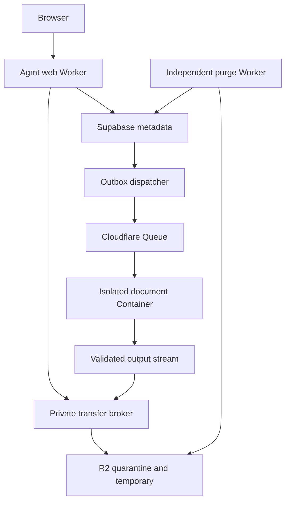

# Agmt Proof: world-class product and implementation plan

**Status: Controlling plan.** Browser-only processing supersedes the server-upload architecture for this release (founder approval 2026-09-09).
**Audit date:** 6 September 2026 (UTC); final review 7 September 2026 (UTC). **Remote baseline:** `15ad1e8c04533d5152107d614999d9fdc2dd5889`; tree `532d8d7da8b31cbb32b73f3ccc405d1934a9dcb4`.
**Planning branch:** `proof-world-class-plan`. Implementation proceeds on `proof-world-class-implementation`.

This document controls sequencing, architecture, acceptance and release for this initiative. The founder's ten fixed requirements remain binding except where this release supersession expressly replaces a storage/processing promise. Where this plan expressly supersedes an older implementation choice, follow this plan; preserve unrelated security requirements and historical evidence. Start implementation at PWC-00 and maintain `docs/AGMT_PROOF_IMPLEMENTATION_STATUS.md` under a new PWC ledger heading. Do not restart old T00–T16 or historical hardening sequences blindly.

Evidence vocabulary: **Existing** = found in source; **Implemented** = executable code exists; **Tested** = named test actually ran; **Verified** = stated behaviour directly observed in the named environment; **Deployed** = supported by deployment or live-surface evidence; **Proposed** = this plan; **Blocked** = a specified unmet prerequisite prevents completion; **Superseded** = expressly replaced for new temporary Proof runs. These labels are independent: an implemented function can still be blocked from release.

## 0. Release architecture supersession (browser-only Proof)

Founder approval 2026-09-09: this release processes documents **on the user’s device**. The server-upload, R2 quarantine, Cloudflare Queue, isolated Container, ClamAV-in-compute and two-hour Agmt-content-deletion architecture in sections 7, 17–20 and 23 is **Superseded** for launch. Existing engine, mapping, export, ZIP-safety, independent JS validation and test work is retained. Hostinger remains excluded. Cloudflare Containers remain unprovisioned. The spending freeze is unchanged. Server upload stays fail-closed (`PROOF_UPLOADS_ENABLED` unset).

Normative promises for this release:

1. Documents are processed on the user’s device and are not sent to Agmt.
2. Agmt does not claim a virus scan. Local admission is ZIP/XML/active-content/EICAR only and is never recorded as ClamAV clean.
3. Independent JavaScript package and reconstruction validation runs on every document before download.
4. Open XML SDK and actual Word checks remain release/regression tests, not claimed per-document production checks.
5. Refreshing or closing the page loses the current run; the user must choose the file again.
6. Do not promise secure erasure from browser memory or deletion of users’ downloaded copies.
7. Published file cap is the measured browser policy (`proof-local-limits-v3`): desktop **100 MiB** source / 150 MiB expanded / 8 MiB `document.xml` / 1e6 extracted code points, mobile **8 MiB** source / 24 MiB expanded (phone-UA class, not mobile-verified), plus ZIP, time and cancellation gates. Do not claim unlimited processing. Do not treat file size as sufficient: XML complexity and extracted text are separate refusals. Dense prose may stop at `extracted_text_limit` while a large image-heavy package still processes. 150 MiB is a Chromium-tested image-heavy stretch, not the UI cap.

PWC-12 remains a CI/lab oracle. PWC-22/23 compute and ClamAV are not launch gates for this architecture. PWC-26/27/36 two-hour Agmt content deletion is vacuous while Agmt never stores document bytes. Verified-account access to `/proof` remains. Zero LLM, owner isolation of accounts, and original-artefact preservation remain binding.

## 1. Executive conclusion

Build Proof as a conservative document-integrity product that returns the lawyer's own Word document with trustworthy markup. Its advantage should be that a lawyer can understand every finding, reject every correction, retain the negotiated document's structure and finish the last pass with less effort. Do not compete on a headline count of checks or pretend deterministic rules understand commercial intent.

Retain React/TanStack Start, Tailwind/Radix, Better Auth, Supabase metadata/RLS, the exact-source-map approach and the surgical OOXML exporter. Keep `app.agmt.legal` on Cloudflare Workers for the application shell, authentication and help. **This release runs the deterministic engine in the browser**; it does not upload document bytes to Agmt, R2, Queues or a Container. Do not move the public website or rewrite the web framework. Do not provision Cloudflare Containers or send documents to Hostinger.

The first release is a rigorously gated, narrow free beta. A broader professional release adds reliable definitions, numbering, references, dictionary spelling and safely scoped consistency checks. It is not reasonable to call the present four-typo/six-rule implementation the best proofreader. Zero LLM is compatible with excellent mechanical and structural checking; it is incompatible with reliable general semantic proofreading, open-ended missing-word recovery, legal interpretation and subtle meaning contradictions. Those remain explicitly outside current coverage. An optional future language-model product would require separate consent and a new privacy/accuracy contract; it is not part of these implementation tasks.

Three priorities precede more rules for this release: (1) a valid on-device choose-to-download lifecycle, (2) independently validated Word preservation in the JavaScript validator on every run, and (3) honest privacy copy — Agmt never receives the file, so two-hour Agmt content deletion is not a user-facing promise. SDK and Word remain laboratory oracles.

## 2. Definition of a world-class Proof product

“World-class” is an ambition, not launch copy. Measure against a frozen corpus and an independently reviewed beta. Never combine all dimensions into an accuracy score.

| Dimension | Free beta release floor | Professional-release target / measurement |
|---|---|---|
| Safe corrections | Zero observed unsafe corrections; at least 1,000 adjudicated eligible correction cases; per-rule precision ≥99.5% | Zero observed unsafe corrections across ≥10,000 held-out correction opportunities; report binomial uncertainty, not “100% safe” |
| Judgment comments | Each enabled rule ≥98% precision, ≥90% recall within its declared supported scope | ≥99% precision and ≥95% recall for promoted structural checks; no promotion on pooled averages |
| Noise | ≥95% of clean documents receive no false finding; ≤0.2 false comments per 10,000 supported words | ≥98% clean-document silence; ≤0.1 false comments per 10,000 words |
| Anchors | 100% published findings reconstruct the exact quote from source nodes | All supported stories and revision combinations; no nearest-paragraph substitutes |
| Fidelity | Zero lost structures, unexpected changes or Word repair prompts in supported fixture matrix | Expanded revision/comment/story matrix, Word desktop release evidence |
| Preservation | Reject only new Agmt changes and remove only new Agmt comments restores source semantics | Accept only new Agmt changes equals the planned text; all pre-existing markup and untouched part bytes preserved |
| Useful coverage | Clearly labelled supported checks, skipped regions and reasons on every run | ≥95% of representative target documents complete the advertised profile without refusal; measured before expansion |
| Speed | P95 ≤120 s from completed upload for ≤5 MiB/50,000 words, including cold start | P95 ≤30 s for ≤1 MiB/10,000 words; ≤90 s typical agreements; large-file tier section 23 |
| Reliability | ≥99% success for valid supported synthetic inputs over 7-day soak; refusal reported separately | ≥99.5% over rolling 30 days; no silent failures or lost active run after refresh |
| Deletion | Every tested content class absent before original T+120 min, including failure races | 100% deadline compliance; any miss is an incident, not a tolerable SLO error budget |
| UX | ≥9/10 beta participants upload and download unassisted; ≥8/10 understand limited coverage and deletion | Median active effort ≤60 s, excluding authentication email delivery and document review |
| Accessibility | WCAG 2.2 AA relevant criteria; zero serious/critical automated findings plus manual checks | Keyboard, NVDA/Chrome and VoiceOver/Safari complete every main state |

Unsafe means any unplanned text/structure change, wrong-location edit, altered name/number/legal operative phrase or incorrect “safe” correction. General recall over all possible English errors is neither promised nor measurable from a restricted corpus. At zero failures in 1,000 independent cases, the approximate one-sided 95% upper failure bound is 3/1,000, not zero; the corpus is not fully independent, so stratify by document family and report that limitation.

### Product research and benchmark interpretation

Vendor descriptions below establish workflows, not measured accuracy. No competitor account or paid trial was used. User reports are qualitative signals, not representative prevalence estimates.

| Product / official source | Useful benchmark | Consequence for Proof |
|---|---|---|
| [PerfectIt](https://www.perfectit.com/) and [check-specific limits](https://intelligentediting.com/docs/perfect-it/understanding-perfect-its-checks/italics) | Consistency checking, style preferences, restrained scopes; desktop privacy positioning | Offer precise consistency checks and explain their boundaries; no arbitrary preference changes |
| [Definely Proof workflow](https://www.definely.com/tutorials/getting-started-with-definely-proof) and [manual references](https://www.definely.com/tutorials/manual-cross-references-made-easier-with-definely-proof) | Definitions and references in the lawyer's working context | Every structural comment names its scope and points to the relevant text; preserve Word as the review surface |
| [Litera Contract Companion](https://www.litera.com/products/contract-companion) | Legal document checking embedded in Word | Benchmark real agreements and inherited drafting structures, not only plain-text sentences |
| [Microsoft Editor](https://support.microsoft.com/en-us/word/training/check-grammar-spelling-and-more-in-word) | Category navigation, ignore decisions and language controls | Use comprehensible categories, run-local exclusions and explicit English variants; no opaque score |
| [DocJuris Document Checker](https://www.docjuris.com/solution/document-checker) | Returning tracked markup and a reviewable summary | A downloadable, usable DOCX is the product; a findings dashboard alone is incomplete |
| [iLovePDF security](https://www.ilovepdf.com/help/security) | Simple file utility and disclosed automatic deletion | Keep one-file utility flow; retain Agmt's stricter original-upload clock rather than copying another service's clock |

Repeated proofreading and inherited names/clauses are pain points in [lawyer reports](https://www.reddit.com/r/Lawyertalk/comments/160ysn0/tips_to_proofread_trusts_and_contracts/) and [cross-reference discussions](https://www.reddit.com/r/Lawyertalk/comments/1c0j3n8/contract_lawyers_this_is_your_reminder_and_also/). Reports of [meaning changes and correction loops](https://www.reddit.com/r/Grammarly/comments/1fpzrqc/grammarly_suggestions_are_getting_bad/) and [incorrect suggestions](https://www.reddit.com/r/Grammarly/comments/1jbdsg0/is_grammarly_going_down_hill/) motivate negative traps, idempotent checking and no unsolicited rewriting. This is a research inference to validate with beta users, not a factual allegation that all competing products behave this way.

## 3. Primary user and job to be done

Primary user: a transactional lawyer preparing a negotiated English agreement for a partner, client or counterparty. The document may have copied clauses, restarted schedule numbering, defined terms, tables and pre-existing redlines. The user wants errors that survive ordinary spellcheck identified without changing the deal or spending another hour checking the software's edits.

Job: “Before I circulate this Word document, catch defensible mechanical errors, mark the changes so I remain in control, tell me what you could not check and remove your copies promptly.” Secondary users prepare policies, reports, formal letters, board papers and other professional documents. Build reusable story/language/structure primitives; do not assume every capitalised expression is a defined term or every numbered paragraph a contractual clause.

The product cannot confirm legal adequacy, enforceability, the correct commercial amount, whether a missing definition exists in another agreement, or whether all negotiations are resolved. It must not turn tentative evidence into authoritative comments.

## 4. Current-state audit with code evidence

### Repository reconciliation and audit limits

An existing checkout was on local `main` at `c84afa01deddd03c3f4a6252776178c86d534de2`, with three uncommitted changes: `site/public/fonts/plexmono-latin-n400-1.woff2`, `web/scripts/cloudflare-deployment.test.mjs`, and `web/src/lib/auth/server.ts`. Those remain untouched. Direct Git fetch lacked credentials. The connected GitHub API established remote `main` at the baseline above; a complete, non-truncated recursive tree contained 680 entries. Existing Git objects were reused and 23 changed/added blobs were retrieved, individually hash checked; the exact remote tree and unsigned commit were reconstructed and hash checked. The isolated planning worktree is based on that remote commit, not the older local branch. No code was merged from the dirty checkout.

The remote tree contains `web/AGENTS.md` and no root/deeper AGENTS file. Its hostile-input, verified-account, RLS, exact-evidence and forward-migration instructions inform this plan. Its brand-asset pass is scoped to web changes; this documentation-only task does not change brand assets or web code.

Current audit execution: Node 24.19.0, existing installed dependencies reused (no claim of a fresh lockfile install). `npm --prefix web run test:proof`: **Tested, 58/58 pass**. Direct Node test invocation of `retention.test.ts`, `product-runs.test.ts`, `proof-scan.test.ts`, `object-store.test.ts`: **Tested, 13/13 pass**. No full build, full auth suite, production migration or live storage drill was performed. A direct call to `canTransitionProductRun` returned false for scanning→processing and true for scanning→queued. Tests do not establish Word fidelity.

| Surface and exact code evidence | Evidence label and actual behaviour | Decision |
|---|---|---|
| `web/src/routes/proof.tsx::submit` | Implemented: raw DOCX POST, in-memory result, random idempotency key on every click; one “Proofreading…” state; response run ID discarded | Rebuild orchestration/UI around recoverable run ID, exact stages and stable idempotency |
| `web/src/routes/api/proof/$.ts::handler` | Implemented: upload/download/delete, no status/list/retry endpoints; `request.arrayBuffer()` occurs before verified-email check and actual-size validation | Authenticate and bound streaming before bytes; add explicit contracts |
| `web/src/lib/server/proof-service.ts::uploadAndProcessProof` and `product-runs.ts::transitions` | Implemented defect: service asks scanning→processing; transition table disallows it. Valid-file path reaching that call throws. This is code/contract verification, not a live authenticated reproduction | New queue path must use valid transitions; test the whole service boundary |
| `proof-service.ts::recordArtifact`, `markRunReady` | Existing: external puts precede artifact publication; count/artifact updates not all fenced by generation; retries/crashes can leave ambiguous external writes | Reserve artifacts before writes; conditional publication and orphan reconciliation |
| `proof-service.ts::deleteProofRun`, `blobs.ts::deleteBlob` | Implemented calls to delete, but no provider HEAD/list absence verification; missing manifests return early; deletion verification timestamp then set anyway; interrupted `deleting` state is not restart-safe | Replace verification semantics and make purge resumable |
| `proof-service.ts::purgeDueProofRuns`, `web/server/plugins/cloudflare.ts`, migration `0008` | Implemented: same-app scheduled purge, 25 due runs per call, sequential deletion, depends on DB discovery; hook logs raw error | Independent object-prefix sweep and bounded parallel deletion, safe error codes |
| `web/src/lib/server/proof-scan.ts::scanProofDocx` | Implemented: JSZip CRC load before its own expansion checks, private `_data` fields, blanket external relationship refusal, no antivirus | Call central-directory safety first; authoritative AV in isolated process; passive hyperlink distinction |
| `web/src/lib/agmt/zip-safety.ts::inspectZipCentralDirectory` | Implemented/Tested: pre-expansion headers, paths and resource checks; 4,096 entries/150 MiB/250 ratio differ from scan's 2,000/100 MiB/100 | Retain implementation, unify stricter published limits and bound actual inflation |
| `web/src/lib/agmt/docx-v2.ts::extractDocx` | Implemented/Tested: ordered XML, package/capability inspection, body/table/header/footer/notes extraction; numeric/story metadata | Retain; eliminate duplicated parsing and make all-story coverage explicit |
| `web/src/lib/agmt/source-map.ts::mapProofSource` | Implemented/Tested: exact UTF-16 node spans but source map fixed to `/word/document.xml`; fields reset per paragraph; broad incomplete-scope flag | Extend immutable per-part map and field/story boundary model |
| `proof/registry.ts`, `launch-checks.ts`, `typo-allowlist.ts` | Implemented/Tested: six active rules; only four typo spellings, restrictive English-prose heuristic, repeated function words, narrow placeholders, duplicate definitions/numbers, absent references | Retain as provisional rules; English-looking Latin text is not language detection |
| `proof/{checks,runner,product}.ts` | Existing older rule system; legacy validator can use weaker fallback logic; not active new-export contract | Keep regressions, prohibit import into new publication lane |
| `export/docx.ts::exportProofDocx`, `validateProofExport`, `export/ooxml.ts` | Implemented/Tested: real `w:ins`/`w:del`, comment ranges, ID allocation, surgical paragraph rewrite, unchanged entries, accept/reject checks. Any overlapping findings fail. Some comment candidates inside revisions cannot be exported | Retain surgical design; preflight eligibility; separate validation; expand only with Word fixtures |
| `proof/launch.ts::analyzeProof` | Implemented: refuses modern comment extension parts/protection/complex revisions; skipped non-main stories yield limited coverage; total >500 findings fails | Publish supported matrix; granular story/rule coverage; bounded suppression instead of failing otherwise safe checks |
| `web/src/lib/products/*`, `components/agmt/proof-run.tsx` | Implemented/Tested pure state/result view, but actual route uses its own reduced result UI; product catalogue advertises availability independently | One view contract and capability truth source |
| migrations `0005`–`0008`, `server/{jobs,direct-upload,malware-gate,worker-contract,object-reconciliation}.ts` | Existing/Tested foundations, much of older job plane Matter-bound/provider-neutral; not proof of live queue/AV | Reuse transaction/idempotency patterns, explicitly bridge temporary runs; no fake Matter |
| `server/blobs.ts::putBlob`, `agmt/crypto.ts::wrappingKey` | Existing Proof path uses legacy envelope/object_manifest; fallback can derive key from auth secret and a test path from DB credentials | New Proof temporary provider uses R2 managed encryption, dedicated namespace and no legacy content/key rows; preserve historical decryptability |
| `auth/{server,db-guard.server,resend.server}.ts`, `routes/login.tsx` | Implemented newer DB/timeouts and safe client messages; `db-guard.server.ts::logDriverError` still records sanitised raw driver message | Retain auth architecture; log enum/stage only and prove timeout cleanup/verified boundary |
| `web/wrangler.jsonc`, `web/vite.config.ts`, root `package.json`, `.github/workflows/deploy-cloudflare.yml` | Configured Worker module build, R2, two Hyperdrive bindings, five-minute cron; deploy uses generated web Wrangler artifact | Retain web Worker; verify generated config bindings, routes and scheduled hook on every release |
| `src/worker.ts`, `Dockerfile`, `web/vite.cloudflare.config.ts` | Existing alternate Node-container web route, not selected by current root deploy command/config; comments describing it as current are misleading | Do not deploy this alternate web backend; new compute Container is a separate explicitly configured service |
| `.github/workflows/web-proof-corpus.yml`, `web-migrate.yml`, `web/scripts/migrate.mjs` | Existing tests/build and separate migration workflow; deploy workflow not visibly dependent on completed corpus gates and captures raw Worker tail | Gate deployments on exact-SHA checks; remove content-bearing diagnostic capture |

### Live inspection (anonymous browser)

**Verified/Deployed only as UI surfaces:** `https://app.agmt.legal/proof` rendered upload control, six-check disclosure, sign-in link and a categorical two-hour deletion statement. After session resolution, upload remained disabled for this anonymous visitor. `https://app.agmt.legal/` rendered Proof card plus “Beta preparation · uploads not yet available”. Both use a “Workspace” nav with Matters first and “Agmt — agreement utilities” branding. The live `/proof` screen has restrained paper/ink styling but raw file input, long privacy paragraph and no active run lifecycle.

Following its sign-in link rendered email/password sign-in and account creation toggle. No credentials were entered; successful sign-in, verification email delivery, upload, results, download and manual deletion are **Blocked from verification** by absence of an authenticated test session and provider inspection. Do not infer they work from rendered HTML.

`https://agmt.legal` rendered a 50-seat beta marketing page, broader checks, a deal map and durable Matter narrative. This conflicts with the fixed temporary utility scope and broader Agmt brand. It is an audit finding only: `/site` redesign is out of scope. Record a separate launch-copy dependency with its owner, rather than modifying `/site` in PWC tasks.

No authoritative mapping from live custom-domain deployment to exact Git SHA was obtained. Historical status receipts about September 5 deployments are not current production proof. No SDK or Microsoft Word execution took place in this audit.

## 5. Conflicts and superseded assumptions in existing documentation

| Existing source / assumption | Resolution for this initiative |
|---|---|
| `AGMT_PLATFORM_PROOF_SPEC.md`: core journey, free launch, verified accounts, original upload clock, zero LLM | Retained in full as founder requirements |
| Same document: AWS-specific S3/SQS/KMS/direct-multipart implementation | Superseded by sections 17–20; Cloudflare proxied bounded upload, R2, Queues and isolated compute; explain encryption change explicitly |
| `AGMT_PROOF_IMPLEMENTATION_STATUS.md`: T05 disabled upload and T08+ unimplemented | Historical ledger, stale in part: route wiring, R2 adapter and purge hook now exist; completeness still unverified |
| `AGMT_PROOF_PRODUCTION_LAUNCH_BLUEPRINT.md`: Vercel body-size problem; root Cloudflare not current backend | Historical deployment context; current `/web` Worker deployment makes this architectural premise obsolete |
| `web/docs/SPEC.md`: mandate → map → Proof → Review, durable evidence and page limits | Superseded for temporary Proof. No user confirmation wizard, Matter requirement, page-count refusal or automatic Review transfer |
| `web/docs/DATA-MODEL.md`: `proof_hit`, canonical text, persistent evidence and feedback tickets | Not the temporary product's storage contract. Use product_run/artifact metadata, with content only in temporary memory/R2 |
| Older launch checks described as complete language proofreading | Six checks are a narrow beta profile; publish actual rule inventory, not broad claims |
| Two-hour deletion implied by clock helpers or scheduled delete | Clock tests prove deadlines only; object absence, orphan cleanup and process termination must be observed |
| Existing revision text comment-only while exporter refuses its anchor | Decide export capability before emitting finding. Preserve revision and mark coverage skipped until anchoring is Word-verified |
| All external relationships rejected | Refuse executable/remote-content relationships; preserve well-formed passive hyperlinks without fetching; gate this expansion with fixtures |
| Full pre-existing modern comments support | Currently refused. Add opaque preservation first only after SDK/Word tests; never flatten/resolve existing discussions |
| Existing per-document envelope encryption | New temporary lane uses TLS + R2 provider-managed encryption. This simplifies key/backup leakage and streaming, but loses app-managed key separation; no customer-managed-key claim. Historical objects keep existing keys and readers |

## 6. Product principles and non-goals

1. Evidence before assertion. A missing item requires complete evaluated scope; ambiguous scope produces coverage information, not an invented finding.
2. Preserve the artefact. Never round-trip through HTML, regenerate the document from plain text, refresh fields or accept existing revisions.
3. Default to restraint. Correct only allowlisted mechanical errors; comment on defensible inconsistencies; ignore preferences and speculative interpretation.
4. Tell the truth at every state. “Ready” means validated downloadable bytes exist; “deleted” means storage absence and writer shutdown were verified.
5. One task, one file, one recoverable run. No required workspace, onboarding questionnaire, permanent document library or fake job progress.
6. Reuse only sound boundaries. New temporary Proof must not inherit durable Matter content, canonical rewriting, old fallback anchors or LLM dependencies.

Non-goals: legal advice, enforceability review, risk scoring, legal citation validation against external law, generative drafting, deal maps, collaboration, bulk uploads, Word add-in, browser document editor, PDF/OCR/legacy DOC conversion, exact pagination estimation, style-guide marketplace, permanent dictionaries containing client names. No background messages/email containing run content. No monetisation work at launch.

## 7. Complete user journey

**This release (browser-only):**

1. Visitor reaches `/proof`; sees the outcome, free-launch status, that processing happens on this device, and the supported-file summary. Choosing a file does not send it anywhere.
2. Sign in or create/verify account through current auth. Preserve a validated relative return path. A file may be selected before sign-in; after a redirect the user reselects it. Never store the document in IndexedDB, localStorage or sessionStorage.
3. Select one DOCX with **Choose a Word document**, see local filename/size, choose **Agreement** or **General document**, and **English (UK)** / **English (US)**. Default Agreement + UK. The profile only enables rules whose capabilities actually pass.
4. On **Proofread document**, process on this device off the UI thread. Show actual stages: checking the file, checking the document, preparing the Word document, checking the finished document. Provide cancel. No upload, server queue or virus-scan copy.
5. Independent JavaScript validation runs before the download is offered. Success exposes one prominent download, correction/comment counts and checked/skipped categories. Zero findings means only “No issues found by the completed checks.” Limited coverage is prominent even with zero findings.
6. Lawyer downloads, opens Word, uses All Markup and accepts/rejects Agmt changes. Existing comments/revisions remain. The web interface is not a second editor.
7. Refreshing or closing the page loses the current run. The user must choose the file again. Proof does not resume from Agmt. Do not promise secure erasure of browser memory or deletion of downloaded copies.

The historical upload-to-R2-to-Container journey in the remainder of this document is retained as evidence of the superseded design. Do not implement it for this release.

## 8. Information architecture and screen specifications

| Route / screen | Structure and behaviour |
|---|---|
| `/` Agmt application home | Agmt header, “Tools for modern legal work”, Proof card, planned product names only; optional legacy Matters link under account navigation, never the required starting point |
| `/proof` select | Narrow product header; outcome sentence; file card; profile/language disclosure; main action; concise privacy statement; supported-file details accordion; active runs list below only when present |
| `/proof?run=<opaque-id>` active/result | Same route/component; no filename in URL; server summary restores state. Header, run status, download or current-stage card, coverage, deletion. Back to new file is explicit |
| `/login?returnTo=...` | Existing auth form, clear error/retry, verification recovery. Permit only `/`, `/proof`, and `/proof?run=<validated ASCII opaque ID>`; never arbitrary URLs |
| `/proof/help` | What Proof checks, limits, Word instructions, privacy/deletion and error recovery; no infrastructure terminology |

Active list: at most 20 non-expired owner runs, newest first, “Document uploaded at 14:32” after refresh because names are not retained. No permanent history dashboard. Client retains filename only in current component memory; download uses `<local basename>_Proofread.docx` if available, otherwise `Agmt_Proofread.docx`. Sanitize control characters and path separators locally; server attachment name is always generic.

Component tree: `Shell` → `ProofPage` → `ProofIntro`, `ProofAccessGate`, `ProofFilePicker`, `ProofOptions`, `ProofRunView` → `ProofStage`, `ProofResultSummary`, `ProofCoverage`, `ProofActions`, `ProofDeleteDialog`, `ProofFeedback`; `ProofActiveRuns` and `ProofHelp` beneath. Reuse `components/ui/button`, alert-dialog, accordion, select and existing form primitives. Pure run views consume one versioned DTO. Route owns fetching and commands; server owns transitions and availability.

Result priority: heading and main download → limited-coverage warning if any → parallel correction/comment counts → exact availability/deletion times → coverage details → delete/feedback. No numerical confidence badges, document score, issue charts or default rendered document preview.

## 9. Detailed UX states and exact copy

These are normative copy strings, with pluralisation and localised timestamps. `{time}` includes timezone, accessible `<time datetime>` and server-clock offset; no constantly announced second counter.

| State | Heading / main text | Action and recovery |
|---|---|---|
| First visit | “Proofread your Word document.” / “Get safe corrections as tracked changes and points to check as Word comments.” | “Choose a Word document”; “Free at launch” |
| Privacy | “Your document is processed on this device. Agmt’s servers do not receive the file. Agmt does not virus-scan the file. Refreshing or closing this page loses the current run; choose the file again to restart. Proof does not promise secure erasure from browser memory, and a copy you download stays on your device.” | “Processing happens on this device.” |
| Auth loading | “Checking your sign-in…” | No flicker to anonymous; after 15 s show bounded retry |
| Signed out | “Sign in to use Proof.” | “Sign in”; file stays local |
| Unverified | “Verify your email to use Proof.” | “Resend verification email”; server rate limit; “I’ve verified my email” refreshes session |
| Verification sent | “Check your inbox for Agmt’s verification email.” | “You may need to select your file again when you return.” |
| Auth unavailable | “We couldn’t complete sign-in. Please try again shortly.” | “Try again”; no infinite disabled button |
| Selected | “Ready to proofread” / local filename and size | “Proofread document”; “Choose a different file” |
| Wrong extension/empty | “Choose a Word (.docx) file containing document text.” | “Choose another file” |
| Too large | “This file exceeds the {policy.label} limit.” | “Choose a smaller Word document”; no promise that splitting preserves reference scope |
| Multiple files | “Choose one document at a time.” | Keep none from multi-drop; existing selection unaffected |
| Uploading / queued | Not used in this release | Browser-only processing has no upload or server queue |
| Checking file | “Checking the file…” | “Cancel”; never “virus-free” |
| Processing | “Checking your document…” | Show stage label only; not a list of technical jobs |
| Exporting | “Preparing your Word document…” | No download yet |
| Validating | “Checking the finished document…” | Substage of exporting; output remains unpublished |
| Slow (>120 s) | “This is taking longer than usual. Your document is still being checked.” | “Check status”; no automatic second upload |
| Ready, findings | “Your proofread document is ready.” / “{n} tracked corrections · {m} comments to review” | “Download Word document”; “Review Agmt’s changes and comments in Word.” |
| Ready, zero | “No issues found by the completed checks.” / “This does not confirm that the document is error-free.” | “Download checked Word document”; byte-identical if no notices |
| Limited | “Your document is ready with limited coverage.” / “Proof skipped {plain-language list}. Review these parts yourself.” | “Download Word document”; expanded coverage by default; do not call result clean |
| Coverage details | “Checked” / “Not checked” / “Not applicable” | Actual categories and story types, no raw enum codes |
| Unsupported/protected | “Proof can’t safely process this document yet.” / specific safe reason, e.g. “This file contains unsupported tracked changes.” | “Choose another file”; do not instruct user to accept all revisions |
| Security rejection | “This file could not pass our safety checks.” | No download of quarantined source; delete promptly; generic support reference |
| Temporary failure | “We couldn’t finish checking this document.” | “Try again” only if original run has clean source, budget and time; “Delete files” |
| Retry ineligible | “This run can’t be retried. Please upload the document again.” | Explicit new-run action and new clock; never silent reupload |
| Connection lost | “We’ve lost the connection. Your uploaded document may still be processing.” | “Check status”; preserve run ID and idempotency key |
| Download started | “Your download has started. Check your browser’s downloads.” | Never claim file saved to disk; keep download available |
| Delete confirmation | “Delete this run’s files?” / “You won’t be able to download them again. Any copy you already downloaded will remain on your device.” | “Keep files” / “Delete files” |
| Deleting | “Access has been closed. We’re deleting your files.” | Poll metadata; no success toast yet |
| Delete delayed | “Access is closed. Deletion is still being verified.” | Automatic retries; support reference; never extend deadline silently |
| Deleted | “Your files have been deleted from Agmt’s content storage.” | Only `deletionVerifiedAt` from verified receipt; “Check another document” |
| Expired, not verified | “This run has expired and downloads are closed.” | Separate deletion status; do not equate expiry with erasure |
| Unknown/other owner | “This run isn’t available.” | Same response for unknown and unauthorised IDs |
| Quota | “You’ve reached today’s free limit. You can start another check after {time}.” | Active downloads/deletion continue; no upgrade bait |
| Uploads paused | “Proof is temporarily unavailable for new uploads.” | “Existing downloads and deletion remain available.” Only show if that is true |

Security/unknown failures map to codes in section 18; no raw exception text. Coverage examples: “Headers and footers were preserved but not checked”; “Some text already marked with tracked changes was not edited”; “Definition checks were skipped because the scope was unclear”. A document-level coverage comment is explicitly a notice; it does not assert the first paragraph is defective.

## 10. Visual and component-system direction

Retain Agmt's current paper/ink/oxblood relationship and serif product headings, with a quiet sans-serif interface. Brand assets and tokens in `docs/brand/README.md`, `web/src/styles.css` (confirm actual stylesheet path at PWC-30) and `components/agmt/shell.tsx` are input, not a reason to keep agreement-only branding. No public-site redesign.

Use a 720 px content column for select/progress and 960 px maximum for results, 16 px mobile gutters / 32 px desktop, 8 px spacing grid, body 16 px/1.5, secondary text ≥14 px, title 32–44 px. Reuse current font files; no new font dependency. Use actual existing token values after contrast testing; do not invent brand hex codes. A single bordered file/result card, generous whitespace and a restrained accent are sufficient. Status needs a word and icon, never colour alone. Error text sits next to the affected input and in a focusable error summary when needed.

Mobile: native file picker, single column, full-width primary button, long filename wrapping, no horizontal scrolling at 320 CSS px. Touch controls ≥44×44 CSS px. Sticky action only if it does not obscure content or the keyboard. Desktop keyboard order follows reading order. Keep visible focus, skip link, correct active navigation, labelled inputs, reduced motion and sensible dark/high-contrast behaviour. Spinner respects reduced motion; screen reader announces stage changes once, not all result content every poll. Test 200% text zoom and 400% browser zoom/reflow. Loading auth, upload, processing and deletion must each be visually distinguishable.

## 11. Supported DOCX matrix

Support means separately **preserve**, **read/check**, and **edit/comment**. Opaque preservation does not mean checked. The released profile is a versioned allowlist, not whatever the parser tolerates. Proposed phases: A = safe beta; B = professional agreements; C = broader documents. “Gate” means not supported until fixtures, validator and named Word tests pass.

| Structure | Today | Phase A | Phase B/C |
|---|---|---|---|
| Native unencrypted transitional `.docx`, body paragraphs/styled runs | Implemented/Tested core | Preserve/check/surgical edits | Broader corpus |
| Ordinary tables, merged cells and nested tables | Body/table extraction exists; mixed coverage | Gate fixtures for ordinary/merged/nested; spans never cross cells | Same, expand unusual layouts only with evidence |
| Native numbering, literal clause labels, restarts | Resolver exists; limited labels | Preserve/check supported patterns; comments only on numbering | Multi-level scope graph, schedule/reference ranges |
| Schedules/annexures/exhibits in main story | Heading heuristic | Supported when uniquely scoped; ambiguous structure suppresses absence rules | Explicit nesting and cross-scope references |
| Basic existing `w:ins`/`w:del`, classic comments | Some preservation tested | Preserve; final-view read; no correction touching prior revisions; new comment only outside protected ranges | Gate anchoring inside existing insertions without nesting revisions |
| Modern comments/threads (`commentsExtended`, IDs, people) | Refused | Refuse with exact reason | Opaque preservation gate; never resolve threads; adding classic comment must be tested with current Word |
| Move revisions, tracked paragraph/table/property changes | Refused/coverage gaps | Refuse unsafe package; no automatic flattening | Preserve/read only after complete revision model; otherwise remain refused |
| Headers/footers, footnotes/endnotes | Extracted but no exact launch map | Preserve opaque; declare unchecked | Exact story maps and lexical checks; direct comments only if supported in target Word; otherwise suppress and disclose |
| Fields: REF/PAGEREF/TOC/DATE/PAGE and cached results | Extracted; non-editable | Preserve instructions/cache; no refresh; structural broken-target checks only when source grammar certain | Cross-paragraph balanced field model, cached-result mismatch comment, no recalculation |
| Bookmarks | Inventoried | Preserve IDs/ranges; reference targets checked only when complete | Full ambiguity/duplicate/cross-story target logic |
| Passive hyperlinks | Parser distinguishes; scanner refuses all external links | Gate safe http/https/mailto preservation; never fetch/correct hyperlink text | Check adjacent prose only |
| Images/drawings/charts | Some package inventory | Preserve bytes; no OCR/alt-text proofreading; drawings with text containers yield limited coverage/refusal | Selected text-box support after exact anchoring gate |
| Content controls/custom XML | Mapping unsafe; scanner can reject customXml | Refuse data-bound controls/custom XML; opaque unbound controls only with explicit gate | Read-only controls and selected unlocked text edits; never alter binding/IDs |
| Text boxes/AlternateContent | Gaps | Preserve only with validated opaque-copy test; unchecked; no duplicate fallback text projection | Namespace-aware choice/fallback selection; edit only verified branch |
| Hidden text, deleted text, field instructions | Partial projection | Preserve; exclude from linguistic checks; inventory hidden content without exposing it | Explicit hidden-material notice; never unhide automatically |
| Mixed language | Latin-script heuristic only | Explicit English preference, inherited `w:lang`; skip non-English/unknown regions, mark limited | Segment language heuristics with abstention; no non-English language claim |
| Embedded objects/macros/ActiveX/altChunk/external template | Structural refusal | Refuse, no strip-and-return | Remain refused |
| Password encrypted, IRM/protected, digitally signed | Refused in parts | Refuse; never remove protection/signature | Remain refused until separate product decision |
| Strict OOXML, malformed namespaces, ZIP64, legacy `.doc`, `.docm`, `.dotx`, PDF | Not promised | Refuse by explicit package signature/type | Evaluate Strict independently; no format conversion in current scope |

No page cap: page count depends on Word layout and fonts. Limits are byte/entry/text/complexity limits. Empty body with useful text only in currently unsupported stories is unsupported, not a zero-finding result. Refuse corrupt or unsafe packages altogether; limited coverage is allowed only when the unexamined structures can be preserved safely and the user receives a persistent notice.

## 12. Proofreading rule architecture

Pipeline: bounded ZIP/package inspection → immutable parts/capability inventory → final-view text and exact source maps → scoped indexes → eligible rule execution → evidence replay → overlap resolution → export plan → independent validation → conditional publication. Security scan precedes rich XML parsing; section 19 gives execution placement.

Registry entry (strict schema): `id`, positive integer `version`, `profile` (agreement/general/both), `phase`, `defaultEnabled`, `requiresCapabilities[]`, `languages[]`, `actionPolicy` (correction/comment), `scopeKind`, `exclusionPolicyVersion`, `evidenceValidator`, `maxCandidates`, `timeBudgetMs`, `evaluationReceiptHash`. Stable IDs survive wording changes; behaviour changes increment version. Run pins parser, projection, index, registry, dictionary, exporter and validator versions. No run may mix versions during a retry.

Each rule returns `completed_with_findings`, `completed_zero_findings`, `not_applicable`, `suppressed` or `failed`, plus coverage reasons. Required predicates do not run when an input capability is unknown. A rule error does not become zero. Registry promotion requires the section 22 metrics and a named reviewer. Keep experimental rules off by default; never import the historical “mustFind” assumption.

Confidence is evidence tier, not an invented model probability: **exact-mechanical**, **exact-structural**, **bounded-heuristic**. Only first tier plus lexical exclusions and validated edit capability can become tracked correction. Structural and heuristic issues are comments. “98% confidence” must never be displayed from an arbitrary score. Thresholds refer to measured per-rule precision; the validator still rejects an individual unsupported candidate.

Build per-document indexes once; no full-document scans for each candidate. Tokenize with original UTF-16 offsets; canonical tokens for comparisons are separate values with reversible mappings. Do not normalize the source XML, names, Unicode whitespace, quote style or line breaks. Grapheme boundaries matter in addition to surrogate pairs. Exclusions include quotations, names, addresses, definitions being declared, signatures, abbreviations, citations, identifiers, formulae, code, URLs/email, fields and existing revisions. Rules may narrow exclusions only via separate corpus evidence.

Resource policy: 500 published findings/run, 100/rule, 2,000 raw candidates/rule, 2 s CPU/rule initially and 30 s aggregate rule CPU. Stop a runaway rule and record `suppressed:rule_budget`; retain independent safe findings with limited coverage. Do not silently take first 500. If total eligible findings exceed 500, select in fixed order: exact structural, exact mechanical, bounded heuristic, then part/scope/span/rule ID; record total omitted by category and explicit limited-coverage notice. Every emitted result stays deterministic.

Duplicate key is source digest + part URI + stable path + span + rule/version + normalized evidence identity + action. Merge exact duplicates. Same-span comments can be combined into one concise comment with distinct reasons; count one Word comment. Never merge different locations because their text matches. For correction conflicts, discard conflicting corrections, emit one judgment comment only if its combined evidence and anchor validate; otherwise suppress with coverage reason. Overlapping comments may be coalesced to an exact validated union in one paragraph if ≤300 UTF-16 units. Never expand across fields/cells/protected boundaries. Correction/comment overlap downgrades the correction to the combined comment; no nested revision repair guess.

## 13. Phased rule catalogue

`A` is the gated narrow beta; `B` is professional agreement coverage; `C` is broader document coverage. Each row defines minimum evidence and forbidden behaviour. All new rules need positives and clean traps before enabling. Low risk is still not automatic-correction permission.

| Category / stable rule IDs | Phase and evidence | Exclusions / expected false-positive risk | Permitted action and example |
|---|---|---|---|
| `language.typo_allowlist` | A: exact frozen misspelling + English prose + ordinary-word context | Names such as Recieve Limited, quoted terms, clause labels, URLs; low only after exclusions | Track `teh`→`the`; never choose dictionary's first suggestion |
| `language.spelling_candidate` | B: token absent from pinned UK/US dictionary and legal allowlist, one/two plausible suggestions | Names, Latin, abbreviations, citations, mixed language; medium/high | Comment “Check the spelling of ‘…’.” Default off until ≥98% precision |
| `language.duplicate_word` | A: adjacent identical allowlisted function word with exact separator | `had had`, `that that`, quotations, table labels, grammatical repetition; low | Track second word+ordinary space deletion; skip tabs/alignment |
| `language.missing_word_pattern` | C: finite context pattern with annotated evidence, e.g. malformed fixed phrase | Negotiated elliptical drafting and lists; high | Comment only; never insert inferred “not”, “and”, “or”, shall/may |
| `language.sentence_mechanics` | C: narrow agreed pattern for agreement/verb mechanics; no open-ended parser claims | Long legal sentences, lists, collective nouns, provisos, quotations; high | Comment only; no rewrite for brevity or passive voice |
| `punctuation.duplicate_mark`, `spacing.accidental` | B: repeated punctuation or ordinary-prose internal space with rule-specific evidence | Ellipsis, decimal points, alignment, nonbreaking spaces, tab stops, signature blanks, quoted punctuation; medium | Initially comments. Promote only ASCII double-space between ordinary words to tracked correction after gate; preserve NBSP |
| `punctuation.unbalanced_pair` | B: quote/bracket stack inside complete logical paragraph/list scope | Multi-paragraph quotation, bracketed amendments, `[●]`, apostrophes; medium | Comment exact unmatched character; never auto-close bracket |
| `definitions.case_variant` | B: one authoritative declared term + matching case-folded use in same scope | Ordinary nouns (“Company”), sentence start, local overridden definition, UK/US variation; medium | Comment showing declaration and use; no global capitalisation |
| `definitions.duplicate` | A: two explicit declarations in same unambiguous scope | Main/schedule local definitions; repeated extract quotation; low/medium | Comment second declaration with related source span |
| `definitions.undefined_use` | B: definite defined-term use, complete inventory, no imported-definition clause | External documents, common capitals, headings, case law; high | Comment only “No matching definition was found in the checked scope…” |
| `definitions.unused` | B: explicit declaration and complete use inventory | References through schedules, plural/possessive variants, incorporated terms; high | Default off; comment at declaration only after precision gate |
| `numbering.duplicate`, `numbering.sequence_anomaly` | A duplicate; B sequence: resolved numId/abstractNum/lvlOverride/startOverride + explicit scope | Schedule restarts, reserved/deleted clause numbers, list discontinuities; medium | Comment, never renumber Word XML |
| `references.missing_target` | A simple explicit internal reference; complete scope and zero resolved targets | Statutes, external agreement, coordinated/range/relative references until resolver supports them; low/medium | Exact reference comment; no guessed destination |
| `references.ambiguous_target`, `references.range`, `references.bookmark` | B: parsed reference AST, scoped numbering/bookmark graph | PAGE/TOC cached values, external links; medium | Comment missing/duplicate targets; do not refresh fields or change labels |
| `figures.words_numbers` | B: adjacent bound amount pair, exact decimal parser and same currency/unit | Lakh/crore vs international grouping, decimal separators, rounding, ranges, percentages; medium | Comment “The amount in words differs from the figure. Please confirm which is intended.” Never choose one |
| `figures.repeated_value`, `dates.inconsistent_value` | C: explicit shared semantic label and two anchored facts | Different tranches, dates at different milestones, totals with exclusions; high | Comment only after label equality established; no global same-number assumption |
| `dates.invalid_calendar`, `percent.invalid_literal` | B: explicit date format or malformed percent literal | Ambiguous `03/04/26`, percentages legitimately >100, formula/date fields; medium | Comment impossible calendar date; never infer locale or cap >100% |
| `completion.placeholder` | A exact `[●]`, `[TBD]`, `[insert date/name/amount/address]`; B TODO/XX patterns | Mathematical brackets, anonymised quoted examples, X in names; low/medium | Comment exact unfinished drafting; never fill automatically |
| `parties.name_variant` | B: opening/signature party declarations + exact role mapping + bounded variant | Affiliates, permitted assigns, similar unrelated entities, quoted names; high | Comment related occurrences, never replace names |
| `stories.header_footer_variant`, `schedules.missing_target`, `signatures.party_mismatch` | B/C: same scoped party/title/schedule label inventory with exact story map | Different section headers, counterpart blocks, witness/authorised signatory text, schedules intentionally unsigned; high | Comment only with valid native Word anchor; otherwise coverage notice; no fake body evidence |
| `review.existing_material` | B: actual comment/revision/placeholder inventory | A comment may be resolved in modern metadata; prior revisions not automatically mistakes | Summary notice “Existing comments/tracked changes remain”; no duplicate comment on every existing comment |
| `formatting.run_anomaly` | C: resolved inherited formatting differs within same logical style role | Emphasis, defined terms, headings, fields, font fallback, formulas; high | Comment isolated anomaly only after precise style comparison; never normalize fonts/margins/paragraphs |

General-document profile disables definition/party/signature assumptions by default; lexical and explicitly numbered-reference rules remain eligible. Deliberately ignore commercial inconsistency, legal adequacy, “shall” versus “will”, Oxford comma preference, stylistic concision, external citation correctness and semantically inferred missing negatives.

## 14. Evidence and anchoring contract

Normative proposed content contract (memory or temporary R2 only, never database/logs/queue):

```ts
type SpanV2 = {
  sourceSha256: string; partUri: string; storyId: string;
  paragraphPath: number[]; textStart: number; textEnd: number;
  projectionVersion: string; view: 'final'; exactQuote: string;
  nodeSegments: { nodePath: number[]; start: number; end: number }[];
};
type FindingV2 = {
  id: string; ruleId: string; ruleVersion: number;
  evidenceTier: 'exact-mechanical' | 'exact-structural' | 'bounded-heuristic';
  action: 'correction' | 'comment'; primary: SpanV2; related: SpanV2[];
  replacement: string | null; messageCode: string; messageArgs: string[];
  capabilityReceipt: string; exclusionPolicyVersion: string;
  scopeEvidence: null | {
    scopeIds: string[]; inventoryDigest: string; indexVersion: string;
    evaluatedParts: string[]; excludedRegions: string[];
    completeness: 'complete'; query: string; matchCount: number;
  };
};
```

Strict validation: unknown fields rejected, integer bounds, ≤128 path depth, half-open nonempty spans, exact concatenated source equality, no surrogate/grapheme split, all related spans independently validated, ≤1,000 UTF-16 units per evidence quote, ≤600 per comment. IDs bind source/part/path/rule/version; path alone is insufficient across stories. `query`/message args are content and follow the two-hour policy. Zero-width missing-item evidence anchors the actual referring expression; no fabricated span for absent text.

`final` includes existing insertions and move-to only when supported, excludes deletions/move-from/instructions/hidden regions, respects field and paragraph boundaries, and records excluded inventory. Native numbering labels are derived evidence tied to numId/level/source paragraph; they are not fabricated `w:t` offsets. A numbering comment anchors the paragraph's actual first nonempty text and explains the derived label; if none exists, suppress the finding.

Validation order: package hash → registered part → exact tree path → source node text → projection segment coverage → quote → rule predicate and exclusions → scope completeness → exporter capability. Any failure removes that finding and records a safe reason. If validation indicates corrupted shared mapping, fail the run; do not treat it as a harmless rule suppression. Absence rules require all potentially relevant supported/inherited scopes; incomplete or ambiguous imports suppress them.

## 15. Tracked-change and comment export contract

Use the original ZIP package as the immutable base. Preserve every untouched entry's uncompressed bytes; preserve all parts not on an exact allowlist. Do not promise identical ZIP compression or timestamps for changed output. Within edited XML, replace only validated byte ranges for affected paragraphs/nodes, preserving namespace declarations and unknown attributes. A normal XML serializer alone is not fidelity assurance.

Corrections use genuine `w:del` with `w:delText` and, when replacement nonempty, `w:ins` containing `w:t`. Preserve `w:rPr`, `xml:space` and grapheme integrity. Use a defined formatting policy: same-format word edits preserve that run's properties; mixed-format replacement is comment-only unless replacement segments have an explicit tested source-format mapping. Never distribute new text across formatting runs by approximate character counts. No nesting inside existing revisions, field instructions, locked content controls or ambiguous ranges. Author `Agmt Proof`, initials `AP`; UTC date fixed for the attempt; allocate noncolliding IDs across all relevant parts. Existing Agmt-authored revisions must not be mistaken for this run's changes: use receipt IDs, not author name, for reconstruction.

Comments require a comment record, matching range start/end and reference marker, valid relationship and content type. Keep all existing comment records, relationships and thread metadata unchanged. Use short, neutral messages: fact, location/context and request to check. Example: “Clause 8.3 was not found in the checked main-body numbering scope. Please confirm the reference.” Do not add unnecessary boilerplate to every comment or label an issue “critical”. Supporting locations may be described in comment text only after exact validation.

Coverage notice is a separate `document_notice` with its own count, one per document; first safe paragraph is presentation location, not evidence. Wording lists skipped categories/stories in plain language. If no safe notice anchor exists, refuse output. New ordinary comments are counted separately from notices and existing comments. A zero-finding, fully checked result returns identical original bytes; limited coverage needs the notice even at zero findings.

Microsoft's [comment construction](https://learn.microsoft.com/en-us/office/open-xml/word/how-to-insert-a-comment-into-a-word-processing-document) and [revision semantics](https://learn.microsoft.com/en-us/office/open-xml/word/how-to-accept-all-revisions-in-a-word-processing-document) inform markup. Do not call the sample “accept all revisions” routine on the user's output; acceptance testing targets only newly allocated IDs.

## 16. Output-validation design

Every output passes these gates before publication, including zero-finding outputs. No download fallback when validation fails.

1. **Package:** bounded re-open and actual inflation counts; CRC, content types, relationship targets, namespace profile and all original entry presence. No unplanned external relationship, part or active content.
2. **Markup:** independently enumerate added revision/comment IDs, authors, ranges/references and planned changes. Require exact count/record/range agreement. Validate pre-existing IDs and comments, including unknown metadata part hashes. Guard both unplanned additions and missing records.
3. **Reconstruction:** remove only newly added comments and reject only newly added revisions; compare original structural semantics including rPr/pPr/sectPr/numbering/fields/bookmarks. Accept only new revisions and compare with an independent application of the edit plan. For an input already containing Agmt edits, preserve those IDs exactly. No text-only acceptance.
4. **OOXML SDK (release/regression only):** run pinned Microsoft Open XML SDK in CI or on a lab host against browser-generated outputs. It cannot run in the browser and is **not** a per-document production check in this release. Never suppress all validator errors. SDK validation is schema evidence, not Word rendering evidence.
5. **Word release validation (release/regression only):** actual Word opening, All Markup, accept/reject/save/reopen on browser-generated outputs. Not a claimed per-document production check. SDK success cannot replace this gate.

Separate `validation/` from exporter helpers. The independent checker must not call `rewriteParagraph` or trust `receipt.modifiedParts` as permission to change anything: derive allowed parts from source capability + planned operations. Mutate output fixtures to prove the validator catches shifted anchors, changed old comments, added relationships, formatting drift and changed unrelated parts. Fuzz source and output parsers under bounded runtime. Validation diagnostics are content-bearing by default; map them to closed codes in production, and keep detailed synthetic-only reports in CI.

## 17. Data model and state machine

Choose `product_run` as the canonical lifecycle record and `product_artifact` as the temporary object inventory. Reuse `job_outbox` dispatch/lease patterns by adding a `product_run` aggregate type after checking its actual enum/constraints; do not create a second queue framework or a placeholder Matter. `ingest_job` remains historical and is not a mandatory foreign key for new runs.

Forward-only proposed migration `web/migrations/0009_pwc_run_lifecycle.sql` (reserve next number at implementation; if already taken, record replacement path before editing): add `profile`, `language`, `projection_version`, `index_version`, `validator_version`, `coverage_manifest` (closed metadata codes/counts only), `notice_count`, `lease_token` (random), `lease_expires_at`, `last_heartbeat_at`, `retry_after`, `deleted_reason` (manual/expiry/rejection), `deletion_receipt` (metadata only), and `options_digest`, and `scan_receipt` (strict source SHA-256, byte size, engine/signature/policy versions, scanned-at time and clean status; no vendor raw output). Add database-generated authorization time; retain immutable T+15/110/115/120 deadlines. Do not trust an application timestamp for initial authorisation. Existing runs keep their original timestamps; no mass backfill that extends retention.

Artifact changes: add `attempt_id`, `generation`, `expected_size`, `provider_etag`, `write_status` (reserved/writing/settled/uncertain), and `absence_verified_at`; `storage_key` holds the real opaque R2 key for the new provider, never an overloaded legacy object ID. Replace one-live-kind uniqueness with `(tenant_id, run_id, generation, attempt_id, kind)` and one conditionally published output per run. Composite FK must bind run AND owner, not merely a run in the tenant plus any tenant member. No filename, evidence quote, dictionary term, comment text or raw error text in these tables.

Metadata retention: account/session follows account policy; active run pointers, source digest and detailed per-run coverage removed or detached within 24 h after deletion confirmation. Minimal content-free deletion/security receipt retained 30 days; coarse aggregate rule counters can persist without owner/run links. Backups contain only allowed metadata, never reversible document content. A restored metadata backup cannot re-enable a expired/deleted run: immutable clocks are checked on every operation and storage prefix absence is authoritative.

| Current state | Allowed next state / guard |
|---|---|
| uploading | scanning after completed immutable object and verified size/hash; failed after interrupted transfer; deleting anytime |
| scanning | queued after authoritative clean scan; rejected on unsafe input; failed on scan error; deleting anytime |
| queued | processing after exclusive attempt lease and time/cost admission; failed on exhausted budget; deleting anytime |
| processing | exporting after evidence/plan success; queued after eligible transient failure; failed on deterministic error; deleting anytime |
| exporting | ready only after validation + output write settled + generation CAS; queued on eligible infrastructure failure; failed on invalid output; deleting anytime |
| failed | scanning for retryable scan infrastructure failure without a current clean receipt; queued with existing current clean source; both require attempts <3 and original time budget; deleting |
| ready/rejected | deleting; no silent rescan or mutation of ready artefact |
| deleting | deleting idempotently for restart; deleted only after provider absence and writer shutdown receipt |
| deleted | terminal; GET returns tombstone until metadata TTL; no resurrection |

`validating` is an exporting substage, not another DB status. `expired` is a user-view overlay when now ≥accessDeadline; state must proceed through deleting/deleted. Rejected/failed runs enter early deletion unless retry is explicitly eligible; retained retry source still expires on original clock. A claimed orchestration attempt increments the attempt counter exactly once; duplicate deliveries and retry requests do not increment it independently. Retry never increments generation; deletion increments generation and invalidates all leases. All transitions compare expected state, tenant, owner, generation and lease where applicable. Count/artifact publication happens in the same transaction as ready. Queue message acknowledgement follows durable transition, not merely completion of a function call.

## 18. API contracts

All public Proof endpoints require session authentication; creation/upload/retry/download additionally require verified account and active account status. DELETE remains available to an authenticated owner whose email verification has been revoked. Enforce Origin/CSRF for cookie-authenticated mutations, same-origin requests, RLS and owner checks at every endpoint. Never trust client tenant, owner, deadlines, storage keys, parser versions or results. Content routes: `Cache-Control: private, no-store`, `X-Content-Type-Options: nosniff`, no CDN/service-worker cache, no referrer leakage. All JSON uses strict schemas.

| Endpoint | Request | Success and state semantics |
|---|---|---|
| `GET /api/proof/capabilities` | No document data | `{apiVersion:2, acceptingUploads, maxSourceBytes, profiles, languages, ruleSetVersion, supportMatrixVersion}`; allow anonymous read of public capability metadata |
| `POST /api/proof/runs` | Header `Idempotency-Key`; JSON `{sizeBytes, sha256, profile, language}` | 201 first / 200 exact replay: `RunSummaryV2`; DB time starts here, immediately before upload grant; changed body with same key →409 |
| `PUT /api/proof/runs/:id/source` | Raw DOCX stream, declared MIME, idempotency key; ≤25 MiB actual bytes | 202 with run summary after completed object bound to declared hash; same completed hash →same summary; conflicting object →409 |
| `GET /api/proof/runs/:id` | Opaque ID | 200 summary; 404 unknown/other owner; expired owned tombstone stays 200 with access false |
| `GET /api/proof/runs` | No arbitrary owner filter; cursor optional strict token | ≤20 owner active summaries; server filters by time/status; no filenames or findings |
| `POST /api/proof/runs/:id/retry` | Header idempotency; empty strict object | 202 eligible same-run retry; 409 ineligible; 410 expired; never new deadline |
| `POST /api/proof/runs/:id/download-ticket` | Empty object | `{token, expiresAt}`; ≤60 s, bounded by access cutoff, owner/session-bound, no storage URL |
| `POST /api/proof/runs/:id/download` | Ticket in header; no query token | Stream DOCX with generic attachment name after current owner/state/generation/time checks; revoke immediately on delete; failed/expired →410 |
| `DELETE /api/proof/runs/:id` | Empty | 202 deleting /200 already verified deleted; repeats idempotent; unknown/other owner →404 |
| `POST /api/proof/runs/:id/feedback` | Closed enums `{ruleId?, verdict:helpful|false_positive|missed_issue, category?}` | 204; no free text, filenames, snippets, replacements or uploaded examples; no timing extension |

`RunSummaryV2`: `{apiVersion:2, runId, status, stage, serverNow, deadlines, correctionCount, commentCount, noticeCount, coverage:{status, checked:[{code,count}], skipped:[{code,count,reason}], notApplicable:[code]}, retry:{allowed,code}, download:{available}, deletion:{requestedAt,verifiedAt,reason}, error:{code,retryable,supportId}|null}`. Counts are logical corrections/comments, not XML element count. Null coverage/counts before analysis; never show premature zero. `supportId` is a random incident token, not tenant ID. Metadata only, no content quotes.

Errors: `{error:{code,messageKey,retryable,supportId},serverNow}`. 400 malformed request; 401 signed out; 403 unverified/disabled account; 404 missing/foreign run; 409 idempotency/state conflict; 410 access closed; 413 bytes exceeded; 415 wrong type; 422 unsupported/unsafe/invalid document; 429 quota with Retry-After; 503 scanner/DB/processing unavailable; 504 bounded upstream timeout. Exact user language is section 9. Do not return provider diagnostics. Rate limits return stable reset time, not arbitrary retry loops.

Compatibility: old `/api/proof/upload` must be disabled after new UI rollout and return 410/upgrade-needed for legacy callers; no second unfenced synchronous path. Existing old ready runs may use their old authenticated download handler only until their original deadlines; no retention extension or historical decryption migration.

## 19. Storage, processing and deletion architecture

**Superseded for this release.** Documents are not stored or processed on Agmt infrastructure. The topology below is the historical server-upload design. Do not provision it. Hostinger remains excluded. Cloudflare Containers remain unprovisioned.

### Chosen topology and responsibility (historical; not this release)



The queue consumer streams source into a one-attempt Container over its private binding; container does not fetch arbitrary URLs or hold DB/R2/auth secrets. Diagram's C→V is output, not Internet egress. The private broker and queue consumer may share a Worker deployment but have separate entrypoints/permissions; the public web Worker cannot invoke arbitrary process execution. Independent purge is a separate deployment, credential set and one-minute schedule, with list/delete-only access to dedicated content buckets and a narrow receipt-writing DB function. It operates even if application code or DB discovery fails. No AWS service is required by the chosen plan.

**Objects:** create new private `agmt-proof-quarantine-<env>` and `agmt-proof-temporary-<env>` buckets; public domains off, no replication, retention lock, archival copy, content backups or R2 FUSE mount. Original upload goes to quarantine; clean source may remain there under a clean scan receipt, avoiding a second copy. Outputs and optional temporary analysis go to temporary bucket. Keys: `proof/v2/<UTC-expiry-minute>/<128-bit-random-run-token>/<generation>/<attempt>/<kind>-<random-id>`. Exact millisecond deadline and schema version are non-content custom metadata; prefix minute is a conservative scan partition, not the deadline authority. No user/firm/filename in key. Run token is not a bearer credential.

**Transfer choice:** proxied, streaming upload through the authenticated Worker/broker, not long-lived browser R2 presigned PUT. At 25 MiB this avoids revocation/late-upload complications and another SDK/CORS surface. Read the body incrementally, cap actual bytes, bound total transfer to 120 s and inactivity to 20 s, cancel upstream on failure. Use explicit bounded multipart R2 writes (8 MiB parts, sequential, max four source parts) so memory stays bounded and abortable; reserve upload ID/part metadata before issuing each write. Actual source SHA-256 is verified before scan; client hash is not trusted alone. Client selection/hash is local, and file content never enters JSON/base64.

**Immutable writes and cancellation:** reserve key/artifact in DB before provider write; mark writing; settle provider receipt; compare size/hash; publish only through CAS. Broker checks run state/generation/deadline before and after each transfer and registers every active transfer in metadata. Cancellation first commits deleting + incremented generation (closes all access), then stops/drains writers, aborts multipart, deletes all registered and prefix-discovered objects, verifies absence, then marks deleted. Provider timeout is `uncertain`, not “nothing written”; reconcile the reserved key/prefix. A download ticket must pass a fresh state check; no raw reusable R2 GET grants. A stream already delivered to the user cannot be recalled; prevent new access and terminate active streams where supported.

**Compute:** Cloudflare Container running pinned Node LTS + ClamAV executable + pinned .NET/Open XML validator. Start with one active job per container, at most two globally for private beta. Use a ≥4 GiB supported instance type after measuring signature/SDK/node RSS (PWC-23 records exact supported type; no made-up size property). No swap/core dump/heap dump, no request logging, no content on persistent disk or Durable Object SQLite. Prefer streams/memory and `/dev/shm` only where capacity is demonstrated. Fail startup if safe temporary storage is unavailable. Destroy one-attempt container after terminal response/cancellation, not a generic 30-minute warm web instance. Cold-start and signature-load cost must be measured; budget below includes that risk. Container orchestration state contains metadata only.

AV definitions are built into a verified image from a separate no-document build/update job; image refuses processing if signature age exceeds 24 h. ClamAV exit 0 is clean only if all configured scanning limits were honoured. Threat, skipped oversized content, encryption, timeout, stale definitions, daemon error and unsupported archive are not clean. Scan receipt binds source SHA, byte size, engine version, signature version, policy version and time. No uploads to VirusTotal or another shared sample service. Structural preflight occurs before AV/archive expansion; rich OOXML parse occurs only after clean scan. Containers have `enableInternet=false` plus tested outbound deny policy; test DNS/TCP/HTTP behaviour rather than assuming an HTTP setting proves all egress isolation. Source/output are streamed in/out by trusted Worker binding, not by container credentials. [Cloudflare Container interface](https://developers.cloudflare.com/containers/reference/container-class/).

Queue delivery is at least once, so DB claim/CAS is required. Reuse outbox for durable dispatch, acknowledging only after persisted completion/disposition. Envelope ≤2 KiB: version, run token, tenant context reference, attempt, generation and pinned build IDs; no bytes, source URLs, findings or secrets. Lease heartbeat every 15 s, lease 60 s, attempt max 300 s including scan/validation, ≤3 claimed attempts total; retry after 5 s then 30 s plus bounded jitter while budget allows. Recompute remaining time from original deadlines. Dead-letter envelope remains metadata-only and expires by queue policy; it cannot revive a run.

**One orchestration attempt, explicit stage boundaries:** completion of upload atomically commits `scanning` and one outbox dispatch. The queue consumer claims the run lease, creates a one-attempt Container and streams the source to its private `/scan` endpoint. That endpoint retains the bounded source only in attempt memory/tmpfs and returns the closed scan receipt. The controller persists the clean receipt and `scanning→queued`, then CAS-transitions `queued→processing` under the same lease and calls private `/process` with the expected source hash and pinned versions. Processing refuses absent/mismatched retained source or scan receipt. There are no separate scan/process queue messages and no new attempt count between these stages. A fresh Container recovering an already-queued run receives the exact source again and scans it before processing; it cannot trust an in-memory state from a dead instance. The persisted receipt authorizes eligibility, never skipping security checks on new compute. Infrastructure failure during scanning produces retryable failed state; threat/incomplete coverage is rejection. Reaper/outbox atomically reschedules eligible failed or expired-lease attempts using the table in section 17. A duplicate live lease cannot start a second Container. Controller-only endpoints are unavailable on the public app origin; stage/body timeouts consume the same 300-second attempt budget.

### Original two-hour timeline

| Time from database-authorized upload start T | Required behaviour |
|---|---|
| T | Start immutable clock immediately before upload access; create metadata and quota reservation |
| T+15 min | No new/continued source upload grants; abandoned multipart aborted promptly |
| Before T+110 min | Attempts must fit full 300 s runtime +60 s cleanup strictly before processing deadline; output writes also need bounded finish time |
| T+110 min | No processing/publication; terminate unfinished compute/writers; stage failures for purge |
| T+115 min | Download access ends; primary and independent sweeper begin final deletion (manual/rejection deletion can be much earlier) |
| T+118 min | Warning if any content/uncertain writer remains; close new uploads if purge freshness or capacity unsafe |
| Before T+120 min | All content objects, multipart, process buffers/tmpfs and any temporary findings gone; absence receipt recorded |
| T+120 min or later | Any remnant/unverified write is an incident; do not label successful deletion or permit access |

Purge algorithm: enumerate all due run prefixes from R2 independently of DB; paginate fully; reconcile multipart and attempt IDs; close admission, signal cancellation, wait for confirmed writer/process termination; delete exact keys and multipart uploads; repeat HEAD/list and multipart listing; record no active writers + absent objects + provider receipt/time. Retain uncertain state and retry on provider failure. Resume idempotently from deleting. No fixed batch of 25 then forgetting the rest: drain within measured budget with bounded concurrency, persist cursor and schedule continuation. Include every prefix older than access cutoff, not only one minute partition.

[R2 strong consistency](https://developers.cloudflare.com/r2/reference/consistency/) makes read-after-delete verification useful, provided later writers have been fenced. [R2 lifecycle deletion](https://developers.cloudflare.com/r2/buckets/object-lifecycles/) is asynchronous and typically within 24 hours of expiration; a one-day lifecycle is an orphan backstop only and never satisfies two hours. The independent purge Worker protects against application/DB failures, not a complete Cloudflare outage. During a provider outage, immediate access denial remains possible only where the relevant control path is available; deletion must retry and be reported honestly. This is the precise remaining conflict with an unconditional two-hour physical-erasure promise. Do not represent cryptographic key deletion, a failed HEAD request, or provider unavailability as confirmed object absence. If the founder requires an absolute guarantee under arbitrary outage, block launch and consider a separately specified fully local processing product; do not silently weaken the cloud contract.

## 20. Authentication, security and privacy

Preserve Better Auth, email verification and server-derived tenant context. Same-tenant different-owner access must fail as well as cross-tenant access. Verified auth is checked before accepting bytes; library imports and route wrappers cannot accidentally bypass it. Hyperdrive auth and app bindings stay distinct, query caching disabled for authentication/authorization, timeout and request-scoped connection behaviour tested. No new magic-link/anonymous mode. Rate-limit verification resend without disclosing whether arbitrary email addresses exist.

Upload preflight: server size/type check, byte-stream cap, ZIP signature, exact approved OOXML content type, duplicate/case-colliding paths, local/central header mismatches, traversal, encrypted entries, compression ratio, entry depth, DTD/entity and namespace safety. XML entities must not resolve externally. Use namespace URI identity rather than trusting `w:` spelling alone; refuse unsupported prefix/namespace forms until parser supports them consistently. No external relationship fetch. Allow passive hyperlinks only after protocol/type validation; deny file/UNC/javascript/data protocols and remote templates/linked active content. Reject executables/macros/embedded objects rather than removing them silently.

Initial admission: one active processing run per owner, three active runs total including ready, 20 accepted uploads/owner/UTC day, 100 globally/day and two compute attempts globally at once. Atomically reserve quotas before bytes. Upload byte cap 25 MiB, output 35 MiB, 2,000 entries, 100 MiB expanded total, 32 MiB per entry, 100:1 ratio, ≤1,000,000 extracted Unicode code points, depth 128. A synthetic clean corpus must prove these caps are practical; raise only through benchmark evidence and explicit limits version. No extension-only trust.

Encrypted storage: TLS for transfer and Cloudflare-managed encryption at rest, including object metadata, as [documented by R2](https://developers.cloudflare.com/r2/reference/data-security/). No end-to-end encryption, customer-managed key or zero-knowledge claim. New temporary Proof bypasses legacy `encryptBytes`/object_manifest storage; this is an explicit simplification, not a claim that provider keys offer identical isolation to app-managed envelope keys. If contractual key separation or India-only processing is required, D-02/D-03 must be resolved before onboarding those users. Cloudflare location hints and Mumbai Supabase do not prove all content remains in India.

No Proof content in DB, logs, analytics, error reports, traces, crash dumps, queue payloads, DO persistence, object names, CI artifacts or feedback. Filenames only on device. Do not retain source SHA as analytics; remove run-linked integrity metadata after short operational TTL. Content strings are escaped when rendered; no HTML injection or automatic linkification of findings. Service worker must exclude `/api/proof/**`, run responses and documents from caches. Public fixtures are synthetic and labelled. Support gets codes and dates, never automatic document access.

Threat tests cover zip bombs, XML bombs, namespace spoofing, malformed OOXML, SSRF relationships, AV bypass/timeout, stale scan substitution, owner substitution, race deletes, repeated writes, guessed run IDs, signed-token reuse, expired grants, bodyless/slow requests, poisoned error strings, backup restoration and unbounded queue retry. Require a failure-closed upload switch driven by purge health, scanner freshness, validation availability and cost admission. Operators cannot extend retention with an environment variable.

## 21. Open-source component assessment

Official sources/licences checked on audit date. “Adopt” means proposed after lockfile/integration gate, not already installed. No assertion that any release is vulnerability-free: at installation record exact version, integrity hash, transitive licences, published security advisories and support status; block known exploitable critical/high issues. Existing versions below are manifest values unless explicitly pinned. CI-only tools do not enter the browser/Worker bundle. Commercial licence conclusions below are practical constraints, not permission to omit licence notices.

| Project / source | Purpose and insufficiency of existing code | Licence / commercial implication | Runtime, maintenance/security, cost and privacy | Decision |
|---|---|---|---|---|
| [Radix Primitives](https://github.com/radix-ui/primitives/blob/main/LICENSE) | Existing dialog/select/accordion primitives cover controls; use correct focus/error semantics | MIT; retain notice | Existing React/client stack; no document network calls; measure route chunks; maintained repository, still requires manual a11y testing | Retain; no replacement component library |
| [JSZip](https://github.com/Stuk/jszip/blob/main/LICENSE.markdown) 3.10.1 | Existing package edits; lacks trustworthy admission limits by itself | Select MIT alternative of dual MIT/GPLv3 | Pure JS, Node/Worker compatible in principle; copy/CRC memory risk means Container only for full parse; slow release cadence warrants guarded use | Retain behind ZIP gate; remove private `_data` dependency |
| [fast-xml-parser](https://github.com/NaturalIntelligence/fast-xml-parser/blob/master/LICENSE) manifest ^5.11.1 | Ordered XML tree; not OOXML validator and not byte-preserving serializer | MIT | Existing JS; active upstream; inspect exact lock/advisories for XML expansion/security; Container parses only bounded XML; no network | Retain; use surgical original-byte rewrite |
| [Open XML SDK](https://github.com/dotnet/Open-XML-SDK) / [releases](https://github.com/dotnet/Open-XML-SDK/releases) | Independent package/schema validation missing today; retain JS exporter rather than rewriting it | MIT; retain notice | .NET runtime cannot run as normal Worker package; isolated Linux Container and CI; active releases, pin SDK 3.x after compatibility check; image/startup cost, no content leaves compute | Adopt validator only; actual Word remains separate gate |
| [ClamAV](https://github.com/Cisco-Talos/clamav) / [licence](https://github.com/Cisco-Talos/clamav/blob/main/COPYING.txt) | Real malware scanning absent | GPLv2 terms (COPYING includes version-or-later language); commercial use allowed subject to obligations; preserve notices/source obligations for distributed images, execute as separate program | Native Linux + substantial signature RAM; not Worker JS; track engine support and daily signatures; no sample upload, content in memory; isolated process/image cost | Adopt isolated AV, fail closed on stale/partial scan |
| [nspell](https://github.com/wooorm/nspell/blob/main/package.json) 2.1.5 observed | Dictionary candidates exceed four-typo allowlist; not grammar/context classifier | MIT | Pure JS, tokenizer supplied by Proof; older stable release, benchmark candidate time and runaway suggestions; server only, no API traffic | Evaluate in B; comment-only until precision gate |
| [dictionary-en and dictionary-en-gb](https://github.com/wooorm/dictionaries), [UK licence](https://github.com/wooorm/dictionaries/blob/main/dictionaries/en-GB/license) | Explicit UK/US wordlists; current engine has no broad dictionary | Listed `(MIT AND BSD)`; preserve each aff/dic's actual full notices, not just wrapper MIT | ESM/Node buffers, package at image build; each dictionary licence differs; maintainer packages upstream data rather than maintaining lexicon; dictionary bytes and RSS measured, browser cost zero | Evaluate with nspell; add first-party legal allowlist, no confidential proper-name corpus |
| [LanguageTool core](https://github.com/languagetool-org/languagetool) | Potential selected deterministic grammar patterns, not drop-in world-class legal grammar | LGPL-2.1-or-later; separate-process use avoids unnecessary embedding; any redistribution/modifications reviewed | Java runtime/large rules, not Worker; cloud product differs from OSS and may use models; local-only explicit rule whitelist/no LM dependencies; extra CPU/RAM/maintenance | Evaluate in C only; reject hosted API for current Proof |
| [jsdiff](https://github.com/kpdecker/jsdiff/blob/master/LICENSE) | Text comparison does not identify original OOXML occurrence; source maps already solve anchoring | BSD-3-Clause; notices/no endorsement condition | Pure JS and maintained releases; ambiguous repetitive text and runtime cost; no external processing | Reject production anchor use; optional CI diagnostics only if a concrete need arises |
| [docx-preview/docxjs](https://github.com/VolodymyrBaydalka/docxjs) | Browser preview optional, not needed for download-first journey | Apache-2.0; notices and applicable patent terms | Browser HTML rendering cannot guarantee Word layout; only renderAsync described as stable; parsing/fonts/images enlarge bundle and attack surface | Reject launch dependency; future isolated preview experiment only |
| [Mammoth](https://github.com/mwilliamson/mammoth.js) | Semantic HTML extraction intentionally loses formatting; wrong exporter foundation | BSD-2-Clause | Node/browser; official warning that input is not sanitised; HTML mismatch and XSS surface; no reason to add second projection | Reject export/preview lane |
| [Playwright](https://github.com/microsoft/playwright/blob/main/LICENSE) existing ^1.62.0 | Real multi-browser/auth/run tests missing despite unit state tests | Apache-2.0 | CI/dev only, browser downloads large; active upstream; test synthetic accounts/files, prohibit production trace attachments | Retain and expand actual browser tests |
| [axe-core](https://github.com/dequelabs/axe-core/blob/develop/LICENSE) and [Playwright wrapper](https://github.com/dequelabs/axe-core-npm) | Automated a11y rules absent; cannot prove screen-reader usability | MPL-2.0; retain notices, file-level obligations on distributed modifications; inspect transitive notices | Dev/CI only, zero production bundle; maintained; no document upload | Adopt `@axe-core/playwright` pinned with axe; manual tests still required |
| Native input/XHR, streams, Web Crypto | Existing fetch buffers whole file and lacks measured transfer progress | Web platform, no added package licence | Client XHR progress measures actual sent bytes; server streaming/crypto compatibility verified; avoid telemetry/body logging | Adopt platform APIs; no tus/Uppy/dropzone package needed for one 25 MiB file |
| Cloudflare built-in metrics + existing closed-event logger | Need safe metrics, not document replay | Provider service terms, not OSS | Content-free events only; current raw tail/error capture unsafe; use allowlist; do not add Sentry/session replay/OTel SDK by default | Retain platform observability, rewrite unsafe event boundaries |

Do not install everything labelled Evaluate. PWC-40/PWC-43 return an adoption decision and measured evidence before any production registry import. Bill of materials includes Node/.NET/base image OS packages and ClamAV signatures as well as npm. Retain existing stack lockfiles; no blanket upgrades. New production JS route budget ≤40 KiB gzip beyond current measured Proof route, excluding reused shared chunks; exact byte/RSS measurements are implementation outputs, not fabricated estimates here.

## 22. Evaluation corpus and quality metrics

Create `web/src/lib/agmt/corpus/pwc/manifest.json` with provenance, generator seed, document family, capability tags, language/profile, input SHA, supported/refused expectation and expected finding IDs. Use synthetic or independently approved anonymised fixtures only; synthetic preferred. Names, comments, custom properties, image metadata and revision authors must all be checked. No client document, even for a “temporary debugging fixture”, enters Git/CI/analytics/permanent test storage.

Corpus before beta: ≥120 document packages, including ≥60 clean traps, plus ≥1,000 correction microcases and ≥100 positive/100 negative cases per enabled comment rule. Agreement families: SHA/SSA, SPA, NDA, services, licence, employment, loan/security, lease, amendments and schedules. General families: board paper, policy, report and formal letter. Include UK/US English, Indian number formats, multilingual excerpts, placeholders deliberately preserved, similar party names, nested numbering, reused phrases, tables, tracked revisions and old/new comments. Mutate independently generated documents, not only exporter-generated positive fixtures. Split by template family (60% development/20% calibration/20% held-out); no sibling template leak. Repeated tuning against held-out results requires a new frozen holdout.

Expected finding schema: fixture ID, source SHA, rule/version, primary/related original spans and quotes, permitted action/replacement, scope proof, excluded traps, coverage expectation and adjudicator rationale. A prediction matches only at correct rule/action/location; wrong anchor is both a false positive and missed expected finding. Report per-rule TP/FP/FN, precision TP/(TP+FP), recall TP/(TP+FN), false findings/10k words, clean-document silence, refusal rate and coverage yield. Zero denominator is “not evaluated”, never 100%. Adjudicate both suppressed real errors and unsafe corrections. One transactional lawyer and an independent reviewer label disputed examples; unresolved cases stay off the promotion set.

Adversarial fixtures: forged ZIP sizes, duplicate paths, case collisions, traversal, data descriptors, CRC mismatch, zip bomb, encrypted entry, invalid UTF-8/XML, DTD/entity, malicious relationship, namespace aliases/spoof, deeply nested tree, missing rel target, external template, embedded OLE, invalid comment IDs, unmatched fields, split graphemes, identical text in different stories and >500 eligible findings. ClamAV tests use approved harmless EICAR fixtures in isolated staging, never real malware or public production uploads.

Word matrix: current Microsoft 365 Word Windows and Mac desktop, recording exact build/channel/OS/fonts; Word web smoke for open/comment visibility/save but not an independent desktop layout claim. At least 24 representative documents for beta and every supported capability crossed with a positive change and a clean trap. For each: open without repair, All Markup highlights correct text, original redlines/comments unchanged, inspect tables/numbering/headers/footers/fields, accept only new Agmt edits, save/reopen, reject only new Agmt edits from a fresh output, save/reopen, compare expected text/formatting. One changed word may naturally reflow lines; no unexpected style/section/numbering changes are allowed. Screenshots and hash/build receipts only for synthetic files. LibreOffice is a useful additional reader, not a substitute for Microsoft Word.

Security integration uses two tenants and two owners within one tenant: all routes, DB policies, object tokens and download tickets exercised as each actor. Retention drills include normal output, zero result, analysis if persisted, cancelled upload/multipart, orphan write without DB manifest, repeated queue delivery, late exporter, deleted run, scanner outage, DB loss, purge restart and metadata backup restoration. One accelerated fake-clock suite plus three real two-hour staging drills across distinct days; every content class absent before original deadline. A failed storage query is not an absence result.

Feedback: web controls submit rule/category/verdict only. Post-expiry support does not retrieve a document. Convert reported concepts into new synthetic traps; do not train on uploaded documents. A future donated-fixture process would need separate explicit consent, anonymisation review and policy; it is not enabled here. Existing persistent `proof_feedback_ticket` content schema must not be reused.

## 23. Performance and reliability targets

Measure upload, queue wait, scanner cold start/load, scan, parse/index, rules, export, SDK and storage publish separately, using monotonic clocks for durations and DB time for retention. Section 2 targets are engineering gates, not advertised service guarantees.

| Tier | Target after completed upload | Resource ceiling / failure |
|---|---|---|
| On-device ≤1 MiB (this release) | Chromium measurement: ~1.3 s / ~102 MiB extra heap at 1.02 MiB | 30 s timeout; 16 MiB expanded ZIP; refuse above measured cap |
| Typical ≤5 MiB / large ≤25 MiB | **Not claimed** for this release | Unproven in-browser; do not advertise |
| Status poll | P95 ≤500 ms excluding offline browser | 2 s visible polling, backoff to 10 s, paused when hidden; one refetch on focus |
| Metadata create/delete admission | P95 ≤1 s in healthy staging | No object operation inside long DB transaction |
| Manual delete | Access closure ≤2 s, absence verified P95 ≤30 s/P99 ≤60 s | Delayed deletion is explicit and alarmed |
| Purge | Entire due workload clears ≤60 s at 2× admitted peak | If headroom insufficient, close uploads; no retention extension |

Workers have a [128 MB isolate memory limit and bounded CPU](https://developers.cloudflare.com/workers/platform/limits/); the current whole-buffer/repeated-ZIP/tree/export pattern cannot responsibly promise 25 MiB/100 MiB-expanded processing there. Stream transfers with ≤16 MiB added buffers and benchmark edge memory; full document work belongs in Container. Test maximum clean and hostile packages under measured RSS, not only elapsed time. No recursive parser or regex can bypass time/depth budgets. Freeze document limits per release.

Cost model is a planning estimate, not a provider quote. At 1,000 runs/month, assume 45 active container seconds/run, 4 GiB reserved RAM and 20 CPU seconds/run. Memory 180,000 GiB-seconds less 25 GiB-hours included gives approximately $0.225; CPU 20,000 vCPU-seconds is within 375 included vCPU-minutes. This excludes startup/signature loading, larger actual runtime, disk, Worker/DO operations and idle instances. The essential risk is idle residency: 4 GiB kept active for 30 days alone is about $25.70 memory after allowance, before CPU. Destroy attempts promptly and measure actual bills. [Container rates](https://developers.cloudflare.com/containers/platform/pricing/).

Budget envelope: $5 Workers base plus metered Workers/Queues/R2/DO/Containers, existing Supabase and auth-email plan charges, and a $25–50/month initial operating allowance; reserve up to $100/month only with founder approval. Paid managed database/email upgrades are separate decisions. Use [Workers pricing](https://developers.cloudflare.com/workers/platform/pricing/), [Queues pricing](https://developers.cloudflare.com/queues/platform/pricing/) and [R2 pricing](https://developers.cloudflare.com/r2/pricing/) at provisioning, recording date/units. This plan authorizes no expenditure. Maintain internal estimated usage cap ($50 initial threshold) and provider alerts at 50/80/100% of approved budget. Provider alerts are not hard billing caps; internal admission stops new uploads at threshold, while deletion/downloads remain funded. Include daily signature image rebuild and CI/browser storage costs in measured forecast.

## 24. Observability and operations

Use allowlisted events: `run_admitted`, `upload_complete`, `scan_outcome`, `attempt_started`, `stage_duration`, `rule_outcome`, `validation_outcome`, `ready`, `download_started`, `delete_requested`, `purge_verified`, `purge_overdue`, `admission_paused`. Fields: random operational token, stage/error enums, pinned version IDs, size bucket, duration bucket, counts. No raw SQL, stack containing payload, URLs with IDs/tokens, filenames, snippets, object keys, auth addresses or request/response bodies. Aggregate metrics first; detailed run records max 30 days and minimum access. Disable request body capture, replay, error attachments and raw Worker tail in deploy logs.

Alerts: any unsafe output/anchor mismatch; any overdue object; purge heartbeat >90 s stale; oldest pending deletion >60 s; stale AV image; invalid output rate >1% over 20 runs; sustained queue wait >60 s; low capacity before deadline; repeated owner violations; budget thresholds. Purge and validation health feed upload switch. Alerts use content-free incident IDs; no confidential data in notifications.

Incident playbook: stop admissions, revoke affected downloads/generations, preserve content-free evidence, purge content on original schedule, deploy rollback only if it understands active run versions, investigate synthetic reproduction, record affected window and obligations for founder/legal review. Do not retain client content for debugging or litigation hold through Proof's temporary lane. A deletion incident is not resolved until objects/multipart/processes are absent and writers cannot recreate them. Keep provider outage separate from app bug in status and incident receipt.

Configuration inventory: existing web R2/Hyperdrive bindings remain until old runs drain; proposed new quarantine/temp bindings, private broker binding, queue/DLQ, Container binding, purge-only R2 access, migration identity, scanner image digest/signature timestamp, registry manifest and `PROOF_UPLOADS_ENABLED`/health gate. Exact provider IDs/secrets are deployment outputs, never hardcoded in this plan. Critical switch defaults off when config is missing. No LLM API key reaches compute.

## 25. Deployment and migration strategy

All implementation starts from latest main on a new implementation branch after reconciliation. Do not implement on the planning branch unless explicitly instructed later. Do not touch `/site` or unrelated legacy encryption/data. Additive migrations run through manual migration workflow with separate release credential; build/deploy identities cannot perform schema DDL. Test on current-schema synthetic staging and a restored metadata snapshot. Rollback uses forward-compatible schema, not dropping new columns or rewriting old deadlines.

Deployment order: (1) pin baseline and record pending changes; (2) synthetic corpus and contracts; (3) additive DB metadata changes; (4) provision private storage/broker/purge with uploads off; (5) prove scan/compute/validator isolation; (6) deploy queue consumer and API behind gate; (7) deploy UI; (8) run authenticated synthetic end-to-end and retention/Word gates; (9) founder-approved private beta; (10) measured gradual launch. External spending/deployment remains a later explicit action, not authorized by this planning task.

Build `web` with existing `build:cloudflare`, inspect generated Wrangler artifact (main/assets/R2/Hyperdrive/cron, custom host), and deploy exactly that artifact to staging/production. The alternate root Container web source is not selected. New compute Worker/Container/purge deployments live under `infra/proof/` with explicit configs; no root-entrypoint repurposing. Compare deployed build identity to Git SHA through a content-free build endpoint. Use exact-SHA test dependencies, not parallel green-looking workflows that deploy first. Stop raw response/tail logging in deployment workflow. Do not recreate buckets or generate long-lived encryption secrets as a side effect of routine deploy if provisioning can be separate.

Canary: synthetic documents only first, then invited verified users after release sign-off. Mixed-version runs stay pinned to original engine image; old workers finish or fail/purge, never silently process old data with new rules. Registry rollback disables future rules and identifies affected active versions without retaining content. New code must read old run metadata until all original two-hour windows drain. A rollback cannot re-enable the broken synchronous path, bypass AV, or disable purge. Custom-domain `/proof`, login/session, anonymous upload denial and real verified flow are release evidence; testing only `workers.dev/` HTML is insufficient.

## 26. Phased product roadmap

| Phase | User outcome | Scope / exit |
|---|---|---|
| 0 — Reconcile and close gates | Honest availability, no new unsafe uploads | PWC-00–02; audit contradictions, capability gate, strict contracts |
| A — Safe free beta | Upload → valid tracked/commented DOCX → verified deletion | Core source/export tests plus lifecycle/AV/queue/UI/Word/retention gates; six reviewed rules, explicit limited coverage |
| B — Professional agreement proofing | Definitions/references/spelling/figures genuinely useful with low noise | Expanded scoped indexes, exact stories, dictionary candidates, modern comment preservation and per-rule promotion |
| C — Broader professional documents | Strong lexical/mechanical checks without agreement assumptions | Grammar-pattern experiment, formatting anomalies, general-document corpus; still zero LLM |
| Future separate initiative | Optional semantic assistance only if deterministic ceiling matters to users | Explicit opt-in per run, named provider, data-use/retention/region agreement, independent evaluation, comments-first; no current model integration tasks |

Do not attach calendar promises to unmeasured Word/provider gates. Small-session tasks in section 27 are the unit of progress. Phase A is not marketed as comprehensive grammar. “Best” remains contingent on comparative user evidence, not completion of a feature list.

## 27. Exact implementation plan

### Execution rules and ledger

Each task is one focused session; if a task exceeds its stated files or observable scope, split into suffixed child IDs before implementation and retain parent acceptance. The task fields below are normative in addition to sections referenced. Future file paths are deliberate targets, not claims that they already exist. Resolve an occupied migration number by recording the new exact filename first. Do not create unlisted packages/architectures to satisfy a task.

All tasks begin **Proposed; not Implemented; not Verified**. Mark **Blocked** only for the named dependency/human/provider gate actually preventing execution. After code passes unit/integration checks, mark Implemented/Tested; mark Verified only with the stated browser/Word/staging receipt. An implemented task with a missing required live gate remains release-blocked. No task is currently complete merely because related older code exists.

Every task ledger record must contain: task ID, baseline and change commit SHA, exact changed files, status (Proposed/Implemented/Tested/Verified/Blocked), commands with counts/results, environment, fixture/source hashes, versions, evidence paths, unmet gate and next eligible task. Never commit secrets, raw client files, runtime content or fabricated screenshots. Documentation/no-runtime tasks explicitly state tests not applicable. “Not applicable” below is a deliberate scope decision, not permission to skip a later integration gate.

Common must-not-change constraint for every task: fixed founder requirements; `/site`; legacy Matter/Review behaviour or ciphertext; verified-account boundary; original two-hour deadlines; zero LLM. No deployment/spend or database mutation is implicit in a code task. Task-specific exceptions to files are named below. Required browser/Word checks use only synthetic documents. Parallel eligibility refers to independent tasks, not authorization to spawn agents automatically.

### Critical path and parallel lanes

Critical release path: **PWC-00 → 01 → 02 → 16 → 17 → 18 → 19 → 22 → 23 → 24 → 25 → 26 → 27 → 28 → 35 → 36 → 37**. Source/export lane **03 → 04 → 05 → 06 → 07 → 08 → 09 → 10 → 11 → 12 → 13** joins compute at 23 and Word gate at 35. UI lane **02 → 29 → 30 → 31 → 32 → 33** joins at 35; parallel backend **16/20/21 → 33A** joins 33. Security/telemetry/deploy lane **02 → 20 → 21 → 34** joins at 35. Tasks 14–15 strengthen beta rules after 06/10 and join 35. Later professional tasks 38–45 follow beta evidence and are independently gated; no need to wait for them to ship narrow beta. Exact dependencies below override this summary where additional parents appear.

External services: 17–28, 34–37. Human Word verification: 13,35,38,44,45. Founder decisions: 17/22/34/37 and section 29. Shared-file tasks must be serialized even when their concepts are independent.

### PWC-00 — Reconcile baseline and create PWC ledger

- **Objective:** Reconcile baseline and create PWC ledger.
- **User value:** Preserve current work and make progress auditable.
- **Dependencies:** None. **Execution lane:** Local; parallel: none.
- **Inspect:** `web/AGENTS.md`, `docs/AGMT_PROOF_IMPLEMENTATION_STATUS.md`, `docs/AGMT_PROOF_WORLD_CLASS_PLAN.md`.
- **Create/modify:** `docs/AGMT_PROOF_IMPLEMENTATION_STATUS.md`. Add a PWC ledger entry as required above.
- **Instructions:** Record branch, remote/local heads, dirty paths, actual deployment entrypoint and current gates. Add PWC ledger without deleting historical receipts. Re-run the specific scanning→processing contract probe and record it as a defect, not a completed flow.
- **Data/interface contract:** Section 4 evidence taxonomy.
- **Security/privacy:** No credentials or client content in receipts.
- **Unit tests:** Documentation checks: referenced paths and task IDs resolve; no runtime unit test needed.
- **Integration tests:** Inspect diff: only ledger change; no application integration test applies.
- **Browser/Word verification:** Browser/Word not applicable; preserve this plan's live-verification limitations.
- **Acceptance:** Ledger identifies first eligible task and unresolved current production verification.
- **Failure/edge cases:** Remote drift, dirty checkout and unavailable credentials are recorded, never overwritten.
- **Must not change:** Do not treat old T-task completion as PWC completion. Common constraints above also apply.
- **Ledger evidence:** Baseline/change SHA, exact test counts, synthetic hashes, environment and unmet gates; record task-specific acceptance and verification receipts.
- **Completion status:** Proposed; not Implemented or Verified. Mark Blocked if listed dependencies or the named external/human verification are unavailable.

### PWC-01 — Add one fail-closed capability and upload gate

- **Objective:** Add one fail-closed capability and upload gate.
- **User value:** Stop the UI promising a service that cannot safely run.
- **Dependencies:** PWC-00. **Execution lane:** Local; parallel after 00 with 03.
- **Inspect:** `web/src/lib/products/registry.ts`, `web/src/lib/server/product-handlers.ts`, `web/src/routes/proof.tsx`, `web/src/routes/index.tsx`, `web/src/lib/server/proof-service.ts`.
- **Create/modify:** `web/src/lib/products/capabilities.ts`, `web/src/lib/products/capabilities.test.ts`, `web/src/lib/server/proof-service.ts`, `web/src/routes/api/proof/$.ts`, `web/src/routes/index.tsx`, `web/src/routes/proof.tsx`. Add a PWC ledger entry as required above.
- **Instructions:** Define acceptingUploads from explicit switch AND fresh purge/scanner/validator readiness. Missing signals deny. Apply server gate before body consumption, and expose public capability metadata. Home/Proof show the same availability; preserve signed-in user's existing download/deletion. Keep current upload path off until replacement passes gates.
- **Data/interface contract:** Section 18 capabilities DTO; readiness timestamps use server time.
- **Security/privacy:** A hidden button is not access control; direct POST must also deny.
- **Unit tests:** Missing/stale/false readiness, unknown product and expiry boundaries.
- **Integration tests:** Direct request while disabled consumes no document bytes or quota; ready old run still downloadable within deadline.
- **Browser/Word verification:** Browser: home and Proof agree in enabled/paused fixture states; Word not applicable.
- **Acceptance:** One truth source; no unconditional upload-ready UI when server rejects admission.
- **Failure/edge cases:** Race where gate changes after file selection: recheck on create/upload.
- **Must not change:** Do not fix lifecycle by adding scanning→processing to transition table. Common constraints above also apply.
- **Ledger evidence:** Baseline/change SHA, exact test counts, synthetic hashes, environment and unmet gates; record task-specific acceptance and verification receipts.
- **Completion status:** Proposed; not Implemented or Verified. Mark Blocked if listed dependencies or the named external/human verification are unavailable.

### PWC-02 — Define strict public and internal contracts

- **Objective:** Define strict public and internal contracts.
- **User value:** Give UI and worker a shared, testable language.
- **Dependencies:** PWC-01. **Execution lane:** Local; parallel with 03–13 after dependencies.
- **Inspect:** `web/src/lib/products/contracts.ts`, `web/src/lib/agmt/proof/contracts.ts`, `web/src/lib/server/worker-contract.ts`, `web/src/routes/api/proof/$.ts`.
- **Create/modify:** `web/src/lib/products/contracts.ts`, `web/src/lib/products/api-contracts.ts`, `web/src/lib/products/api-contracts.test.ts`, `web/src/lib/server/proof-worker-contract.ts`, `web/src/lib/server/proof-worker-contract.test.ts`. Add a PWC ledger entry as required above.
- **Instructions:** Implement section 18 DTO/error schemas and section 19 metadata-only envelope. Make pre-result counts nullable, distinguish notices, and define coverage reason enum. Add fixtures for every section 9 state. Separate content contracts from public/queue metadata imports. Do not expose filenames, source URLs or finding text.
- **Data/interface contract:** Sections 14,17,18; API version 2, internal envelope version 1.
- **Security/privacy:** Strict unknown-field rejection, bounded tokens and arrays.
- **Unit tests:** Round-trip every DTO; reject bytes/snippets/tenant-supplied fields and invalid deadlines.
- **Integration tests:** Serialize through API boundary and queue adapter fixture; content canary never appears.
- **Browser/Word verification:** Browser/Word not applicable: contract task; consumed in 30–33/35.
- **Acceptance:** Schemas reject malformed/extra fields and support all user states without ad hoc UI data.
- **Failure/edge cases:** Null vs zero, future enum, oversized payload and clock skew.
- **Must not change:** Do not silently alter current DB enums before migration. Common constraints above also apply.
- **Ledger evidence:** Baseline/change SHA, exact test counts, synthetic hashes, environment and unmet gates; record task-specific acceptance and verification receipts.
- **Completion status:** Proposed; not Implemented or Verified. Mark Blocked if listed dependencies or the named external/human verification are unavailable.

### PWC-03 — Build independently generated corpus fixtures

- **Objective:** Build independently generated corpus fixtures.
- **User value:** Prevent overfitting to the exporter's own examples.
- **Dependencies:** PWC-00. **Execution lane:** Local; parallel with 01–02.
- **Inspect:** `web/src/lib/agmt/corpus/launch-fixtures.ts`, `web/src/lib/agmt/corpus/runner.ts`, `web/src/lib/agmt/corpus/types.ts`.
- **Create/modify:** `web/src/lib/agmt/corpus/pwc/manifest.json`, `web/src/lib/agmt/corpus/pwc/generate.ts`, `web/src/lib/agmt/corpus/pwc/expected.ts`, `web/src/lib/agmt/corpus/pwc/corpus.test.ts`. Add a PWC ledger entry as required above.
- **Instructions:** Create synthetic family-separated fixtures from section 22, starting 24 representative packages and clean twins; add generator seeds, hashes, expected source spans and provenance. Use hand-authored OOXML and actual Word-created synthetic files for independent cases. Store expected actions rather than copying actual engine output. Extend to 120 packages before 35.
- **Data/interface contract:** Section 22 manifest/expected finding schema.
- **Security/privacy:** Inspect package metadata, revision authors and images for real identities; no client files.
- **Unit tests:** Generator reproducibility; expected quote matches original node; clean twin contains no target error.
- **Integration tests:** Current engine outputs evaluated against frozen baseline; misses labelled, not auto-updated.
- **Browser/Word verification:** Word gate deferred to 13; this task cannot fabricate Word-created receipts.
- **Acceptance:** Manifest and expected evidence stable across regeneration; positive/negative families separated.
- **Failure/edge cases:** Repeated text, Latin names, schedule restarts and source-only stories included.
- **Must not change:** Do not regenerate expectations merely to make tests green. Common constraints above also apply.
- **Ledger evidence:** Baseline/change SHA, exact test counts, synthetic hashes, environment and unmet gates; record task-specific acceptance and verification receipts.
- **Completion status:** Proposed; not Implemented or Verified. Mark Blocked if listed dependencies or the named external/human verification are unavailable.

### PWC-04 — Unify pre-expansion ZIP and resource limits

- **Objective:** Unify pre-expansion ZIP and resource limits.
- **User value:** Reject hostile files before expensive decompression.
- **Dependencies:** PWC-03. **Execution lane:** Local; parallel with lifecycle lane.
- **Inspect:** `web/src/lib/agmt/zip-safety.ts`, `web/src/lib/agmt/docx-v2.ts`, `web/src/lib/server/proof-scan.ts`.
- **Create/modify:** `web/src/lib/agmt/zip-safety.ts`, `web/src/lib/agmt/zip-safety.test.ts`, `web/src/lib/server/proof-scan.ts`, `web/src/lib/server/proof-scan.test.ts`. Add a PWC ledger entry as required above.
- **Instructions:** Use a single versioned section 20 limits object and call inspectZipCentralDirectory before any JSZip CRC/decompression. Remove `_data` inspection. Validate central/local records and count actual inflated bytes with abort on discrepancy; reject duplicate/case-colliding paths. No rich XML parsing in edge upload handler.
- **Data/interface contract:** Section 20 byte/entry/ratio/depth ceilings.
- **Security/privacy:** No unbounded inflate or exceptions echoing path names.
- **Unit tests:** Bomb, CRC, forged sizes, descriptor, duplicate path, ZIP64 and exact boundary cases.
- **Integration tests:** Instrument decompressor: malformed central directory causes zero inflation; malicious payload remains contained.
- **Browser/Word verification:** Browser/Word not applicable; rejected-input API copy later in 32.
- **Acceptance:** Same limits enforced at all ingest paths; actual expansion cannot exceed cap.
- **Failure/edge cases:** Unknown compressed size, all-zero length entry and invalid UTF-8 names.
- **Must not change:** Do not increase limits to fit an unmeasured parser. Common constraints above also apply.
- **Ledger evidence:** Baseline/change SHA, exact test counts, synthetic hashes, environment and unmet gates; record task-specific acceptance and verification receipts.
- **Completion status:** Proposed; not Implemented or Verified. Mark Blocked if listed dependencies or the named external/human verification are unavailable.

### PWC-05 — Create namespace-aware package capability inventory

- **Objective:** Create namespace-aware package capability inventory.
- **User value:** Separate safe preservation from checks that genuinely ran.
- **Dependencies:** PWC-04. **Execution lane:** Local; parallel with 16–21.
- **Inspect:** `web/src/lib/agmt/docx-v2.ts`, `docs/adr/0010-ooxml-capability-inventory.md`, `docs/adr/0002-proof-supported-docx-matrix.md`.
- **Create/modify:** `web/src/lib/agmt/package-capabilities.ts`, `web/src/lib/agmt/package-capabilities.test.ts`, `web/src/lib/agmt/docx-v2.ts`. Add a PWC ledger entry as required above.
- **Instructions:** Inventory every part/relationship with preserve/read/edit capability and explicit unsupported reason. Resolve namespace URIs and internal targets safely. Classify passive links separately from external templates/active content. Freeze a supported profile; no blanket acceptance because XML parses. Protect original byte arrays.
- **Data/interface contract:** Section 11 matrix; capability receipt version/hash.
- **Security/privacy:** Never fetch links, external entities or embedded objects.
- **Unit tests:** Prefix aliases/spoof, absent rels, modern comments, protection, external hyperlink/template and customXml.
- **Integration tests:** DOCX fixtures yield expected refusal/limited/full inventory; unchanged parts hash stable.
- **Browser/Word verification:** Word support expansion remains gated at 13/44; no Word fidelity claim here.
- **Acceptance:** Every text-bearing or potentially active part classified; unknown isn't silently complete.
- **Failure/edge cases:** AlternateContent, namespace aliases, content-type mismatch and empty main body.
- **Must not change:** Do not strip unknown parts or macros and return a modified source. Common constraints above also apply.
- **Ledger evidence:** Baseline/change SHA, exact test counts, synthetic hashes, environment and unmet gates; record task-specific acceptance and verification receipts.
- **Completion status:** Proposed; not Implemented or Verified. Mark Blocked if listed dependencies or the named external/human verification are unavailable.

### PWC-06 — Implement exact visible-text and story projections

- **Objective:** Implement exact visible-text and story projections.
- **User value:** Prevent findings on deleted, hidden or wrong-language text.
- **Dependencies:** PWC-05. **Execution lane:** Local; parallel with lifecycle after 05.
- **Inspect:** `web/src/lib/agmt/source-map.ts`, `web/src/lib/agmt/docx-v2.ts`, `web/src/lib/agmt/canonicalise.ts`.
- **Create/modify:** `web/src/lib/agmt/projection.ts`, `web/src/lib/agmt/projection.test.ts`, `web/src/lib/agmt/source-map.ts`, `web/src/lib/agmt/docx-v2.ts`. Add a PWC ledger entry as required above.
- **Instructions:** Create per-part immutable final-view projection, inherited language/style context and structural separators. Exclude deletion/instruction/hidden text. Carry field stack across paragraphs and refuse unbalanced/unsupported structures. Keep body, cells, headers, footers and notes separate. No source normalization; record skipped regions.
- **Data/interface contract:** Sections 11/14 projectionVersion, storyId and source spans.
- **Security/privacy:** No canonical persistence, no document-wide find/replace.
- **Unit tests:** Tabs/breaks/entities, hidden runs, cross-paragraph fields, mixed language, split Unicode.
- **Integration tests:** Expected fixture text/spans match original OOXML in each mapped story; unsupported stories disclosed.
- **Browser/Word verification:** Word-read semantics checked in 13; browser not applicable.
- **Acceptance:** Projection accounts for every included/excluded text node; no fake paragraph joins.
- **Failure/edge cases:** Nested fields, empty cells, move revisions and inherited w:lang.
- **Must not change:** Do not treat Latin script as English detection or rewrite canonical names. Common constraints above also apply.
- **Ledger evidence:** Baseline/change SHA, exact test counts, synthetic hashes, environment and unmet gates; record task-specific acceptance and verification receipts.
- **Completion status:** Proposed; not Implemented or Verified. Mark Blocked if listed dependencies or the named external/human verification are unavailable.

### PWC-07 — Validate exact evidence and absence scopes

- **Objective:** Validate exact evidence and absence scopes.
- **User value:** Ensure each reported defect is supported at its exact location.
- **Dependencies:** PWC-06, PWC-02. **Execution lane:** Local; parallel with 16–21.
- **Inspect:** `web/src/lib/agmt/source-map.ts`, `web/src/lib/agmt/proof/contracts.ts`, `web/src/lib/agmt/proof/launch.ts`.
- **Create/modify:** `web/src/lib/agmt/proof/evidence.ts`, `web/src/lib/agmt/proof/evidence.test.ts`, `web/src/lib/agmt/proof/contracts.ts`, `web/src/lib/agmt/source-map.ts`. Add a PWC ledger entry as required above.
- **Instructions:** Add FindingV2/SpanV2 schemas and replay validator. Bind hash, URI, paths, grapheme-safe offsets, quote, related spans and capability. Add scoped inventory completeness receipts; reject absence when imported/unknown scopes could contain target. Distinguish mapping corruption from rule abstention.
- **Data/interface contract:** Section 14 strict contract.
- **Security/privacy:** Evidence stays in memory; metadata DTO rejects it.
- **Unit tests:** Tampered source/part/quote/version, same text elsewhere, missing scope and grapheme splits.
- **Integration tests:** Run fixture candidates through source validation and predicate replay; wrong anchor never reaches export.
- **Browser/Word verification:** Browser/Word not applicable until export gate.
- **Acceptance:** 100% published-candidate anchors reconstruct exact source; absence needs complete inventory.
- **Failure/edge cases:** Empty numbering label anchor and repeated paragraphs in different stories.
- **Must not change:** Do not reuse legacy substring/fallback anchor validator. Common constraints above also apply.
- **Ledger evidence:** Baseline/change SHA, exact test counts, synthetic hashes, environment and unmet gates; record task-specific acceptance and verification receipts.
- **Completion status:** Proposed; not Implemented or Verified. Mark Blocked if listed dependencies or the named external/human verification are unavailable.

### PWC-08 — Preflight edit capability around existing review material

- **Objective:** Preflight edit capability around existing review material.
- **User value:** Avoid losing the document because a finding cannot be marked safely.
- **Dependencies:** PWC-07. **Execution lane:** Local; parallel with queue/storage lane.
- **Inspect:** `web/src/lib/agmt/export/docx.ts`, `web/src/lib/agmt/source-map.ts`, `web/src/lib/agmt/proof/launch-checks.ts`.
- **Create/modify:** `web/src/lib/agmt/export/edit-capabilities.ts`, `web/src/lib/agmt/export/edit-capabilities.test.ts`, `web/src/lib/agmt/proof/launch.ts`. Add a PWC ledger entry as required above.
- **Instructions:** Classify each exact span as correction-safe, comment-safe or unsupported before plan admission. Block prior revision/field/protected/comment-boundary intersections. For unsupported comment anchors suppress and disclose coverage; do not invent a nearby paragraph. Basic unrelated prior edits remain preserved. Mixed-format replacements require explicit segment mapping, otherwise comment-only.
- **Data/interface contract:** Sections 11/15 capability rules.
- **Security/privacy:** Never accept/reject user revisions or flatten threads.
- **Unit tests:** Insertion/deletion intersection, old same-author Agmt IDs, mixed rPr and classic range boundaries.
- **Integration tests:** Generate plan for prior-review fixtures; no unsupported candidate later crashes exporter.
- **Browser/Word verification:** Word verification required at 13 for enabled cases; browser not applicable.
- **Acceptance:** Plan contains only operations exporter can realize; skipped review regions recorded.
- **Failure/edge cases:** Comment candidates inside insertion, field results and empty visible range.
- **Must not change:** Do not silently promote modern comment support. Common constraints above also apply.
- **Ledger evidence:** Baseline/change SHA, exact test counts, synthetic hashes, environment and unmet gates; record task-specific acceptance and verification receipts.
- **Completion status:** Proposed; not Implemented or Verified. Mark Blocked if listed dependencies or the named external/human verification are unavailable.

### PWC-09 — Resolve duplicate and overlapping findings deterministically

- **Objective:** Resolve duplicate and overlapping findings deterministically.
- **User value:** Keep one clear annotation instead of a failed or noisy document.
- **Dependencies:** PWC-08. **Execution lane:** Local; serialize with exporter edits.
- **Inspect:** `web/src/lib/agmt/export/docx.ts::uniqueFindings`, `web/src/lib/agmt/proof/launch.ts`.
- **Create/modify:** `web/src/lib/agmt/proof/resolve-findings.ts`, `web/src/lib/agmt/proof/resolve-findings.test.ts`, `web/src/lib/agmt/export/docx.ts`. Add a PWC ledger entry as required above.
- **Instructions:** Implement section 12 duplicate/overlap ordering. Exact duplicates merge; conflict downgrades to one validated comment or suppression; protected boundaries forbid union. Add rule and total caps, omitted counts and explicit limited coverage. Stable sort by evidence tier/part/span/rule. Do not drop findings invisibly.
- **Data/interface contract:** Section 12 limits/action arbitration.
- **Security/privacy:** No widened unvalidated anchors.
- **Unit tests:** Identical/different IDs, same quote different story, adjacent/nonadjacent/overlap cases and 501 findings.
- **Integration tests:** Export overlap corpus without unplanned changes; counts reflect logical comments/corrections.
- **Browser/Word verification:** Word checks for merged comments at 13; browser cap disclosure at 32.
- **Acceptance:** Deterministic output plan and explicit cap notice, no global failure for a single runaway rule.
- **Failure/edge cases:** Conflicting replacements and union >300 UTF-16 units.
- **Must not change:** Do not auto-select one commercial/linguistic answer. Common constraints above also apply.
- **Ledger evidence:** Baseline/change SHA, exact test counts, synthetic hashes, environment and unmet gates; record task-specific acceptance and verification receipts.
- **Completion status:** Proposed; not Implemented or Verified. Mark Blocked if listed dependencies or the named external/human verification are unavailable.

### PWC-10 — Extend surgical tracked-change and comment export

- **Objective:** Extend surgical tracked-change and comment export.
- **User value:** Return native, reviewable markup without formatting drift.
- **Dependencies:** PWC-09. **Execution lane:** Local; depends on source lane.
- **Inspect:** `web/src/lib/agmt/export/docx.ts`, `web/src/lib/agmt/export/ooxml.ts`, `web/src/lib/agmt/export/docx.test.ts`.
- **Create/modify:** `web/src/lib/agmt/export/docx.ts`, `web/src/lib/agmt/export/ooxml.ts`, `web/src/lib/agmt/export/docx.test.ts`, `web/src/lib/agmt/export/receipt.ts`. Add a PWC ledger entry as required above.
- **Instructions:** Apply only admitted spans to original-byte regions; preserve namespace/unknown attributes and existing parts. Replace approximate replacement-format distribution with explicit same-format/segment policy. Allocate IDs globally; counts separate notices. Byte-identical return for genuinely zero findings/full coverage. Keep modern review structures refused pending 44.
- **Data/interface contract:** Section 15 exporter receipt binds source and planned IDs/parts.
- **Security/privacy:** No in-place mutation of source, no content in logs.
- **Unit tests:** rPr/xml:space, split runs, unicode, old IDs, classic comments and no-change cases.
- **Integration tests:** Accept/reject Agmt-only transformations match independent expected edits on synthetic packages.
- **Browser/Word verification:** Required Word checks in 13; until then Implemented/Tested only.
- **Acceptance:** Every allowed output operation has exact receipt; existing structures survive untouched.
- **Failure/edge cases:** Unanchorable notice, no document rels and ID exhaustion cause explicit refusal.
- **Must not change:** No docx regeneration/HTML roundtrip or broad formatting rewrite. Common constraints above also apply.
- **Ledger evidence:** Baseline/change SHA, exact test counts, synthetic hashes, environment and unmet gates; record task-specific acceptance and verification receipts.
- **Completion status:** Proposed; not Implemented or Verified. Mark Blocked if listed dependencies or the named external/human verification are unavailable.

### PWC-11 — Add independent structural/reconstruction validator

- **Objective:** Add independent structural/reconstruction validator.
- **User value:** Catch exporter mistakes with a separate implementation.
- **Dependencies:** PWC-10. **Execution lane:** Local; parallel with infrastructure.
- **Inspect:** `web/src/lib/agmt/export/docx.ts::validateProofExport`, `web/src/lib/agmt/export/ooxml.ts`.
- **Create/modify:** `web/src/lib/agmt/validation/structure.ts`, `web/src/lib/agmt/validation/reconstruct.ts`, `web/src/lib/agmt/validation/validation.test.ts`, `web/src/lib/agmt/export/docx.ts`. Add a PWC ledger entry as required above.
- **Instructions:** Move publication validation behind independent boundary; derive allowed changes from source+plan rather than trusting modifiedParts. Verify original comments/revisions/relationships, reject-only and accept-only semantics in all enabled stories. Fail corrupted shared evidence. Leave receipts in memory.
- **Data/interface contract:** Section 16 gates 1–3.
- **Security/privacy:** Detailed diagnostics only for synthetic tests; closed production codes.
- **Unit tests:** Mutation tests for altered rPr, unrelated entry, shifted comment, extra revision/relationship.
- **Integration tests:** Every corpus export passes or explicit unsupported; intentionally corrupted exports fail.
- **Browser/Word verification:** Word not substituted; required separately in 13.
- **Acceptance:** At least one deliberate mutation per invariant rejected independently.
- **Failure/edge cases:** Older Agmt author name collision and unsupported XML extension.
- **Must not change:** Do not import exporter rewrite helpers into independent validator. Common constraints above also apply.
- **Ledger evidence:** Baseline/change SHA, exact test counts, synthetic hashes, environment and unmet gates; record task-specific acceptance and verification receipts.
- **Completion status:** Proposed; not Implemented or Verified. Mark Blocked if listed dependencies or the named external/human verification are unavailable.

### PWC-12 — Add Open XML SDK validator harness

- **Objective:** Add Open XML SDK validator harness.
- **User value:** Use Microsoft's schema validator before download.
- **Dependencies:** PWC-11. **Execution lane:** Local .NET dependency; external package installation as authorized implementation; parallel infrastructure.
- **Inspect:** `web/package.json`, `web/src/lib/agmt/export/docx.ts`, `web/src/lib/agmt/corpus/pwc/manifest.json`.
- **Create/modify:** `infra/proof/validator/ProofValidator.csproj`, `infra/proof/validator/Program.cs`, `infra/proof/validator/validator.test.mjs`, `web/src/lib/agmt/validation/sdk-contract.ts`. Add a PWC ledger entry as required above.
- **Instructions:** Pin compatible .NET/Open XML SDK after official licence/advisory review. Read bounded source/output through memory or tmpfs, validate declared target version, emit only enums/counts/hashes. Phase A zero schema errors; no blanket ignore. Keep CLI independently runnable in CI and future Container.
- **Data/interface contract:** Section 16 SDK contract: input digests/target, valid boolean/code/count; no text diagnostics in production.
- **Security/privacy:** No durable input file, crash dump or file-name logging.
- **Unit tests:** Valid source/output, invalid relationship/content type and unsupported-extension cases.
- **Integration tests:** Run harness on complete synthetic export corpus; process failure/timeout cannot produce ready.
- **Browser/Word verification:** Human Word still required in 13; browser not applicable.
- **Acceptance:** SDK results recorded as schema validation, never Word fidelity.
- **Failure/edge cases:** Runtime unavailable blocks validator-dependent output; no bypass environment flag.
- **Must not change:** Do not port entire exporter to .NET or accept all user revisions. Common constraints above also apply.
- **Ledger evidence:** Baseline/change SHA, exact test counts, synthetic hashes, environment and unmet gates; record task-specific acceptance and verification receipts.
- **Completion status:** Proposed; not Implemented or Verified. Mark Blocked if listed dependencies or the named external/human verification are unavailable.

### PWC-13 — Verify supported export capabilities in Microsoft Word

- **Objective:** Verify supported export capabilities in Microsoft Word.
- **User value:** Prove lawyers can actually review the returned document.
- **Dependencies:** PWC-12. **Execution lane:** Human gate; independent of production provider provisioning.
- **Inspect:** `web/src/lib/agmt/corpus/pwc/manifest.json`, `web/src/lib/agmt/export/docx.test.ts`, `docs/AGMT_PROOF_IMPLEMENTATION_STATUS.md`.
- **Create/modify:** `web/src/lib/agmt/corpus/pwc/word-receipts.json`, `docs/AGMT_PROOF_IMPLEMENTATION_STATUS.md`. Add a PWC ledger entry as required above.
- **Instructions:** Prepare 24 synthetic original/output pairs with hashes and step-by-step section 22 protocol. Human reviewer opens in Windows/Mac Word, inspects All Markup/old comments/numbering, accept/reject only new IDs, saves and reopens. Record exact builds/fonts and failures; unsupported capabilities stay disabled.
- **Data/interface contract:** Section 22 Word matrix and receipt schema.
- **Security/privacy:** Synthetic-only files/screenshots; no real clients or authors.
- **Unit tests:** Receipt schema/hash validity; no new runtime unit suite.
- **Integration tests:** SDK and reconstruction reports must match exact inspected outputs.
- **Browser/Word verification:** REQUIRED actual Microsoft Word; blocked until reviewer/tool available; Word web supplementary.
- **Acceptance:** All advertised Phase A capabilities have no-repair/markup/preservation evidence.
- **Failure/edge cases:** Platform difference or existing redline altered blocks relevant capability.
- **Must not change:** Do not mark Word verified from LibreOffice, XML or screenshots alone. Common constraints above also apply.
- **Ledger evidence:** Baseline/change SHA, exact test counts, synthetic hashes, environment and unmet gates; record task-specific acceptance and verification receipts.
- **Completion status:** Proposed; not Implemented or Verified. Mark Blocked if listed dependencies or the named external/human verification are unavailable.

### PWC-14 — Create rule registry, budgets and promotion controls

- **Objective:** Create rule registry, budgets and promotion controls.
- **User value:** Keep unreliable new checks out of the default product.
- **Dependencies:** PWC-07, PWC-09. **Execution lane:** Local; parallel after source contracts.
- **Inspect:** `web/src/lib/agmt/proof/registry.ts`, `web/src/lib/agmt/proof/launch.ts`, `web/src/lib/agmt/proof/runner.ts`.
- **Create/modify:** `web/src/lib/agmt/proof/registry.ts`, `web/src/lib/agmt/proof/rule-runtime.ts`, `web/src/lib/agmt/proof/rule-runtime.test.ts`, `web/src/lib/agmt/corpus/pwc/metrics.ts`. Add a PWC ledger entry as required above.
- **Instructions:** Add section 12 versioned schema, capability/profile gating, closed outcomes and deterministic budgets. Preserve six-rule baseline; older experimental CHECKS not auto-enabled. Precompute indexes and avoid replaying whole-document scans per finding. Require evaluation receipt for default-enabled rule.
- **Data/interface contract:** Sections 12/22 registry and metrics.
- **Security/privacy:** Zero fetch/model calls; no permanent evidence.
- **Unit tests:** Missing capability, rule throw/budget exhaustion, unknown version and deterministic order.
- **Integration tests:** Frozen rules run twice same inputs/versions with identical outputs; network denied instrumentation.
- **Browser/Word verification:** Browser coverage consumes outcomes in 32; Word not required for registry-only change.
- **Acceptance:** Failure and suppression never counted as clean; version pinned across retry.
- **Failure/edge cases:** Zero denominators and missing evaluation samples prohibit promotion.
- **Must not change:** Do not turn heuristic certainty into numeric probability. Common constraints above also apply.
- **Ledger evidence:** Baseline/change SHA, exact test counts, synthetic hashes, environment and unmet gates; record task-specific acceptance and verification receipts.
- **Completion status:** Proposed; not Implemented or Verified. Mark Blocked if listed dependencies or the named external/human verification are unavailable.

### PWC-15 — Review and tighten six beta rules

- **Objective:** Review and tighten six beta rules.
- **User value:** Make narrow launch checks useful and quiet.
- **Dependencies:** PWC-14, PWC-06. **Execution lane:** Local; depends on registry, can run alongside lifecycle.
- **Inspect:** `web/src/lib/agmt/proof/launch-checks.ts`, `web/src/lib/agmt/proof/typo-allowlist.ts`, `web/src/lib/agmt/proof/launch.test.ts`.
- **Create/modify:** `web/src/lib/agmt/proof/launch-checks.ts`, `web/src/lib/agmt/proof/launch.test.ts`, `web/src/lib/agmt/corpus/pwc/beta-rule-cases.ts`. Add a PWC ledger entry as required above.
- **Instructions:** Keep four typo corrections until expanded data warrants additions. Exclude tabs from duplicate-word deletion, respect explicit language and inherited scopes, preserve names/quotes. Make simple references/duplicate definitions conditional on complete exact inventory. Add independently labelled clean traps and positive variants for each rule.
- **Data/interface contract:** Section 13 six Phase A rules; current IDs versioned if changed.
- **Security/privacy:** No guessed target, name correction or LLM calls.
- **Unit tests:** At least 100 positives/100 negative traps per comment rule; 1,000 correction cases shared/stratified.
- **Integration tests:** All candidates pass evidence/export/validator and measured per-rule gate.
- **Browser/Word verification:** Word review of changed action/anchor categories at 35.
- **Acceptance:** Section 2 per-rule floors pass; failing rule remains default off and coverage says so.
- **Failure/edge cases:** Valid that-that/had-had, schedule restart, external statute and named Recieve.
- **Must not change:** Do not advertise broad spelling/grammar from narrow rules. Common constraints above also apply.
- **Ledger evidence:** Baseline/change SHA, exact test counts, synthetic hashes, environment and unmet gates; record task-specific acceptance and verification receipts.
- **Completion status:** Proposed; not Implemented or Verified. Mark Blocked if listed dependencies or the named external/human verification are unavailable.

### PWC-16 — Extend metadata schema and owner-safe lifecycle

- **Objective:** Extend metadata schema and owner-safe lifecycle.
- **User value:** Make run state recoverable without retaining document content.
- **Dependencies:** PWC-02. **Execution lane:** Local then external staging; parallel with source lane.
- **Inspect:** `web/migrations/0006_product_runs.sql`, `web/migrations/0005_job_object_plane.sql`, `web/src/lib/server/product-runs.ts`, `web/scripts/migration-plan.mjs`.
- **Create/modify:** `web/migrations/0009_pwc_run_lifecycle.sql`, `web/src/lib/server/product-runs.ts`, `web/src/lib/server/product-runs.test.ts`, `web/scripts/pwc-migration.test.mjs`. Add a PWC ledger entry as required above.
- **Instructions:** Implement section 17 additive fields/constraints and complete valid transition table. Use DB time at admission, composite owner/run artifact binding, attempt leases and atomic ready counts. Add retry and deleting→deleting restart without widening retained deadlines. Extend job_outbox aggregate safely. Reserve migration filename against current main.
- **Data/interface contract:** Section 17 data model; no content columns.
- **Security/privacy:** RLS owner isolation within tenant; no runtime migration privilege.
- **Unit tests:** Transition/budget/idempotency/deadline invariants.
- **Integration tests:** PGlite + real staging role matrix before Verified; reject same-tenant other-owner artifact.
- **Browser/Word verification:** Browser/Word not applicable; schema staging gate remains explicit.
- **Acceptance:** Forward-only migration rehearsed, existing deadlines unchanged, stale-generation updates affect zero rows.
- **Failure/edge cases:** Old metadata compatibility, duplicate requests and occupied migration number.
- **Must not change:** Do not rewrite 0001–0008 or create Matter rows. Common constraints above also apply.
- **Ledger evidence:** Baseline/change SHA, exact test counts, synthetic hashes, environment and unmet gates; record task-specific acceptance and verification receipts.
- **Completion status:** Proposed; not Implemented or Verified. Mark Blocked if listed dependencies or the named external/human verification are unavailable.

### PWC-17 — Provision temporary R2 boundaries and adapter

- **Objective:** Provision temporary R2 boundaries and adapter.
- **User value:** Make every content copy discoverable and deletable.
- **Dependencies:** PWC-16. **Execution lane:** External service; D-02/03; can prepare code while provisioning blocked.
- **Inspect:** `web/src/lib/server/object-store.ts`, `web/src/lib/server/blobs.ts`, `web/wrangler.jsonc`, `infra/proof/README.md`.
- **Create/modify:** `web/src/lib/server/proof-objects.ts`, `web/src/lib/server/proof-objects.test.ts`, `infra/proof/storage.md`, `infra/proof/wrangler-broker.jsonc`. Add a PWC ledger entry as required above.
- **Instructions:** Implement dedicated new-lane adapter with reserve/write/HEAD/list/delete/multipart abort primitives and versioned opaque expiry prefixes. Source/output use separate private buckets. Retain old adapter for draining legacy runs. Prepare concrete no-secret provisioning config; after separately authorized provisioning verify privacy, permissions and no replication/backups.
- **Data/interface contract:** Section 19 key/receipt contract; TLS + R2-managed encryption explicit.
- **Security/privacy:** Broker cannot list unrelated data; purge list/delete only; no filename/key material in SQL beyond opaque metadata.
- **Unit tests:** Prefix parsing, immutable keys, checksum/size receipt and pagination.
- **Integration tests:** Real staging put/read/delete/HEAD/list/multipart abort under each restricted identity.
- **Browser/Word verification:** Browser/Word not applicable; provider receipt required.
- **Acceptance:** No memory-store provider accepted in deployed mode; all new objects have original deadline.
- **Failure/edge cases:** Missing metadata, orphan prefix, partial multipart and provider error remain discoverable.
- **Must not change:** No historical re-encryption or fallback to object_manifest content path. Common constraints above also apply.
- **Ledger evidence:** Baseline/change SHA, exact test counts, synthetic hashes, environment and unmet gates; record task-specific acceptance and verification receipts.
- **Completion status:** Proposed; not Implemented or Verified. Mark Blocked if listed dependencies or the named external/human verification are unavailable.

### PWC-18 — Implement transfer reservations and cancellation fencing

- **Objective:** Implement transfer reservations and cancellation fencing.
- **User value:** Stop late writes from recreating deleted documents.
- **Dependencies:** PWC-17. **Execution lane:** Local plus staging; serialize with 17.
- **Inspect:** `web/src/lib/server/product-runs.ts`, `web/src/lib/server/object-reconciliation.ts`, `web/src/lib/server/proof-objects.ts`.
- **Create/modify:** `web/src/lib/server/proof-transfer.ts`, `web/src/lib/server/proof-transfer.test.ts`, `web/src/lib/server/proof-reconciliation.ts`, `web/src/lib/server/proof-reconciliation.test.ts`. Add a PWC ledger entry as required above.
- **Instructions:** Reserve attempt/key before provider operation, register writing/settled/uncertain states and bounded I/O. Check generation/time before and after writes. Cancellation commits tombstone first, then drains/aborts registered writers; uncertain operations reconcile through key and prefix. Define no-writer receipt used by purge. Never hold DB transaction open during network transfer.
- **Data/interface contract:** Section 19 write protocol; expected state+generation+lease CAS.
- **Security/privacy:** No provider credential in queue/container; new access closes on tombstone.
- **Unit tests:** Cancel before/during/after put; timeout with actual successful write; duplicate write receipt.
- **Integration tests:** Fault-injected DB rollback/provider acknowledgement loss discovers/deletes orphan and never publishes stale output.
- **Browser/Word verification:** Browser/Word not applicable; live race drill in 36.
- **Acceptance:** All external writes have pre-recorded identity; no false verified absence while writer uncertain.
- **Failure/edge cases:** Process crash after R2 success but before DB receipt; missing manifest.
- **Must not change:** Do not infer abort success from Promise timeout alone. Common constraints above also apply.
- **Ledger evidence:** Baseline/change SHA, exact test counts, synthetic hashes, environment and unmet gates; record task-specific acceptance and verification receipts.
- **Completion status:** Proposed; not Implemented or Verified. Mark Blocked if listed dependencies or the named external/human verification are unavailable.

### PWC-19 — Replace whole-buffer upload with bounded stream API

- **Objective:** Replace whole-buffer upload with bounded stream API.
- **User value:** Upload reliably without blocking the page on proofreading.
- **Dependencies:** PWC-18, PWC-02. **Execution lane:** Local then real staging; requires 18.
- **Inspect:** `web/src/routes/api/proof/$.ts`, `web/src/lib/server/proof-service.ts`, `web/src/lib/server/direct-upload.ts`.
- **Create/modify:** `web/src/routes/api/proof/$.ts`, `web/src/lib/server/proof-upload.ts`, `web/src/lib/server/proof-upload.test.ts`, `web/src/lib/server/proof-service.ts`. Add a PWC ledger entry as required above.
- **Instructions:** Add create-run and source PUT contracts; verified auth/gate/quota before body. Stream to reserved R2 multipart with byte/time limits and actual hash; confirm immutable source, transition uploading→scanning and outbox dispatch atomically. Exact replay returns same run; old synchronous POST stays disabled. Return 202, never process inside upload.
- **Data/interface contract:** Section 18 create/source API; 8 MiB sequential parts and original clock.
- **Security/privacy:** No base64/filename, no unbounded buffer, CSRF/origin enforced.
- **Unit tests:** Wrong MIME/size/hash, missing length, stream overflow/timeout and idempotency mismatch.
- **Integration tests:** Route→real service→transaction→provider fixture proves valid transitions and no scan before source complete.
- **Browser/Word verification:** Browser measured upload/cancel later in 31; Word not applicable.
- **Acceptance:** Source checksum bound, run recoverable on response loss, upload returns before processing.
- **Failure/edge cases:** Connection drops after last byte; repeated PUT must not create duplicate object.
- **Must not change:** Do not retain legacy upload as a second bypass. Common constraints above also apply.
- **Ledger evidence:** Baseline/change SHA, exact test counts, synthetic hashes, environment and unmet gates; record task-specific acceptance and verification receipts.
- **Completion status:** Proposed; not Implemented or Verified. Mark Blocked if listed dependencies or the named external/human verification are unavailable.

### PWC-20 — Verify account, tenant and endpoint isolation

- **Objective:** Verify account, tenant and endpoint isolation.
- **User value:** Protect documents even when IDs or tickets are guessed.
- **Dependencies:** PWC-02, PWC-16. **Execution lane:** Local then external synthetic accounts; parallel 17–19.
- **Inspect:** `web/src/lib/auth/server.ts`, `web/src/lib/auth/db-guard.server.ts`, `web/src/lib/auth/runtime-context.server.ts`, `web/src/lib/server/account.ts`, `web/src/routes/api/proof/$.ts`.
- **Create/modify:** `web/src/lib/server/proof-authorization.ts`, `web/src/lib/server/proof-authorization.test.ts`, `web/src/routes/api/proof/$.ts`, `web/src/lib/auth/db-guard.server.ts`, `web/src/lib/auth/db-guard.test.ts`. Add a PWC ledger entry as required above.
- **Instructions:** Centralize server-derived Proof access; owner+tenant required on status/retry/ticket/download/delete/feedback. Verified boundary before body. Test auth DB timeout cleanup and remove raw driver messages from logging. Preserve existing email/password/verification behaviour and safe return targets. Deny arbitrary cookie origins.
- **Data/interface contract:** Section 18 authorization/error matrix.
- **Security/privacy:** Two tenants and two owners within one tenant; no admin credential for app.
- **Unit tests:** Expired/revoked session, unverified email, malformed IDs, forbidden origin and driver error payload.
- **Integration tests:** Real staging RLS crossover and authenticated route probes; bad actor sees 404 not resource existence.
- **Browser/Word verification:** Browser sign-in/unverified/return/error with synthetic accounts; Word not applicable.
- **Acceptance:** No route leaks content/metadata cross-owner; timeouts produce clear bounded error.
- **Failure/edge cases:** Verification revoked after run ready: deny download but retain authenticated owner's delete.
- **Must not change:** No anonymous/test-workspace bypass or broad auth rewrite. Common constraints above also apply.
- **Ledger evidence:** Baseline/change SHA, exact test counts, synthetic hashes, environment and unmet gates; record task-specific acceptance and verification receipts.
- **Completion status:** Proposed; not Implemented or Verified. Mark Blocked if listed dependencies or the named external/human verification are unavailable.

### PWC-21 — Implement quotas and content-free operational events

- **Objective:** Implement quotas and content-free operational events.
- **User value:** Keep free launch affordable without leaking documents.
- **Dependencies:** PWC-02, PWC-16. **Execution lane:** Local plus provider monitoring validation; parallel with 17–20.
- **Inspect:** `web/src/lib/agmt/log.ts`, `web/src/lib/server/audit.ts`, `web/src/lib/server/proof-service.ts`, `web/wrangler.jsonc`.
- **Create/modify:** `web/src/lib/server/proof-admission.ts`, `web/src/lib/server/proof-admission.test.ts`, `web/src/lib/server/proof-events.ts`, `web/src/lib/server/proof-events.test.ts`. Add a PWC ledger entry as required above.
- **Instructions:** Add atomic owner/global upload and compute reservations with section 20 defaults; stable reset/retry times. Event schema accepts only section 24 enums/counts/buckets. Reject raw Error serialization, request bodies and object keys. Gate admission on purge/scanner/validation freshness and budget; deletion/download remain available.
- **Data/interface contract:** Sections 20/23/24 quotas and events.
- **Security/privacy:** No persistent exact source hash or snippets in analytics.
- **Unit tests:** Concurrent quota races, stale health, cost threshold, injected secret/error canary.
- **Integration tests:** Capture all logs/events in synthetic full flow; forbidden markers absent; gate cannot be bypassed via old route.
- **Browser/Word verification:** Browser quota/paused states later in 32; Word not applicable.
- **Acceptance:** Concurrent admissions respect caps; operational errors content-free.
- **Failure/edge cases:** Daily reset vs active run, missing pricing estimate, health clock skew.
- **Must not change:** Do not rely on billing email alerts as hard cost controls. Common constraints above also apply.
- **Ledger evidence:** Baseline/change SHA, exact test counts, synthetic hashes, environment and unmet gates; record task-specific acceptance and verification receipts.
- **Completion status:** Proposed; not Implemented or Verified. Mark Blocked if listed dependencies or the named external/human verification are unavailable.

### PWC-22 — Build isolated antivirus Container boundary

- **Objective:** Build isolated antivirus Container boundary.
- **User value:** Make a clean scan mean an actual checked file.
- **Dependencies:** PWC-19, PWC-04, PWC-17. **Execution lane:** External compute; D-01 budget and provider gate; isolated from main web deployment.
- **Inspect:** `web/src/lib/server/proof-scan.ts`, `web/src/lib/server/malware-gate.ts`, `Dockerfile`, `src/worker.ts`, `package.json`.
- **Create/modify:** `infra/proof/compute/Dockerfile`, `infra/proof/compute/scan.mjs`, `infra/proof/compute/scan.test.mjs`, `infra/proof/compute/wrangler.jsonc`, `infra/proof/compute/worker.ts`, `infra/proof/compute/update-signatures.mjs`, `.github/workflows/proof-scan-image.yml`, `web/src/lib/server/proof-scan.ts`. Add a PWC ledger entry as required above.
- **Instructions:** Create separate no-secret compute service, not alternate web Container. Pin Node/base image/ClamAV, signatures and supported ≥4 GiB type. Disable external network and test DNS/TCP/HTTP; no content disk/swap/dumps. Stream source from broker; inspect ZIP before scan; closed scan receipt binds exact hash. Build verified signatures in a daily no-document image workflow with pinned base and signature provenance; publish an immutable image digest and health receipt, never mutate the running image. Failed refresh alerts and closes admissions when age exceeds 24 h. Processing has no updater or outbound network.
- **Data/interface contract:** Section 19 scanner receipt and Container lifecycle.
- **Security/privacy:** No shared sample service, no DB/R2/auth/model secrets; one attempt per isolated instance.
- **Unit tests:** Clean/EICAR/stale signature, incomplete scan, timeout, max-size and process failure.
- **Integration tests:** Real staging scan canary, egress denial, process termination/tmpfs absence and no logs containing marker.
- **Browser/Word verification:** Browser scan/security-reject state in 35; Word not applicable.
- **Acceptance:** Only authoritative complete clean receipt advances scanning→queued; failed scan cannot be overridden.
- **Failure/edge cases:** Cold start, unavailable safe tmpfs, unsupported provider controls block service.
- **Must not change:** Do not claim structural screening equals antivirus. Common constraints above also apply.
- **Ledger evidence:** Baseline/change SHA, exact test counts, synthetic hashes, environment and unmet gates; record task-specific acceptance and verification receipts.
- **Completion status:** Proposed; not Implemented or Verified. Mark Blocked if listed dependencies or the named external/human verification are unavailable.

### PWC-23 — Run deterministic engine and validator in isolated compute

- **Objective:** Run deterministic engine and validator in isolated compute.
- **User value:** Keep the web responsive while preserving document safety.
- **Dependencies:** PWC-22, PWC-12, PWC-14. **Execution lane:** External compute; joins engine and lifecycle lanes.
- **Inspect:** `web/src/lib/agmt/proof/launch.ts`, `web/src/lib/agmt/export/docx.ts`, `infra/proof/compute/scan.mjs`, `infra/proof/validator/Program.cs`.
- **Create/modify:** `infra/proof/compute/process.mjs`, `infra/proof/compute/process.test.mjs`, `infra/proof/compute/Dockerfile`, `web/src/lib/server/proof-compute.ts`, `web/src/lib/server/proof-compute.test.ts`. Add a PWC ledger entry as required above.
- **Instructions:** Package pure engine and SDK harness in the compute image. After scan receipt, execute pinned projection/rules/export/validation on exact source. Return bounded binary output stream and content-free counts/coverage receipt. Clear buffers/tmpfs and destroy attempt instance on all terminal paths. Measure peak RSS/cold start before fixing instance type.
- **Data/interface contract:** Sections 14–16/19 compute input hash, pinned versions, output hash/size, logical counts, stage enums.
- **Security/privacy:** No direct network/model/DB access; no content in Container/DO persistence.
- **Unit tests:** Version/hash mismatch, parser crash, SDK timeout, output >35 MiB and aborted consumer.
- **Integration tests:** Isolated synthetic package generates expected marked DOCX; no residual files after success/crash/cancel.
- **Browser/Word verification:** Word validated by 13/35 on exact returned bytes; browser not applicable here.
- **Acceptance:** Output only leaves successful validation path; web Worker never loads full ZIP/tree.
- **Failure/edge cases:** Container response interruption and lost receipt never mark ready.
- **Must not change:** Do not reuse root legacy web Container or ship OpenRouter keys. Common constraints above also apply.
- **Ledger evidence:** Baseline/change SHA, exact test counts, synthetic hashes, environment and unmet gates; record task-specific acceptance and verification receipts.
- **Completion status:** Proposed; not Implemented or Verified. Mark Blocked if listed dependencies or the named external/human verification are unavailable.

### PWC-24 — Wire outbox dispatch and exclusive queue execution

- **Objective:** Wire outbox dispatch and exclusive queue execution.
- **User value:** Recover from crashes without duplicate jobs or markup.
- **Dependencies:** PWC-23, PWC-16. **Execution lane:** External Queues; serialize state-machine changes.
- **Inspect:** `web/src/lib/server/jobs.ts`, `web/migrations/0005_job_object_plane.sql`, `web/src/lib/server/worker-contract.ts`, `web/src/lib/server/product-runs.ts`.
- **Create/modify:** `web/src/lib/server/proof-queue.ts`, `web/src/lib/server/proof-queue.test.ts`, `infra/proof/compute/queue.ts`, `infra/proof/compute/wrangler.jsonc`. Add a PWC ledger entry as required above.
- **Instructions:** Dispatch section 19 envelopes from product_run outbox aggregate, claim exclusive lease/CAS, heartbeat every 15 s and bound attempts/retries. Use the single-attempt two-endpoint protocol in section 19: persist scan receipt and scanning→queued before queued→processing, without a second queue message or attempt increment. Recovered queued runs are rescanned in fresh compute. No scanning→processing shortcut. Duplicate delivery acknowledges already-terminal/current job; reaper reschedules only eligible lease expiry.
- **Data/interface contract:** Section 17 transitions; section 19 retry/lease envelope.
- **Security/privacy:** Queue/DLQ content-free, max attempts 3 and no deadline extension.
- **Unit tests:** Duplicate/out-of-order events, stale generation, expired lease and retry exhaustion.
- **Integration tests:** Kill consumer before/after dispatch and completion; one published attempt, orphan cleanup and correct durable state.
- **Browser/Word verification:** Browser recoverable stages in 35; Word no new requirement beyond compute.
- **Acceptance:** At-least-once events cause exactly one published result, with no lost dispatch.
- **Failure/edge cases:** DB outage during ack, duplicate clean scan and pinned image unavailable.
- **Must not change:** Do not create another queue framework or require ingest_job/Matter FK. Common constraints above also apply.
- **Ledger evidence:** Baseline/change SHA, exact test counts, synthetic hashes, environment and unmet gates; record task-specific acceptance and verification receipts.
- **Completion status:** Proposed; not Implemented or Verified. Mark Blocked if listed dependencies or the named external/human verification are unavailable.

### PWC-25 — Publish output atomically and implement safe retry

- **Objective:** Publish output atomically and implement safe retry.
- **User value:** A ready result must always name a validated available file.
- **Dependencies:** PWC-24, PWC-18. **Execution lane:** External DB/R2; critical path.
- **Inspect:** `web/src/lib/server/proof-service.ts`, `web/src/lib/server/product-runs.ts`, `web/src/lib/server/proof-objects.ts`.
- **Create/modify:** `web/src/lib/server/proof-publication.ts`, `web/src/lib/server/proof-publication.test.ts`, `web/src/lib/server/proof-service.ts`, `web/src/routes/api/proof/$.ts`. Add a PWC ledger entry as required above.
- **Instructions:** Reserve output per attempt, stream bounded result into R2, settle hash/HEAD receipt, then transactionally publish artifact+counts+coverage+ready under owner/generation/lease/time CAS. Failed CAS schedules exact deletion. Add retry endpoint with original source/scan/version/budget checks; use same run/deadline and new attempt.
- **Data/interface contract:** Sections 17/18 publication/retry.
- **Security/privacy:** No source receipt substitution, no unpublished output download.
- **Unit tests:** Stale CAS, hash/size mismatch, conflict retry body, max attempts and exact cutoff.
- **Integration tests:** Fault at every provider/DB boundary: result never ready without valid settled object; stray object discoverable.
- **Browser/Word verification:** Browser retry/results in 35; exact output Word gate already required.
- **Acceptance:** Ready metadata and artifact correspond to same validated bytes; repeat retry idempotent.
- **Failure/edge cases:** Output succeeds but ready commit response lost; query state instead of duplicating.
- **Must not change:** Do not silently reupload or extend two hours. Common constraints above also apply.
- **Ledger evidence:** Baseline/change SHA, exact test counts, synthetic hashes, environment and unmet gates; record task-specific acceptance and verification receipts.
- **Completion status:** Proposed; not Implemented or Verified. Mark Blocked if listed dependencies or the named external/human verification are unavailable.

### PWC-26 — Implement resumable manual deletion with real absence proof

- **Objective:** Implement resumable manual deletion with real absence proof.
- **User value:** Let the lawyer remove every server-side copy immediately.
- **Dependencies:** PWC-25, PWC-18. **Execution lane:** External storage/compute; critical path.
- **Inspect:** `web/src/lib/server/proof-service.ts::deleteProofRun`, `web/src/lib/server/retention.ts`, `web/src/lib/server/proof-objects.ts`.
- **Create/modify:** `web/src/lib/server/proof-delete.ts`, `web/src/lib/server/proof-delete.test.ts`, `web/src/lib/server/proof-service.ts`, `web/src/routes/api/proof/$.ts`. Add a PWC ledger entry as required above.
- **Instructions:** DELETE commits deleting and increments generation once. Repeated calls resume same operation. Stop/drain writers and compute, abort multipart, enumerate all run prefixes, delete all artefacts, HEAD/list verify absence. Store deletion receipt only when no uncertain writers/content remain; otherwise remain deleting with error enum and retry.
- **Data/interface contract:** Section 19 algorithm; section 18 202/200 semantics.
- **Security/privacy:** No false success on absent DB manifest or provider error; authenticated owner access only.
- **Unit tests:** Cancel at every state, deleting restart, missing artifact manifest, raw error canary.
- **Integration tests:** Race manual deletion against output write and download: no new access, no resurrection, actual R2 absence.
- **Browser/Word verification:** Browser confirmation/pending/delayed/success states in 33/35; Word not applicable.
- **Acceptance:** deletionVerifiedAt requires complete provider/no-writer receipt; retries safe.
- **Failure/edge cases:** Already deleted/unknown/other-owner, DB outage mid-cleanup and unconfirmed abort.
- **Must not change:** Do not call deleted after only setting DB status. Common constraints above also apply.
- **Ledger evidence:** Baseline/change SHA, exact test counts, synthetic hashes, environment and unmet gates; record task-specific acceptance and verification receipts.
- **Completion status:** Proposed; not Implemented or Verified. Mark Blocked if listed dependencies or the named external/human verification are unavailable.

### PWC-27 — Build independent deadline purge and backlog draining

- **Objective:** Build independent deadline purge and backlog draining.
- **User value:** Delete even when the main application or database is unavailable.
- **Dependencies:** PWC-26, PWC-17. **Execution lane:** External independent service; D-01 operational spending; critical path.
- **Inspect:** `web/server/plugins/cloudflare.ts`, `web/migrations/0008_proof_purge_function.sql`, `web/src/lib/server/retention.ts`, `infra/proof/storage.md`.
- **Create/modify:** `infra/proof/purge/worker.ts`, `infra/proof/purge/wrangler.jsonc`, `infra/proof/purge/worker.test.ts`, `web/migrations/0010_pwc_purge_receipts.sql`, `web/server/plugins/cloudflare.ts`. Add a PWC ledger entry as required above.
- **Instructions:** Separate purge deployment/credentials and one-minute schedule. Enumerate R2 due prefixes and multipart independently from DB; verify original deadline metadata, account for clock skew conservatively. Drain paginated backlog with bounded concurrency/cursor. Write receipt via narrow function once DB returns. Retain primary purge as additional path; raw errors removed.
- **Data/interface contract:** Sections 19/24; list/delete-only R2 identity, narrow metadata receipt.
- **Security/privacy:** No content download needed for purge; no broad DB service role.
- **Unit tests:** Pagination >25/100 runs, malformed prefix, missing deadline metadata, restart cursor and clock boundary.
- **Integration tests:** Take app and DB offline while staged objects expire: purge still removes all known/prefix-discovered content; verify under restricted key.
- **Browser/Word verification:** Browser expiry view in 35; Word not applicable.
- **Acceptance:** Independent sweep clears 2× admitted peak before hard deadline; no DB-only discovery dependency.
- **Failure/edge cases:** Invalid metadata uses conservative earliest expiry/quarantine incident; never skip indefinitely.
- **Must not change:** Do not use one-day R2 lifecycle as two-hour implementation. Common constraints above also apply.
- **Ledger evidence:** Baseline/change SHA, exact test counts, synthetic hashes, environment and unmet gates; record task-specific acceptance and verification receipts.
- **Completion status:** Proposed; not Implemented or Verified. Mark Blocked if listed dependencies or the named external/human verification are unavailable.

### PWC-28 — Add status, active-run recovery and revocable downloads

- **Objective:** Add status, active-run recovery and revocable downloads.
- **User value:** Let users return safely and retrieve the right output.
- **Dependencies:** PWC-27, PWC-20. **Execution lane:** External service; joins API/auth lanes.
- **Inspect:** `web/src/routes/api/proof/$.ts`, `web/src/lib/server/proof-service.ts`, `web/src/lib/products/contracts.ts`, `web/src/lib/products/registry.ts`.
- **Create/modify:** `web/src/lib/server/proof-status.ts`, `web/src/lib/server/proof-status.test.ts`, `web/src/lib/server/proof-download.ts`, `web/src/lib/server/proof-download.test.ts`, `web/src/routes/api/proof/$.ts`, `web/src/lib/products/registry.ts`. Add a PWC ledger entry as required above.
- **Instructions:** Implement owner status/list and bounded ticket/download POST endpoints. Sign short ticket with separate domain/key, bind owner/session/run/generation/output/expiry; verify current state on every request. Stream file with no-store and generic filename, no raw R2 URL. Permit safe run return path. Expired status is distinct from verified deletion.
- **Data/interface contract:** Section 18 full DTO/ticket ≤60 s; validated relative return path.
- **Security/privacy:** No bearer tokens in URL/log/cache; same-tenant owner isolation.
- **Unit tests:** Tampered/replayed ticket, old generation, deadline flooring and unsafe redirects.
- **Integration tests:** Fresh auth status plus R2 output hashes; manual delete invalidates issued ticket; restore metadata cannot recreate output.
- **Browser/Word verification:** Browser refresh/return/new tab/download at expiry in 35; Word opens downloaded output there.
- **Acceptance:** Active run persists without filename/content storage in browser; download accesses only current validated object.
- **Failure/edge cases:** Download interrupted, auth revoked, expired token and lost local filename.
- **Must not change:** Do not make storage public or preserve access after cutoff. Common constraints above also apply.
- **Ledger evidence:** Baseline/change SHA, exact test counts, synthetic hashes, environment and unmet gates; record task-specific acceptance and verification receipts.
- **Completion status:** Proposed; not Implemented or Verified. Mark Blocked if listed dependencies or the named external/human verification are unavailable.

### PWC-29 — Build pure complete run-state presentation

- **Objective:** Build pure complete run-state presentation.
- **User value:** Make all outcomes comprehensible before wiring network calls.
- **Dependencies:** PWC-02. **Execution lane:** Local; parallel with engine/storage after 02.
- **Inspect:** `web/src/lib/products/proof-state.ts`, `web/src/components/agmt/proof-run.tsx`, `web/src/lib/products/products.test.ts`.
- **Create/modify:** `web/src/lib/products/proof-state.ts`, `web/src/lib/products/proof-state.test.ts`, `web/src/components/agmt/proof-run.tsx`, `web/src/components/agmt/proof-stage.tsx`, `web/src/components/agmt/proof-coverage.tsx`. Add a PWC ledger entry as required above.
- **Instructions:** Replace reduced mapping with section 9 states using RunSummaryV2. Separate failure, offline, expiry and deletion. Coverage maps closed codes to plain copy; notices separate from findings. Render metadata timestamps with server clock offset; no tick announcements or fake progress. Fixtures stay tests/stories only.
- **Data/interface contract:** Sections 8/9/18 UI contract.
- **Security/privacy:** No source snippets in state, no availability inferred solely from client clock.
- **Unit tests:** Every state, null counts, zero vs limited, timezone/skew and stale summary.
- **Integration tests:** Component render tests from strict DTO fixtures; all visible actions map to permitted commands.
- **Browser/Word verification:** Browser fixture route local only for visual review at 30/33; Word not applicable.
- **Acceptance:** Every state has exact heading/action/recovery and sensible disabled conditions.
- **Failure/edge cases:** Out-of-order polling cannot regress terminal state; unknown code safe fallback.
- **Must not change:** Do not add fake deployed runs or dashboard score. Common constraints above also apply.
- **Ledger evidence:** Baseline/change SHA, exact test counts, synthetic hashes, environment and unmet gates; record task-specific acceptance and verification receipts.
- **Completion status:** Proposed; not Implemented or Verified. Mark Blocked if listed dependencies or the named external/human verification are unavailable.

### PWC-30 — Refine Proof layout and accessible components

- **Objective:** Refine Proof layout and accessible components.
- **User value:** Make the product feel finished and easy to scan.
- **Dependencies:** PWC-29. **Execution lane:** Local UI lane; applicable web brand instructions handled without new assets.
- **Inspect:** `web/src/components/agmt/shell.tsx`, `web/src/styles.css`, `web/src/routes/proof.tsx`, `docs/brand/README.md`.
- **Create/modify:** `web/src/components/agmt/proof-intro.tsx`, `web/src/components/agmt/proof-file-picker.tsx`, `web/src/components/agmt/proof-options.tsx`, `web/src/components/agmt/proof-actions.tsx`, `web/src/components/agmt/shell.tsx`, `web/src/styles.css`. Add a PWC ledger entry as required above.
- **Instructions:** Use section 10 sizes/tokens and section 8 hierarchy. Correct Proof active nav and move optional legacy Matters link out of primary Proof flow while keeping route. File picker native keyboard path plus optional drop area; explicit Agreement/General and UK/US controls. Reuse fonts/Radix, no new design library.
- **Data/interface contract:** Sections 8–10 design/copy; capability-driven options.
- **Security/privacy:** No third-party assets/analytics; selected filename local only.
- **Unit tests:** Only meaningful component behaviour: focus/selection/drop errors, not snapshot mirrors.
- **Integration tests:** Local fixture render at 320/390/768/1440 widths; contrast checks and long filename.
- **Browser/Word verification:** Browser visual/keyboard check; screenshot synthetic states; Word not applicable.
- **Acceptance:** Primary action/coverage/expiry readable at mobile and zoom; no nav confusion.
- **Failure/edge cases:** Long translations/timestamps, reduced motion and 400% reflow.
- **Must not change:** Do not redesign /site or break legacy route access. Common constraints above also apply.
- **Ledger evidence:** Baseline/change SHA, exact test counts, synthetic hashes, environment and unmet gates; record task-specific acceptance and verification receipts.
- **Completion status:** Proposed; not Implemented or Verified. Mark Blocked if listed dependencies or the named external/human verification are unavailable.

### PWC-31 — Wire local selection, verification gate and upload progress

- **Objective:** Wire local selection, verification gate and upload progress.
- **User value:** Make the first real upload clear and recoverable.
- **Dependencies:** PWC-30, PWC-19, PWC-20. **Execution lane:** Local plus staging after backend; UI lane.
- **Inspect:** `web/src/routes/proof.tsx`, `web/src/routes/login.tsx`, `web/src/lib/auth/use-current-user.ts`, `web/src/lib/products/api-contracts.ts`.
- **Create/modify:** `web/src/lib/products/use-proof-run.ts`, `web/src/lib/products/use-proof-run.test.ts`, `web/src/routes/proof.tsx`, `web/src/routes/login.tsx`, `web/src/components/agmt/proof-access-gate.tsx`. Add a PWC ledger entry as required above.
- **Instructions:** Local extension/size/one-file validation; hash selected bytes locally; stable idempotency per selected submission. Call create then source PUT with measured XHR progress and cancellation. Save only run ID/options/idempotency in session memory/storage; no file/content/filename persistence. Update URL when run created. Bound auth loading, verify recovery and safe return; no upload before explicit click.
- **Data/interface contract:** Section 7 journey, section 18 API.
- **Security/privacy:** Prevent accidental file submission pre-verification; no analytics filenames.
- **Unit tests:** Double click, file reselection, lost create response, hash failure, unsupported extension and timeout.
- **Integration tests:** Browser→API staged fixture: one source/object for repeated submit; cancellation aborts multipart.
- **Browser/Word verification:** Required mobile/native picker, keyboard, sign-in roundtrip/reselection and measured progress.
- **Acceptance:** After upload completion refresh restores run; interruption before completion offers safe retry/reselection.
- **Failure/edge cases:** Offline at every step, auth expires mid-upload, file changes after hash.
- **Must not change:** Do not put content into localStorage/IndexedDB or issue new idempotency every retry. Common constraints above also apply.
- **Ledger evidence:** Baseline/change SHA, exact test counts, synthetic hashes, environment and unmet gates; record task-specific acceptance and verification receipts.
- **Completion status:** Proposed; not Implemented or Verified. Mark Blocked if listed dependencies or the named external/human verification are unavailable.

### PWC-32 — Wire truthful results, coverage and download

- **Objective:** Wire truthful results, coverage and download.
- **User value:** Give the user a useful result without misleading certainty.
- **Dependencies:** PWC-31, PWC-28. **Execution lane:** External API plus UI; parallel security review.
- **Inspect:** `web/src/routes/proof.tsx`, `web/src/components/agmt/proof-run.tsx`, `web/src/lib/products/use-proof-run.ts`.
- **Create/modify:** `web/src/components/agmt/proof-result-summary.tsx`, `web/src/components/agmt/proof-active-runs.tsx`, `web/src/routes/proof.tsx`, `web/src/lib/products/use-proof-run.ts`, `web/src/routes/proof/help.tsx`. Add a PWC ledger entry as required above.
- **Instructions:** Poll status 2 s/backoff 10 s and on focus; reject stale sequence/state. Render result/zero/limited/unsupported/failure/paused copy exactly. Fetch ticket then authenticated POST download; the server streams, while the browser reads the bounded ≤35 MiB Response.blob(), verifies success/type/size, creates a temporary object URL and activates a download link. Revoke the URL after the browser has started the download and on unmount; never place it in persistent storage. Use local sanitized basename if still available and generic fallback. Test iOS Safari save/share behaviour explicitly; if blocked, offer a visible user-activated download link to the same in-memory blob, never a public storage URL. Add active owner run list without durable history; help explains Word review and supported coverage.
- **Data/interface contract:** Sections 8/9/18; no finding content in DTO.
- **Security/privacy:** Clear on sign-out; no file caching/service-worker interception.
- **Unit tests:** Null/zero counts, combined notice count, old poll after ready, malformed server JSON.
- **Integration tests:** Actual API status/ticket/download integration; downloaded SHA equals published output.
- **Browser/Word verification:** Browser desktop/mobile download, ready refresh, zero and limited result; actual Word in 35.
- **Acceptance:** No fake percentages, no false clean label, no “saved” claim from started download.
- **Failure/edge cases:** Ticket expires while tab hidden, generic name after return, browser download failure.
- **Must not change:** Do not add editor/preview/issue dashboard or permanent file history. Common constraints above also apply.
- **Ledger evidence:** Baseline/change SHA, exact test counts, synthetic hashes, environment and unmet gates; record task-specific acceptance and verification receipts.
- **Completion status:** Proposed; not Implemented or Verified. Mark Blocked if listed dependencies or the named external/human verification are unavailable.

### PWC-33A — Implement metadata-only feedback endpoint

- **Objective:** Persist only closed feedback counters, with no document material.
- **User value:** Report useful or noisy checks without surrendering confidential text.
- **Dependencies:** PWC-16, PWC-20, PWC-21. **Execution lane:** Parallel backend task; complete before PWC-33 UI verification.
- **Inspect:** `web/src/routes/api/proof/$.ts`, `web/src/lib/server/product-runs.ts`, `web/src/lib/server/proof-authorization.ts`, `web/src/lib/server/proof-events.ts` (the latter two created by preceding tasks).
- **Create/modify:** `web/src/lib/server/proof-feedback.ts`, `web/src/lib/server/proof-feedback.test.ts`, `web/src/routes/api/proof/$.ts`, `web/src/lib/products/proof-contracts.ts`. Add a PWC ledger entry as required above.
- **Instructions:** Implement section 18 feedback POST with owner authentication and strict schema; accept known pinned rule IDs, categories and verdicts only. Reject extra keys, arbitrary strings and bodies over 1 KiB before parsing. Rate-limit to 20 submissions per run and 100 per owner/day using existing quota primitives. Emit aggregate version/rule/verdict/category counters through the closed event sink; retain no free-text input or per-finding record. Do not require feedback or defer deletion for it. Anonymous aggregate feedback cannot be used as labelled accuracy evidence.
- **Data/interface contract:** Section 18 request and 204 response; 400 unknown enums/keys, 404 other owner, 410 after run metadata is gone, 429 capped. Deleted owned tombstones may accept feedback during their existing metadata TTL; the request never extends that TTL.
- **Security/privacy:** No filename, snippet, replacement, dictionary entry, client-provided owner or analytics request capture. Existing privacy/event TTLs apply.
- **Unit tests:** All verdicts, unknown rule/category, extra free-text key, large body, enum injection, cap boundary and expired tombstone.
- **Integration tests:** Same-tenant other owner and foreign tenant rejected; permitted feedback produces only aggregate allowlisted fields and leaves original deadlines/deletion receipt unchanged.
- **Browser/Word verification:** PWC-33 tests success/error states and optional interaction; Word not applicable.
- **Acceptance:** Endpoint returns 204 for valid owner feedback, records no document material and cannot postpone deletion.
- **Failure/edge cases:** Counter sink failure returns retryable generic error without persisting request; repeated clicks bounded by quotas, never converted to precision statistics.
- **Must not change:** No free-text feedback form, example upload, retained findings, or mandatory rating. Common constraints above also apply.
- **Ledger evidence:** Request-schema tests, cross-owner rejection and marker-free sink inspection; record exact SHA/environment.
- **Completion status:** Proposed; not Implemented or Verified. Mark Blocked only for unresolved dependencies/provider test access.

### PWC-33 — Complete deletion, expiry and accessibility interactions

- **Objective:** Complete deletion, expiry and accessibility interactions.
- **User value:** Keep control and privacy understandable for every user.
- **Dependencies:** PWC-32, PWC-26, PWC-33A. **Execution lane:** UI/human a11y gate; external deletion service.
- **Inspect:** `web/src/components/agmt/proof-run.tsx`, `web/src/lib/products/proof-state.ts`, `web/src/components/ui/button.tsx`, `web/package.json`.
- **Create/modify:** `web/src/components/agmt/proof-delete-dialog.tsx`, `web/src/components/agmt/proof-feedback.tsx`, `web/e2e/proof-accessibility.spec.ts`, `web/e2e/proof-delete.spec.ts`, `web/package.json`, `web/package-lock.json`. Add a PWC ledger entry as required above.
- **Instructions:** Wire confirmation→202→pending→verified deletion, timer-driven access expiry and server confirmation. Add metadata-only feedback. Install pinned axe wrapper after licence review; check keyboard focus, one-time live announcements, reduced motion and 44 px targets. Prevent new download on expiry; keep deletion state separate.
- **Data/interface contract:** Sections 9/20/22 feedback/deletion.
- **Security/privacy:** No feedback free text or retained file; accessible error messages content-free.
- **Unit tests:** Cancel dialog, repeated delete, delayed receipt, skew and feedback enum validation.
- **Integration tests:** Browser deletion interrupts active processing, revokes ticket and verifies endpoint receipt; axe on each state.
- **Browser/Word verification:** REQUIRED keyboard + NVDA/Chrome and VoiceOver/Safari human passes; Word not applicable.
- **Acceptance:** Zero serious/critical axe issues plus main manual journeys pass; only verified success copy.
- **Failure/edge cases:** Offline after delete click and tab-return after expiry retain honest pending state.
- **Must not change:** Do not announce entire result each poll or equate expiry with erased. Common constraints above also apply.
- **Ledger evidence:** Baseline/change SHA, exact test counts, synthetic hashes, environment and unmet gates; record task-specific acceptance and verification receipts.
- **Completion status:** Proposed; not Implemented or Verified. Mark Blocked if listed dependencies or the named external/human verification are unavailable.

### PWC-34 — Gate deployment, migration and operational health

- **Objective:** Gate deployment, migration and operational health.
- **User value:** Ship the tested build with purge and safety controls intact.
- **Dependencies:** PWC-20, PWC-21, PWC-27, PWC-28. **Execution lane:** External deployment and spending require later explicit authorization; D-01/D-04.
- **Inspect:** `web/vite.config.ts`, `web/wrangler.jsonc`, `.github/workflows/deploy-cloudflare.yml`, `.github/workflows/web-migrate.yml`, `.github/workflows/web-proof-corpus.yml`, `web/scripts/cloudflare-deployment.test.mjs`.
- **Create/modify:** `infra/proof/release.md`, `infra/proof/health.ts`, `web/src/routes/api/proof/build.ts`, `.github/workflows/deploy-cloudflare.yml`, `.github/workflows/web-proof-corpus.yml`, `web/scripts/cloudflare-deployment.test.mjs`. Add a PWC ledger entry as required above.
- **Instructions:** Gate deploy on exact-SHA suites and artifact binding inspection. Separate provisioning/migrations from build. Add safe build identity, fresh purge/scanner/validator health and budget alarms. Remove raw tail/request-body logging. Document rollback preserving active pinned versions and independent purge. Prepare concrete staged release config before any external authorization.
- **Data/interface contract:** Sections 24/25 config/runbook.
- **Security/privacy:** No secrets in artifacts, no build-time DDL, no debug body collection.
- **Unit tests:** Static generated-config invariants and health enum/freshness tests.
- **Integration tests:** Staging deploy shows expected SHA/bindings/scheduled execution; migrate up/redeploy/rollback with synthetic metadata.
- **Browser/Word verification:** Browser custom-domain smoke plus auth/anonymous denial; Word final output gate in 35.
- **Acceptance:** One documented deploy path, no obsolete Container web deployment, rollback keeps purge active.
- **Failure/edge cases:** Bad deploy/partial binding/missing Resend/paused scanner fail safely.
- **Must not change:** Do not modify site deployment or auto-open public uploads. Common constraints above also apply.
- **Ledger evidence:** Baseline/change SHA, exact test counts, synthetic hashes, environment and unmet gates; record task-specific acceptance and verification receipts.
- **Completion status:** Proposed; not Implemented or Verified. Mark Blocked if listed dependencies or the named external/human verification are unavailable.

### PWC-35 — Run full staging product and Word acceptance

- **Objective:** Run full staging product and Word acceptance.
- **User value:** Prove the complete journey, not only individual helpers.
- **Dependencies:** PWC-13, PWC-15, PWC-28, PWC-33, PWC-34. **Execution lane:** External services + human Word/a11y; joins all beta lanes.
- **Inspect:** `web/src/lib/agmt/corpus/pwc/manifest.json`, `docs/AGMT_PROOF_IMPLEMENTATION_STATUS.md`, `web/e2e/proof-delete.spec.ts`, `infra/proof/release.md`.
- **Create/modify:** `web/e2e/proof-flow.spec.ts`, `web/scripts/pwc-release-evidence.mjs`, `web/src/lib/agmt/corpus/pwc/word-receipts.json`, `docs/AGMT_PROOF_IMPLEMENTATION_STATUS.md`. Add a PWC ledger entry as required above.
- **Instructions:** Use verified synthetic accounts on actual staging: selection→upload→scan→queue→process→validate→download→Word. Exercise zero/limited/unsupported/failure/retry/offline/refresh and all owner combinations. Freeze ≥120 packages and required per-rule microcases; record exact downloaded hashes and SDK/Word receipts. Fix only attributable failures in follow-up suffixed tasks.
- **Data/interface contract:** Sections 2/22 release floors.
- **Security/privacy:** Synthetic accounts/docs only, redact auth credentials and stop trace body attachments.
- **Unit tests:** Run required narrow suites and full proof suite; record actual counts.
- **Integration tests:** Real service/API/DB/R2/queue/compute flow and security crossover; no fake provider acceptance.
- **Browser/Word verification:** REQUIRED actual downloaded DOCX opened in Windows/Mac Word; browser desktop/mobile and a11y evidence.
- **Acceptance:** All Phase A quality/UX/fidelity gates pass against exact release SHA, or explicit Blocked.
- **Failure/edge cases:** Auth delivery failure, empty response, changed deployment mid-test and unavailable Word.
- **Must not change:** Do not mark release verified from mocked browser routes. Common constraints above also apply.
- **Ledger evidence:** Baseline/change SHA, exact test counts, synthetic hashes, environment and unmet gates; record task-specific acceptance and verification receipts.
- **Completion status:** Proposed; not Implemented or Verified. Mark Blocked if listed dependencies or the named external/human verification are unavailable.

### PWC-36 — Exercise real two-hour retention and outage drills

- **Objective:** Exercise real two-hour retention and outage drills.
- **User value:** Establish that privacy promises hold on the actual system.
- **Dependencies:** PWC-35. **Execution lane:** External two-hour human-supervised gates; calendar wait explicit.
- **Inspect:** `infra/proof/purge/worker.ts`, `web/src/lib/server/proof-delete.ts`, `web/src/lib/server/retention.test.ts`, `infra/proof/release.md`.
- **Create/modify:** `web/scripts/pwc-retention-drill.mjs`, `infra/proof/retention-drill.md`, `docs/AGMT_PROOF_IMPLEMENTATION_STATUS.md`. Add a PWC ledger entry as required above.
- **Instructions:** Run three real two-hour staging drills on distinct days and separate accelerated boundary suite. Seed every content class, aborted multipart, missing manifest, delayed writer, duplicate queue event and in-progress download. Disable app/DB discovery and prove independent prefix sweep. Verify no objects/uploads/process content remain before original deadline; inspect logs/DB backups for marker leakage.
- **Data/interface contract:** Section 19 hard deadline and receipt fields.
- **Security/privacy:** Never real client content or public malicious samples; no shortening production clock.
- **Unit tests:** Boundary/clock/admission/receipt predicate suite.
- **Integration tests:** Real provider list/HEAD/multipart and process termination receipts, 2× admitted backlog and DB outage.
- **Browser/Word verification:** Browser expired/deleted/delayed copy while drill runs; Word not relevant.
- **Acceptance:** Every content class absent with no writer resurrection; any miss blocks launch and closes admissions.
- **Failure/edge cases:** Provider-wide outage recorded as failure/uncertainty, never an absence pass.
- **Must not change:** Do not replace real drill with fake clock or key erasure. Common constraints above also apply.
- **Ledger evidence:** Baseline/change SHA, exact test counts, synthetic hashes, environment and unmet gates; record task-specific acceptance and verification receipts.
- **Completion status:** Proposed; not Implemented or Verified. Mark Blocked if listed dependencies or the named external/human verification are unavailable.

### PWC-37 — Launch limited free beta and collect user evidence

- **Objective:** Launch limited free beta and collect user evidence.
- **User value:** Find out whether the product saves lawyers effort.
- **Dependencies:** PWC-36. **Execution lane:** Founder launch gate; external actual users; free launch.
- **Inspect:** `infra/proof/release.md`, `docs/AGMT_PROOF_IMPLEMENTATION_STATUS.md`, `web/src/lib/server/proof-admission.ts`.
- **Create/modify:** `docs/AGMT_PROOF_IMPLEMENTATION_STATUS.md`, `infra/proof/beta-evidence.md`. Add a PWC ledger entry as required above.
- **Instructions:** Prepare exact release checklist, cost ceiling, invitation scope and tested rollback. Obtain founder launch authorization as final step; then enable only approved cohort. At least ten independent users use synthetic/public approved documents and report completion, clarity/noise and review time; five should be transactional lawyers. Record denominators/failures; no client document collection.
- **Data/interface contract:** Sections 2/22/28 beta metrics.
- **Security/privacy:** No unsolicited outreach/messages; invitations by founder or separately authorized sender; metadata-only feedback.
- **Unit tests:** No new runtime tests unless beta exposes defect; rerun exact release gates.
- **Integration tests:** Observe actual authorized deployment/admission/monitoring and user completion, not a demo claim.
- **Browser/Word verification:** Human usability/Word outcomes; failed user journey creates targeted follow-up task.
- **Acceptance:** ≥9/10 unassisted completion, ≥8/10 coverage/deletion comprehension, no unsafe output or retention breach.
- **Failure/edge cases:** Low response count is insufficient evidence; do not invent testimonials.
- **Must not change:** Do not introduce payment, permanent storage, model calls or site redesign. Common constraints above also apply.
- **Ledger evidence:** Baseline/change SHA, exact test counts, synthetic hashes, environment and unmet gates; record task-specific acceptance and verification receipts.
- **Completion status:** Proposed; not Implemented or Verified. Mark Blocked if listed dependencies or the named external/human verification are unavailable.

### PWC-38 — Add exact non-main story maps and lexical coverage

- **Objective:** Add exact non-main story maps and lexical coverage.
- **User value:** Catch useful errors beyond the main body without fake anchors.
- **Dependencies:** PWC-37, PWC-06, PWC-11. **Execution lane:** Phase B; human Word gate; independent of 40–43 after dependencies.
- **Inspect:** `web/src/lib/agmt/docx-v2.ts`, `web/src/lib/agmt/source-map.ts`, `web/src/lib/agmt/export/edit-capabilities.ts`, `web/src/lib/agmt/corpus/pwc/manifest.json`.
- **Create/modify:** `web/src/lib/agmt/story-map.ts`, `web/src/lib/agmt/story-map.test.ts`, `web/src/lib/agmt/export/edit-capabilities.ts`, `web/src/lib/agmt/corpus/pwc/story-fixtures.ts`, `web/src/lib/agmt/corpus/pwc/word-receipts.json`. Add a PWC ledger entry as required above.
- **Instructions:** Map header/footer/footnote/endnote IDs/relationships to exact parts and paragraphs. Enable lexical checks independently per story; preserve repeated section links without double-counting same part. Test native comment placement in target Word; where impossible, suppress finding and retain explicit unchecked coverage. No first-body-paragraph issue substitution.
- **Data/interface contract:** Sections 11/14/15 story contracts.
- **Security/privacy:** No hidden text or unrelated story in anchor.
- **Unit tests:** Shared header parts, section variants, note separators, duplicate paragraph paths and empty stories.
- **Integration tests:** Export/SDK/reconstruction across every enabled story; unchanged originals identical.
- **Browser/Word verification:** REQUIRED Word desktop exact anchors and note/header preservation before promotion.
- **Acceptance:** Supported story findings exact; unsupported markup never silently omitted as full coverage.
- **Failure/edge cases:** Header linked across sections and footnote IDs -1/0 separators.
- **Must not change:** Do not turn document notice into evidence for unanchorable issue. Common constraints above also apply.
- **Ledger evidence:** Baseline/change SHA, exact test counts, synthetic hashes, environment and unmet gates; record task-specific acceptance and verification receipts.
- **Completion status:** Proposed; not Implemented or Verified. Mark Blocked if listed dependencies or the named external/human verification are unavailable.

### PWC-39 — Build scoped numbering, definition and reference indexes

- **Objective:** Build scoped numbering, definition and reference indexes.
- **User value:** Resolve agreement structure before expanding rules.
- **Dependencies:** PWC-37, PWC-07, PWC-14. **Execution lane:** Phase B; local index lane; shared numbering file serialized.
- **Inspect:** `web/src/lib/agmt/numbering.ts`, `web/src/lib/agmt/definitions.ts`, `web/src/lib/agmt/provision-tree.ts`, `web/src/lib/agmt/proof/launch-checks.ts`.
- **Create/modify:** `web/src/lib/agmt/proof/indexes/scopes.ts`, `web/src/lib/agmt/proof/indexes/definitions.ts`, `web/src/lib/agmt/proof/indexes/references.ts`, `web/src/lib/agmt/proof/indexes/indexes.test.ts`, `web/src/lib/agmt/numbering.ts`. Add a PWC ledger entry as required above.
- **Instructions:** Create deterministic scoped graph from supported numbering definitions/restarts and explicit declarations. Parse references into AST for single/range/coordinated/internal/external/relative forms. Resolve local definitions and imported-scope uncertainty; native labels stay derived metadata. Build once per document; no fuzzy matching as authority.
- **Data/interface contract:** Sections 12–14 completeness, index version and evidence receipts.
- **Security/privacy:** No external-law/document retrieval, no persistent full text.
- **Unit tests:** Schedules restarting at 1, reserved numbers, imported definitions, list styles, range endpoints and external references.
- **Integration tests:** Compare index to independently labelled fixtures; absence stays suppressed on ambiguity.
- **Browser/Word verification:** Word unchanged-document preservation regression; no new markup until 41.
- **Acceptance:** Exact scoped targets distinguish found/missing/ambiguous/unknown, never boolean guess.
- **Failure/edge cases:** Cross-scope same numbers, definitions in tables and subdocuments.
- **Must not change:** Do not reuse legacy canonical rewriting or require user map confirmation. Common constraints above also apply.
- **Ledger evidence:** Baseline/change SHA, exact test counts, synthetic hashes, environment and unmet gates; record task-specific acceptance and verification receipts.
- **Completion status:** Proposed; not Implemented or Verified. Mark Blocked if listed dependencies or the named external/human verification are unavailable.

### PWC-40 — Evaluate dictionary spelling with run-local exclusions

- **Objective:** Evaluate dictionary spelling with run-local exclusions.
- **User value:** Expand useful spelling without correcting names.
- **Dependencies:** PWC-37, PWC-14, PWC-06. **Execution lane:** Phase B evaluate-first; parallel with 38/39, no automatic package install.
- **Inspect:** `web/src/lib/agmt/proof/typo-allowlist.ts`, `web/src/lib/agmt/proof/registry.ts`, `web/package.json`.
- **Create/modify:** `web/src/lib/agmt/proof/spelling.ts`, `web/src/lib/agmt/proof/spelling.test.ts`, `web/src/lib/agmt/proof/legal-allowlist.ts`, `web/src/lib/agmt/corpus/pwc/spelling-cases.ts`, `infra/proof/dependencies.md`. Add a PWC ledger entry as required above.
- **Instructions:** Evaluate pinned nspell + UK/US dictionaries in compute-only benchmark. Record exact licences/notices and size/RSS; tokenize with original offsets. Exclude scoped names/quoted terms/citations; legal allowlist consists of first-party non-client terms. Candidate suggestions comments only. Adopt dependencies in compute package/lockfile only after ≥98% precision and budget gate; otherwise record reject.
- **Data/interface contract:** Section 13 spelling candidate; dictionary version pinned.
- **Security/privacy:** No external spellcheck API or permanent custom client dictionary.
- **Unit tests:** UK/US legitimate alternatives, Latin, names, code, apostrophes and adversarial suggestions.
- **Integration tests:** End-to-end comments preserve source and obey evidence/export limits; no browser bundle dictionary.
- **Browser/Word verification:** Word comment checks using existing tested capability; user evaluation on synthetic cases.
- **Acceptance:** Written adoption decision with held-out precision/recall/RSS; default off until passed.
- **Failure/edge cases:** All-caps acronyms, legal Latin and mixed English-language tags.
- **Must not change:** Do not use first suggestion as autocorrect or claim dictionary licence equals wrapper licence. Common constraints above also apply.
- **Ledger evidence:** Baseline/change SHA, exact test counts, synthetic hashes, environment and unmet gates; record task-specific acceptance and verification receipts.
- **Completion status:** Proposed; not Implemented or Verified. Mark Blocked if listed dependencies or the named external/human verification are unavailable.

### PWC-41 — Promote definition and reference rules

- **Objective:** Promote definition and reference rules.
- **User value:** Find drafting inconsistencies lawyers otherwise check manually.
- **Dependencies:** PWC-39, PWC-14. **Execution lane:** Phase B; serialize registry promotions with 40/42/43.
- **Inspect:** `web/src/lib/agmt/proof/registry.ts`, `web/src/lib/agmt/proof/launch-checks.ts`, `web/src/lib/agmt/proof/indexes/definitions.ts`, `web/src/lib/agmt/proof/indexes/references.ts`.
- **Create/modify:** `web/src/lib/agmt/proof/rules/definitions.ts`, `web/src/lib/agmt/proof/rules/references.ts`, `web/src/lib/agmt/proof/rules/structural.test.ts`, `web/src/lib/agmt/corpus/pwc/structural-cases.ts`. Add a PWC ledger entry as required above.
- **Instructions:** Implement case variant/undefined-use/duplicate definitions and missing/ambiguous/range/bookmark references using indexes. Each is separate versioned registry rule; unused definitions default off until strong evidence. Comments contain exact source fact/scope and related spans. Promote one rule at a time against section 2 thresholds.
- **Data/interface contract:** Section 13 structural actions and section 14 absence evidence.
- **Security/privacy:** Never auto-rename/renumber/refresh Word fields.
- **Unit tests:** ≥100 positives and ≥100 clean traps/rule including imported terms and ordinary capitals.
- **Integration tests:** Each finding exact export/SDK/reconstruction; runtime within shared budgets.
- **Browser/Word verification:** Lawyer adjudication and Word anchors for new structural examples; no interface overhaul.
- **Acceptance:** Promoted rules independently meet gates; failing rules remain off with documented reason.
- **Failure/edge cases:** Numbering gaps intentionally reserved, local schedule override and multiple definitions.
- **Must not change:** Do not promote entire legacy registry or state inferred commercial error as fact. Common constraints above also apply.
- **Ledger evidence:** Baseline/change SHA, exact test counts, synthetic hashes, environment and unmet gates; record task-specific acceptance and verification receipts.
- **Completion status:** Proposed; not Implemented or Verified. Mark Blocked if listed dependencies or the named external/human verification are unavailable.

### PWC-42 — Add bounded dates, amounts and party consistency

- **Objective:** Add bounded dates, amounts and party consistency.
- **User value:** Flag demonstrable disagreements without choosing the deal terms.
- **Dependencies:** PWC-39, PWC-38. **Execution lane:** Phase B; local rules plus human adjudication.
- **Inspect:** `web/src/lib/agmt/proof/registry.ts`, `web/src/lib/agmt/patterns.ts`, `web/src/lib/agmt/corpus/pwc/manifest.json`.
- **Create/modify:** `web/src/lib/agmt/proof/rules/figures.ts`, `web/src/lib/agmt/proof/rules/parties.ts`, `web/src/lib/agmt/proof/rules/figures-parties.test.ts`, `web/src/lib/agmt/corpus/pwc/figures-parties-cases.ts`. Add a PWC ledger entry as required above.
- **Instructions:** Implement exact decimal/string arithmetic for adjacent words/figures, explicit invalid calendar dates and role-bound party variants. Support lakh/crore and UK/US grouping explicitly; ambiguous formats abstain. Header/signature issues require 38 anchors. Repeated values only when labels/roles are demonstrably same; high-risk heuristic stays off until separately evaluated.
- **Data/interface contract:** Section 13 evidence/action matrix.
- **Security/privacy:** Comment-only for all names/dates/amounts/percentages.
- **Unit tests:** Rounding/ranges/tranches, >100% legitimate figures, 03/04 ambiguity, aliases/affiliates and witness names.
- **Integration tests:** Corpus comments bind both facts; no text changes; false-positive and coverage metrics per rule.
- **Browser/Word verification:** Lawyer adjudication and Word multi-story anchor check.
- **Acceptance:** Each promoted rule meets ≥98% precision and declared recall; no numeric auto-correction.
- **Failure/edge cases:** Currency symbols ambiguous, total includes exclusions, unsigned counterpart and split words/figures.
- **Must not change:** Do not infer intended monetary/date value or name replacement. Common constraints above also apply.
- **Ledger evidence:** Baseline/change SHA, exact test counts, synthetic hashes, environment and unmet gates; record task-specific acceptance and verification receipts.
- **Completion status:** Proposed; not Implemented or Verified. Mark Blocked if listed dependencies or the named external/human verification are unavailable.

### PWC-43 — Evaluate sentence mechanics and formatting anomalies

- **Objective:** Evaluate sentence mechanics and formatting anomalies.
- **User value:** Expand beyond agreements without introducing speculative rewriting.
- **Dependencies:** PWC-37, PWC-06, PWC-14. **Execution lane:** Phase C evaluate-first; can run independently after beta, promotions serialized.
- **Inspect:** `web/src/lib/agmt/proof/registry.ts`, `web/src/lib/agmt/proof/rule-runtime.ts`, `web/src/lib/agmt/corpus/pwc/manifest.json`, `infra/proof/dependencies.md`.
- **Create/modify:** `web/src/lib/agmt/proof/rules/mechanics.ts`, `web/src/lib/agmt/proof/rules/formatting.ts`, `web/src/lib/agmt/proof/rules/mechanics.test.ts`, `web/src/lib/agmt/corpus/pwc/general-cases.ts`, `infra/proof/dependencies.md`. Add a PWC ledger entry as required above.
- **Instructions:** Implement narrow punctuation/spacing/pair rules from section 13 with explicit exceptions. Evaluate LanguageTool offline rule subset separately; no Java/hosted dependency unless measured gains justify cost and zero-LLM inspection. Missing-word/grammar/formatting rules comment-only initially. Resolve inherited styles before anomalies; general profile skips agreement assumptions.
- **Data/interface contract:** Sections 12/13 general-document profile; experiment receipt.
- **Security/privacy:** No model/plugin network, no arbitrary style rewriting.
- **Unit tests:** Quotes/ellipsis/decimals, had-had, lists, NBSP, font emphasis and mixed-language traps.
- **Integration tests:** Held-out general-document metrics and output preservation; benchmark any new runtime separately.
- **Browser/Word verification:** Human writing reviewer plus Word formatting review; no marketing claim until verified.
- **Acceptance:** Adopt/reject each experiment with precision/recall/resource evidence; silent on ambiguous style.
- **Failure/edge cases:** Long legal sentence, intentional blanks, collective nouns and headings.
- **Must not change:** Do not insert negatives or change shall/may, font families or margins. Common constraints above also apply.
- **Ledger evidence:** Baseline/change SHA, exact test counts, synthetic hashes, environment and unmet gates; record task-specific acceptance and verification receipts.
- **Completion status:** Proposed; not Implemented or Verified. Mark Blocked if listed dependencies or the named external/human verification are unavailable.

### PWC-44 — Expand modern review and content-container preservation

- **Objective:** Expand modern review and content-container preservation.
- **User value:** Accept more real negotiated documents without losing prior review.
- **Dependencies:** PWC-38, PWC-10, PWC-12. **Execution lane:** Phase B/C; human Word gate; split into suffixed tasks per additional capability.
- **Inspect:** `web/src/lib/agmt/proof/launch.ts`, `web/src/lib/agmt/package-capabilities.ts`, `web/src/lib/agmt/export/docx.ts`, `web/src/lib/agmt/source-map.ts`.
- **Create/modify:** `web/src/lib/agmt/review-capabilities.ts`, `web/src/lib/agmt/review-capabilities.test.ts`, `web/src/lib/agmt/package-capabilities.ts`, `web/src/lib/agmt/export/edit-capabilities.ts`, `web/src/lib/agmt/corpus/pwc/review-fixtures.ts`, `web/src/lib/agmt/corpus/pwc/word-receipts.json`. Add a PWC ledger entry as required above.
- **Instructions:** First enable opaque preservation of modern comment metadata with unrelated classic comment insertion, only on verified combinations. Then evaluate unlocked unbound content controls and text-box projection one capability at a time. Keep complex moves/property revisions/data bindings refused unless complete mapping/preservation proof exists. Never resolve discussions or recreate authors.
- **Data/interface contract:** Section 11 staged support matrix; per-capability version.
- **Security/privacy:** Unknown metadata preserved, no hidden-text exposure; no broad acceptance switch.
- **Unit tests:** Modern threads/replies/resolved state, existing Agmt comments, control IDs/bindings and AlternateContent duplicate text.
- **Integration tests:** Independent validation verifies old parts/relationships unchanged and selective new markup safe.
- **Browser/Word verification:** REQUIRED Windows/Mac Word open/save/reopen with original thread/revision visibility; no SDK-only promotion.
- **Acceptance:** Each enabled capability has explicit preservation/read/edit statuses and passing Word receipts.
- **Failure/edge cases:** Modern comments not compatible with new classic range; remain refused if unresolved.
- **Must not change:** Do not flatten threads, remove protection or export unsupported edits. Common constraints above also apply.
- **Ledger evidence:** Baseline/change SHA, exact test counts, synthetic hashes, environment and unmet gates; record task-specific acceptance and verification receipts.
- **Completion status:** Proposed; not Implemented or Verified. Mark Blocked if listed dependencies or the named external/human verification are unavailable.

### PWC-45 — Re-evaluate professional release and publish supported profile

- **Objective:** Re-evaluate professional release and publish supported profile.
- **User value:** Make expanded capability claims match evidence.
- **Dependencies:** PWC-38, PWC-40, PWC-41, PWC-42, PWC-44; PWC-43 additionally required only if Phase C capabilities are advertised. **Execution lane:** Phase B/C release; human/founder and external gates.
- **Inspect:** `web/src/lib/agmt/corpus/pwc/manifest.json`, `web/src/lib/products/capabilities.ts`, `infra/proof/release.md`, `docs/AGMT_PROOF_IMPLEMENTATION_STATUS.md`.
- **Create/modify:** `web/src/lib/agmt/corpus/pwc/professional-release.json`, `infra/proof/release.md`, `docs/AGMT_PROOF_IMPLEMENTATION_STATUS.md`, `web/src/lib/products/capabilities.ts`. Add a PWC ledger entry as required above.
- **Instructions:** Expand held-out families and correction opportunities to section 2 targets; re-run Word/security/performance/retention after new runtime/capabilities. Publish actual supported profile and rule inventory; rejected Evaluate dependencies count as resolved experiments, not mandatory adoption. Compare task effort/noise with baseline beta. Prepare founder release decision with exact evidence.
- **Data/interface contract:** Sections 2/11/22/28 professional gate.
- **Security/privacy:** Same privacy/deletion/zero-LLM rules; no broad claim from few samples.
- **Unit tests:** All promoted per-rule and invariant suites; zero denominator means unevaluated.
- **Integration tests:** Actual staging full lifecycle with expanded documents, capacity costs and deletion.
- **Browser/Word verification:** REQUIRED Word matrix and independent users on exact release build.
- **Acceptance:** All claimed capabilities meet professional target or remain honestly limited/off; founder approval before wider release.
- **Failure/edge cases:** One regression disables affected capability; provider or Word gap blocks claimed support.
- **Must not change:** Do not call product best solely because roadmap tasks were completed. Common constraints above also apply.
- **Ledger evidence:** Baseline/change SHA, exact test counts, synthetic hashes, environment and unmet gates; record task-specific acceptance and verification receipts.
- **Completion status:** Proposed; not Implemented or Verified. Mark Blocked if listed dependencies or the named external/human verification are unavailable.

## 28. Release checklist

Every box needs a linked PWC ledger receipt at the release SHA. An unchecked mandatory item means uploads remain closed for that release. Existing unit-test success does not pre-check these boxes.

- [ ] PWC-00/01: baseline reconciled, old synchronous upload closed, home/Proof capability truth aligned.
- [ ] PWC-02/16/20: strict DTOs, DB-generated original clock, verified-account/owner/RLS boundaries and no client-controlled tenancy.
- [ ] PWC-03–15: frozen independent corpus, per-rule metrics, exact evidence, overlap/cap control, genuine revisions/comments, independent validation and actual Word receipts.
- [ ] PWC-17–19 / 22–27: **Superseded for this release** — no document bytes on Agmt, no Container, no ClamAV claim, no two-hour Agmt content deletion promise.
- [ ] Browser-only gates: off-thread processing, cancellation, measured 1 MiB cap, JS validation on every document, network/storage isolation in the processing worker, SDK/Word as regression oracles on browser-generated outputs.
- [ ] PWC-28–33 as applied to local processing: sign-in/verification, choose-file, stages, results, cancel, download, honest “refresh loses the run” UX. No upload progress or Agmt deletion UX.
- [ ] PWC-21/34: no content in logs/DB/queue/caches/feedback, rate/cost limits, health alarms, kill switch, exact-build deployment and rollback exercised.
- [ ] Section 23: actual cold/warm capacity and operating cost within approved budget; purge retains sufficient headroom at 2× peak.
- [ ] Dependency BOM: exact versions, licences/notices, advisory review and image/signature freshness evidence recorded; no unapproved Evaluate dependency enabled.
- [ ] Founder requirements: Agmt platform separation, free launch, no Matter prerequisite, no LLM, original artefact preservation and two-hour maximum retained.
- [ ] Public claims dependency: founder/site owner confirms marketing does not promise unimplemented checks, durable Proof storage or unavailable access. Changes to `/site` happen in its separate authorized initiative, not this plan's implementation commits.
- [ ] PWC-37: founder approves concrete release/cohort/budget; real beta evidence meets thresholds before public expansion.

Professional release additionally requires PWC-38–45 for each advertised capability. An evaluation task can finish with a reasoned rejection; that does not make its proposed capability available. A Phase A launch does not depend on adopting LanguageTool, modern comments, text boxes or general grammar checks.

## 29. Ranked open decisions

These are bounded decisions, not competing architectures. Continue independent implementation work while external/human gates are pending. No answer is needed to finish or commit this planning document.

| Rank / ID | Recommendation | Evidence/input needed | Blocks |
|---|---|---|---|
| 1 / D-01 | **Settled:** no additional spending for the first four months; no Containers; no Hostinger documents; browser-only processing is the launch architecture | Founder freeze 2026-09-09 plus browser-only approval | Do not provision overage-capable compute |
| 2 / D-02 | Use TLS + private R2 managed encryption for new temporary runs; preserve historical envelope keys | Founder confirms no launch customer requires app-managed/customer-managed key separation. If needed, pause affected launch and specify dedicated encryption without legacy fallbacks | Confidential beta customer eligibility; current source already has envelope encryption, so change is explicit |
| 3 / D-03 | Do not claim India-only residency. Launch only for users whose document-use policies permit the chosen disclosed processing/storage locations | Founder defines residency/procurement commitments; collect provider configuration/contract evidence. Mumbai database alone is insufficient | Users requiring strict India-only processing; no assumed legal compliance conclusion |
| 4 / D-04 | Name a Microsoft Word Windows reviewer and Mac reviewer; use synthetic cases and exact receipt protocol | Actual access to Word builds and reviewer availability | Word fidelity verification and capability release |
| 5 / D-05 | Keep two-hour deletion as a hard measured operational requirement; disclose provider-outage limitation accurately | Founder accepts precise application-storage wording; if unconditional physical erasure in every outage is mandatory, cloud launch remains blocked | Public privacy statement and confidential launch; never changes 120-minute target |
| 6 / D-06 | Start Agreement + UK English defaults, user-selectable General/US; narrow free beta first | Founder may change defaults before task 30; changes must not infer language from names/location | Copy/default only, not architecture |
| 7 / D-07 | Resolve marketing claims in the separate brand/site initiative before public launch | Founder/site owner aligns public availability/check coverage/deletion narrative with release capability manifest | Public launch; not this documentation commit or private synthetic testing |

Optional ML/LLM future decision is deliberately unranked for current execution. If user evidence later shows semantic misses matter more than privacy/cost tradeoffs, commission a separate plan: opt-in unchecked by default, named external processor and region, explicit consent before sending any content, no-training/retention contract verified, same original deadline for all derivatives, new adversarial hallucination/meaning-change corpus, and comments requiring judgment. No hidden fallback, no semantic output classified as deterministic correction, and no indefinite retention of prompts/traces. The deterministic product remains usable independently.

### Four-perspective attack test and resulting revisions

This was a desk review of the plan from four roles, not independent external endorsements or additional agents. The following attacks were resolved in the specification; open empirical gates remain open.

| Perspective / attack | Revision made / rule that resolves it | Remaining empirical gate |
|---|---|---|
| Transactional lawyer: “My agreement already has redlines and modern comments; do you destroy or silently accept them?” | Section 11 separates preservation/read/edit; 15 uses new receipt IDs rather than author; 08 preflights protected spans; 44 gates modern comments | Actual Word matrix, especially modern threads and existing Agmt author |
| Transactional lawyer: “You say Clause 4 is missing, but it is in a schedule or another document.” | Sections 13/14 require complete explicit scope and related evidence; 39 uses found/missing/ambiguous/unknown; no imported-document absence claim | Held-out schedule/imported-definition traps and lawyer adjudication |
| Security engineer: “The object write succeeded after deletion, or the DB never knew it existed.” | Reserve key before write, register uncertain outcome, original expiry prefix, independent list/abort sweep, no-writer receipt; DB deletion alone insufficient | Delayed-write/provider-timeout/DB-outage drills |
| Security engineer: “You called a structural scan antivirus and kept temporary files in a warm container.” | Real ClamAV receipt, stale-signature refusal, isolated one-attempt instance, no persistent content disk/DO store, termination receipt | Actual egress/memory/tmpfs and provider lifecycle verification |
| Product designer: “Zero findings and partial checking look identical; refreshing loses my result.” | Null pending counts, prominent limited coverage, distinct notice counts, persistent opaque run URL/status, generic filename fallback | Mobile/keyboard/screen-reader real flow |
| Product designer: “The interface says deleted while the provider is failing.” | Separate access-closed, deleting, expired and verified-deleted copy; section 9 exact strings | Outage UI on staging |
| Smaller coding model: “Which architecture, which files and which tests do I implement first?” | One Cloudflare topology; 47 finite task IDs, explicit contracts, dependencies, file targets, verification and forbidden changes; no old task queue restart | Task-00 path/baseline reconciliation at implementation time |
| Smaller coding model: “Can I mark it complete because existing tests are green?” | Existing/Implemented/Tested/Verified/Deployed distinction, independent validator, exact-SHA ledger and human/live gates | 35/36/37 cannot complete on mocks |

## 30. Traceability matrix connecting requirements, tasks and tests

`UT` = unit/property/corpus tests, `IT` = real service/provider integration, `BW` = browser/accessibility, `MW` = actual Microsoft Word. Test IDs below are stable acceptance IDs to record in the PWC ledger; they are not claims that a test file already exists. Each task's named test file hosts the relevant cases. Every fixed founder requirement is mapped explicitly.

| Requirement / acceptance ID | Implementing tasks | Required evidence |
|---|---|---|
| F-01 Agmt platform; Proof first | 01,29,30 | BW-IA: app nav/product identities; no agreement-only brand scope assumption |
| F-02 app/public website separate | 00,30,34 | IT-DEPLOY: correct `/web` artifact/custom host; diff excludes `/site` |
| F-03 upload→process→valid DOCX | 19,22–25,28,31,32,35 | IT-FLOW: actual verified user source→download hash; MW-OPEN: output no repair |
| F-04 genuine tracked edits + anchored comments | 07–13,35 | UT-EXPORT/ANCHOR/RECONSTRUCT; SDK-VALID; MW-MARKUP |
| F-05 no Matter/mandate/map prerequisite | 16,19,30,35 | IT-NO-MATTER: create/upload with zero Matter rows; BW-FIRST-RUN |
| F-06 original two-hour deletion + early delete | 16–19,26,27,33,36 | UT-CLOCK; IT-DELETE-RACE/ORPHAN/MULTIPART; IT-120MIN across three days; BW-DELETION |
| F-07 free launch | 01,21,37 | BW-FREE/QUOTA: no payment/credit gate; IT-ADMISSION limits apply fairly |
| F-08 zero LLM | 14,22,23,40,43 | UT-NO-NETWORK; IT-EGRESS; image/import/BOM audit, no model secrets |
| F-09 accuracy/fidelity/trust over rule count | 03,07–15,35,37,45 | UT-HOLDOUT metrics per rule; clean silence; unsafe correction zero; beta evidence |
| F-10 preserve Word structures | 05–13,38,44 | UT-PART-HASH/RECONSTRUCT, SDK-VALID, MW-STRUCTURES per supported matrix |
| A-01 supported/limited/refused distinctions | 05,06,08,29,32 | UT-CAPABILITY; BW-ZERO-LIMITED; persistent document notice |
| A-02 exact all-story source anchoring | 06,07,38 | UT-SPAN: same quote/different story, UTF-16/graphemes, fields, tables |
| A-03 scoped definitions/numbering/references | 15,39,41 | UT-SCOPE: restarts/imports/ambiguous labels; per-rule precision/recall |
| A-04 safe lexical/general rules | 15,40,43 | UT-LANGUAGE: names/quotes/Latin/mixed language/intentional repetition; no style rewrite |
| A-05 figures/parties/signatures | 38,39,42 | UT-FIGURES/PARTIES: decimal/currency/lakh/crore/date ambiguity and role-bound spans |
| A-06 preserve existing reviews | 08,10–13,44 | UT-OLD-IDS/COMMENTS; MW-THREADS/REVISIONS with prior Agmt author |
| S-01 verified auth/tenant/owner | 19,20,28,35 | IT-CROSSOVER: 2 tenants ×2 owners, anonymous/unverified/revoked account |
| S-02 hostile DOCX/AV/quarantine | 04,05,17,22 | UT-ZIP/XML, IT-AV-CLEAN/REJECT/STALE, no rich parse before AV |
| S-03 async/exclusive processing/retries | 16,18,24,25 | IT-QUEUE-DUP/LEASE/CRASH/CAS; scanning→queued→processing |
| S-04 no content leakage | 02,17,20–23,33,33A,34 | IT-CANARY: SQL/logs/events/queue/DO/cache/feedback/backups; metadata TTL |
| S-05 revocable private downloads | 20,26,28 | IT-TICKET: owner/generation/expiry/auth tampering, no cache/public object URL |
| S-06 independent deletion/no resurrection | 18,26,27,36 | IT-PURGE-OFFLINE/UNCERTAIN-WRITE; HEAD/list and active-writer absence |
| U-01 complete responsive journey | 29–33,35,37 | BW-ALL-STATES on mobile/desktop; ≥9/10 real beta completion |
| U-02 accessibility | 30,33,35 | BW-AXE + keyboard/NVDA/VoiceOver/manual zoom and focus receipts |
| U-03 accurate coverage/progress/privacy | 01,14,29,32,33 | BW-PROGRESS/COUNTS/EXPIRED/DELETED, no invented percentages or clean score |
| O-01 cost/performance/reliability | 21–25,34–37 | IT-RSS/COLDSTART/LOAD/SOAK, per-stage latency and measured provider bill forecast |
| O-02 deploy/migrate/rollback separation | 16,34,35 | IT-MIGRATE/ROLLBACK/BUILD-SHA; no DDL in build, purge remains live |
| O-03 dependency diligence | 12,17,22,33,40,43 | BOM-LICENSE/ADVISORY/INTEGRITY and adopt/evaluate/reject receipts |
| O-04 systematic improvement | 03,14,33,33A,37,45 | UT-METRICS + metadata-only feedback→synthetic regression example→rule promotion |

### Implementation handoff

Read this plan and the current PWC ledger. Inspect latest branch/working tree/AGENTS instructions, preserve existing work, and select the first dependency-satisfied incomplete PWC task. Implement only that task's files and contracts, verify it with the named evidence, update the ledger and continue where authorized. Keep human Word/provider gates explicitly Blocked while progressing independent tasks. Do not deploy, spend, weaken privacy or call models to make a task appear complete. A valid downloadable Word document and verified removal of every temporary content copy remain the release outcome.
