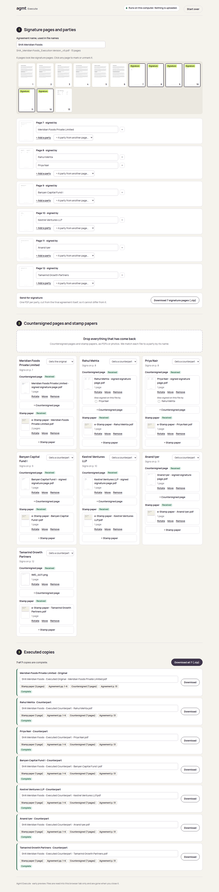

# Agmt Execute

Assemble executed copies of a multi-party agreement in the browser. Nothing is
uploaded.



## What it does

1. **Signature pages and parties.** Add the final agreement as a PDF. Pages that
   read like signature pages are marked, and the signing parties' names are read
   from them. That works for one party per page, two or three parties on one
   page, and side-by-side blocks. Correct anything, then download one signature
   page PDF per party to send out. The pages are cut from the final PDF, so they
   cannot drift from the agreed version.
2. **Returns.** Drop in countersigned pages and stamp papers as they arrive, as
   PDFs or phone photos. Each file is matched to a party by its file name, and
   you confirm. Photos are turned upright and fitted to the agreement's page size.
   One scan signed by several parties on a shared page counts for all of them.
   A party can have several stamp-paper sheets, in the order you choose.
3. **Executed copies.** Each party gets the original or a counterpart, or no
   copy. Each copy is that party's stamp paper, then the agreement, with every
   signature page replaced in place by its countersigned page. File names are
   suggested and editable, e.g.
   `SHA Meridian Foods - Executed Counterpart - Banyan Capital Fund I.pdf`.
   Download one copy or all of them as a zip. Copies still waiting on a return
   keep the unsigned page and say whose page is missing.

"Try a sample deal" loads a made-up 13-page shareholders' agreement with
seven parties and specimen stamp papers.

## Privacy, enforced by the browser

The built page has a Content-Security-Policy with `connect-src 'none'`. The
browser refuses every network request the page might make (fetch, XHR,
WebSocket, beacon), so documents cannot leave the machine, even through a bug.
Once loaded, the page works with the internet switched off. Files are held in the
tab's memory and are gone when it closes.

## Run it

```sh
npm install
npm run dev          # http://localhost:5173
npm test             # unit tests + the sample deal through pdf.js and pdf-lib
npm run build        # static site in dist/, host anywhere
npm run e2e          # after build: drives the built app in Chromium
```

`dist/` is a static site with relative paths, so it can be served from any
host or sub-path (for example `agmt.legal/execute`).

## How it works

| Piece | File | Notes |
|---|---|---|
| Signature-page detection, party names | `src/lib/detect.ts` | Text rules over pdf.js text, column-aware. Suggestions only. |
| Page order of a copy | `src/lib/plan.ts` | Pure function, tested without PDFs. |
| PDF assembly | `src/lib/render.ts` | pdf-lib. Same code in the browser and Node. |
| Screen state | `src/lib/state.ts` | Plain data and pure updates. File bytes stay outside it. |
| Browser I/O | `src/lib/browser.ts` | pdf.js (legacy build, for older office browsers), photo normalisation, zip. |
| Sample deal | `src/lib/sample.ts` | Synthetic. Every name and "stamp paper" is invented and marked specimen. |

Open-source parts: pdf.js (Apache-2.0), pdf-lib (MIT), fflate (MIT),
React (MIT), Manrope (OFL).

## Known limits of this preview

- The agreement must be a PDF. An image-only scan has no text, so signature
  pages must be marked by hand.
- Detection is a heuristic. Always glance at the marked pages.
- Returned pages are not yet checked against the final text (planned: local OCR).
- iPhone HEIC photos cannot be read by Chrome or Edge. Send them as JPG or PDF.
- Work is not saved between sessions (planned: save and resume a deal file locally).
- Tested in Chromium. Safari and Firefox are not yet tested.
