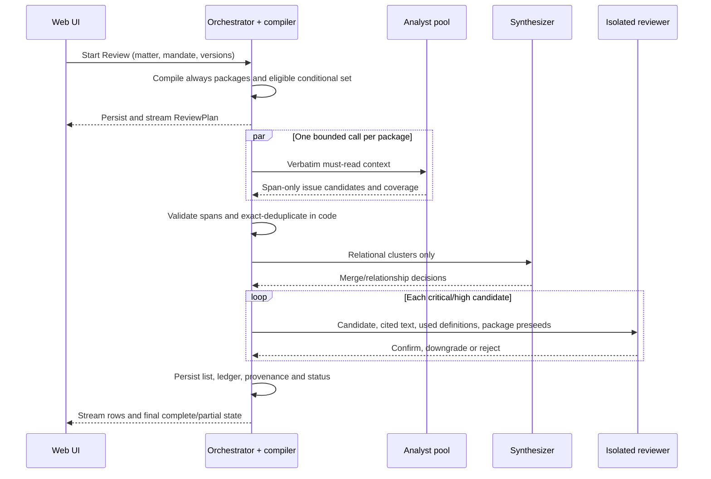

# Agmt Development Specification

**Status:** Implementation contract for v1

**Date:** 27 August 2026

**Repository baseline:** `Daaktor0/AgmtAgent` at `fa945eb511f917821d41bb2fc062f118f4b95e33`

**Companion schema:** [DATA-MODEL.md](DATA-MODEL.md)

The terms **MUST**, **MUST NOT**, **SHOULD** and **MAY** are normative. An **OPEN** item is not
permission to improvise; it requires the founder decision stated in Section 14.

## 0. Status and reading order

### 0.1 Ship boundary

| Release boundary | Included | Excluded |
|---|---|---|
| v1 | Google and email magic-link sign-in; per-user Matters; native DOCX ingest; canonicalisation confirmation; Proof; the six-package SHA / Company / signing Review slice; Key Issues List; dispositions; internal report export; accepted-item tracked-change DOCX; thin Mail | Word add-in; chat; SSA, SPA and disclosure-letter Review packages; capital and exit packages; matter-extra packages; BYOK; public sharing; team workspaces |
| Immediately after v1 | Deterministic v2 document diff against persisted issue lineage and dispositions | Re-reviewing a new file version as an empty Matter |
| SPEC-NEXT | Further catalogue packages, multi-file cross-document Review, BYOK settings, Matter chat tool loop | Any change to v1 evidence, tenancy or catalogue invariants |

Proof MUST remain useful without Review. Review MUST remain unavailable outside the supported v1
route even if a model could produce a plausible answer.

### 0.2 Reading order

1. Read Sections 0, 1 and 13 to understand the boundary and build order.
2. Read Sections 4–7 before implementing any model call.
3. Read Sections 8 and 9 before implementing exports or Mail.
4. Read [DATA-MODEL.md](DATA-MODEL.md) before creating migrations.
5. Treat Section 12 as the release gate, not post-launch analytics.

### 0.3 Wall sequence

| Order | Slice | User-visible outcome | Hard gate before the next slice |
|---:|---|---|---|
| 0 | Auth, Matter, upload, map, Proof | A verified user can create a Matter, upload a DOCX, confirm the canonicalisation map and receive deterministic Proof results | No model call; tenancy tests pass; all Proof quotes are filled from stored offsets |
| 1 | Proof corpus runner | A check version cannot change without replaying 12–13 labelled agreements | Every must-find is found; every trap and not-a-defect remains quiet |
| 2 | DocumentIndex quality | The user sees the outline, deal map, source quality and any incomplete-source warning | Every extracted non-blank line has one text-owning leaf or `unclassified`; Review gating is deterministic |
| 3 | SHA Review | A paid user acting for the Company at signing receives a streamed, reviewable Key Issues List and can record dispositions | All six packages appear in the coverage ledger; citation-faithfulness is 100%; partial runs name unread scope |
| 4 | Exports | The user can download an internal list report and a tracked-change DOCX containing eligible accepted edits only | Redline round-trip tests pass; no rejected/internal-only content leaks |
| 5 | Mail | The user can create, edit and copy one of three grounded drafts after a Review list exists | Every generated factual sentence traces to eligible row IDs; no send path exists |
| 6 | Version lineage | A newer version is classified against existing issues as still open, resolved, changed or new | Rejected unchanged lineages do not resurrect; version-lineage eval gate passes |

Proof MUST NOT be moved behind Review. A later slice MUST consume the persisted objects produced by
earlier slices; it MUST NOT create a parallel document or issue store.

### 0.4 Treatment of the current repository

| Existing seam | Required treatment |
|---|---|
| `agent/document/` and its versioned check registry | Reuse deterministic parsing/check patterns where they satisfy this specification. Replace paragraph-only ownership with the Section 4 provision tree. |
| `agent/memory/`, run events and checkpoints | Reuse migration and event-ledger patterns. Production storage MUST add user ownership and the objects in DATA-MODEL.md. SQLite MAY remain for tests; production MUST use a transactional multi-user relational store. |
| `agent/schemas/evidence.py` | Replace. A model MUST NOT submit `exact_quote`, quote hashes or quote text. It submits offsets only. |
| `agent/router.py` | Replace live-family resolution. Every role MUST resolve from a versioned pinned-model configuration and MUST fail closed. |
| Existing supervisor/tool loop | It MAY remain for legacy tests but MUST NOT power v1 Review. Review MUST use the catalogue-compiled runtime in Section 6. |
| `addin/`, contextual commands, action tickets and public share tokens | Legacy only. They MUST NOT be exposed by the v1 web app. |
| `catalog/manifest.xml` | Legacy add-in manifest, not the legal Review catalogue. New work-package YAML MUST live under `catalog/review/`. |

The production relational target is PostgreSQL because authenticated users and concurrent background
runs require transactional tenancy. Object storage remains vendor-neutral and stores only encrypted
blobs under opaque keys.

## 1. Product and non-goals

### 1.1 Product contract

| Item | Requirement |
|---|---|
| Name | The product MUST be called **Agmt**. The modes MUST be **Proof** and **Review**. The UI, code-facing product copy and exports MUST NOT use “Agmt Standard”. |
| Surface | The launch surface MUST be a web app. Agmt MUST return a tracked-change DOCX that opens in Word. It MUST NOT require a Word add-in. |
| User | Indian transactional counsel. The supported instrument family is SHA, SSA, SPA and disclosure letters; v1 Review is narrower as stated below. |
| Matter | A Matter is one deal pack and MAY own multiple logical Documents and immutable Document Versions. A run is an event inside a Matter. |
| Free mode | Proof MUST make no language-model call. It MUST run deterministic parsing, canonicalisation, mechanical checks and deal-map generation. |
| Paid mode | Review MUST call only the pinned hosted orchestration path in v1 and MUST produce a Key Issues List. |
| v1 Review route | Instrument = SHA; represented party = Company; stage = signing; package set = the six entries in Section 7. |
| Responsibility | Agmt does not provide legal advice. A lawyer MUST review the output and is responsible for the document signed or shared. |

**The unit of value is the matter, not the run.**

### 1.2 Non-goals

Agmt MUST NOT implement or present itself as any of the following:

- a CLM, document repository, e-signature service, obligation manager or legal-research product;
- a litigation product, Google Docs integration or in-browser Word replacement;
- a general legal chatbot or “AI for all of legal”;
- a Harvey, Spellbook or Ivo clone;
- a consumer ChatGPT, Claude or Grok subscription bridge;
- a system that sends email, signs a document or makes the lawyer’s decision.

The launch marketing site MUST NOT promise pricing, SOC 2, an accuracy percentage, model names or
Mail. The separate `site/` waitlist app MUST NOT accept documents or share product data stores.

### 1.3 Forbidden product shortcuts

- Review MUST NOT accept a raw document dump plus a free-form prompt as its plan.
- A memo MUST NOT be the primary Review object. A memo or PDF is an export of the list.
- Chat MUST NOT be the home screen and MUST NOT be required for v1.
- Agmt MUST NOT create a signature page. It MAY inventory named parties, existing signature blocks
  and mismatches. A missing block becomes a Review issue.
- No user-facing or server-side path MAY silently truncate a document.

## 2. Personas and mandate

### 2.1 Personas

| Persona | Primary job | v1 actions |
|---|---|---|
| Associate | Prepare and quality-control a deal pack for partner review | Create Matter; upload; confirm map; run Proof/Review; inspect evidence; edit, accept, reject or park rows; mark accepted rows shareable; export; prepare Mail draft |
| Partner | Decide the legal position and communication | Review critical/high rows and coverage; change dispositions; approve/edit language; download partner pack or redline; create partner/client/team draft |

These are workflow personas, not v1 permission roles. v1 is per-user and has no shared Matter or team
workspace. The authenticated owner has all actions on that owner’s Matters and none on another user’s
Matters.

### 2.2 Mandate chip

| Field | Type | Rule |
|---|---|---|
| `represented_party` | enum | `company \| promoter \| investor \| seller \| purchaser \| other`. v1 Review supports `company` only. |
| `instruments` | non-empty set | `sha \| ssa \| spa \| disclosure_letter`. It describes the Matter; each Document also has an instrument classification. |
| `stage` | enum | `drafting \| negotiation \| signing \| closing`. v1 Review supports `signing` only. |
| `must_protect_notes` | text, nullable | User instructions that change priority or the desired position. They MAY guide analysis but are not evidence of a document fact. |

The mandate MUST be versioned and immutable after use. Model payloads MUST receive the confirmed
defined-term projection of the notes and MUST have direct identifiers removed using the Matter’s
confirmed map.

Changing any chip field MUST:

1. create a new `mandate_version` and hash;
2. invalidate unstarted Review plans and estimates based on the former version;
3. mark completed runs and their rows as “Based on an earlier mandate” without deleting them or their
   dispositions; and
4. require a new Review before Agmt claims current-mandate coverage.

Changing a Matter display name MUST NOT invalidate a plan. A run MUST persist the exact mandate
version it used.

## 3. Information architecture

### 3.1 Required walk

The first-use path MUST be:

**sign-in → new Matter → upload pack → confirm canonicalisation map → Proof results → Run Review →
Key Issues List → row detail → dispositions → download report/redline → Mail**

The first authenticated paint MUST be “New Matter” or the user’s Matter list. It MUST NOT contain a
chat box, generic prompt box, fake risk dashboard or model picker.

### 3.2 Screens and states

| Screen | Purpose and primary actions | Empty, error and partial states | Hidden in v1 |
|---|---|---|---|
| Sign-in | Google sign-in; request single-use email magic link; sign out | Expired/used link, unverified email, rate limit and disabled-account messages MUST reveal no document metadata | Password auth, SSO, organisation selection |
| New Matter / Matter list | Create Matter; set name and mandate chip; reopen an owned Matter | Empty state: “Create your first Matter.” Failed ownership checks return not-found, not another owner’s metadata | Usage dashboard, team activity, precedent feed |
| Upload pack | Add one or more logical Documents; identify instrument and role; upload a newer version from a Document row | Unsupported type; corrupt/encrypted DOCX; >80-page refusal; duplicate checksum; PDF “Upload the native Word (.docx) file” state | Repository search, drag-in from Drive, cross-Matter file reuse |
| Canonicalisation map | Review legal-name→defined-term mappings and identifier removals; correct false matches; confirm the map version | Collision, undefined replacement or unreviewed identifier candidate blocks confirmation. The original remains unchanged | Model preview, raw provider payload, automatic confirmation |
| Proof results | Show deal map, mechanical hits, signature inventory, suppressed checks and source-quality banner; rerun after map change | No hits MUST read “No Proof issues found” only if all required checks ran. A partial state MUST list suppressed checks. Refused files MUST not show a clean result | Review prose, chat, model-generated explanations |
| Run Review | Show supported-route check, planned package names, estimated charge/run debit, page basis, optional “Include proposed language” and stronger supervisor/reviewer override; start run | Unsupported mandate; unconfirmed map; insufficient entitlement; no usable outline; 400-page pack warning; in-progress reconnect | Model slug picker, package editor, free-form reading list |
| Key Issues List | Matter home after the first Review; show active rows, coverage status and run/mandate version | Empty complete: “No issues were recorded in the completed package set.” Empty partial MUST name unread scope and MUST NOT imply a clean review | Memo-first view, chatbot, raw chain of thought |
| Row detail | Show server-filled quote in context, provision path, mandate-why, ask, reviewer stamp, coverage flag and permitted proposed language | Stale evidence version, incomplete source and reviewer-unreviewed states are visible. Invalid spans never render a row | Analyst/synth/reviewer reasoning, unrelated package findings |
| Dispositions / graveyard | Accept, edit, reject or park; separately toggle shareable after acceptance; inspect user-rejected lineages | Editing an accepted row resets acceptance; rejected rows remain searchable in the graveyard | Auto-learning or auto-suppression from one decision |
| Downloads | Export partner-pack PDF/DOCX; build accepted-item tracked-change DOCX | Block/omit accepted rows lacking language; block overlapping edits; show exact excluded row IDs and reason | Signature-page generator, e-sign, browser document editor |
| Mail | Select partner brief, client update or team update; add prompt; paste house skeleton; edit and copy/download draft | Missing eligible rows; unsupported fact gap; stale trace after user edit | Send button, recipient sync, other-side cover letter, Proof-to-Mail |

The UI MAY stream package progress, but progress cards MUST be derived from persisted run events and
coverage rows. It MUST NOT fabricate percentages from elapsed time.

## 4. Ingest and DocumentIndex

### 4.1 File boundary

| Source | Proof | Review | Redline |
|---|---|---|---|
| Native `.docx` | Required v1 path | Allowed if all gates pass | Allowed against the exact encrypted original version |
| Text-bearing `.pdf` | MAY use Docling as a Proof-only fallback | Not allowed in v1 | Not allowed |
| Scanned or low-quality PDF | Refuse with “Please upload the native Word (.docx) file.” | Not allowed | Not allowed |
| Any other type | Refuse | Not allowed | Not allowed |

v1 MUST NOT add OCR-offset infrastructure. Docling MUST NOT replace the native DOCX segmenter. PDF
fallback MUST be labelled Proof-only and MUST NOT create a Review CTA.

### 4.2 Ingest order

For a DOCX, the server MUST perform these steps in order:

1. virus/file-integrity screening and source checksum;
2. native OOXML extraction using `python-docx` plus read-only OOXML inspection where required for
   comments, fields, hidden characters and revisions;
3. page-count determination and the 80-page gate;
4. provision-tree and definition-graph construction;
5. proposed canonicalisation map construction and user confirmation;
6. canonical projection and reversible span-map creation;
7. deterministic Proof checks and deal-map generation; and
8. persistence of the DocumentIndex and Proof result.

No model MAY receive content during these steps. Digests are generated only after the user starts a
paid Review, never as part of free Proof.

### 4.3 Provision tree

The DocumentIndex MUST contain text-bearing leaves for clauses, subclauses, schedules, annexes,
definition entries, recitals, signature blocks and `unclassified` runs. Internal tree nodes MAY
represent document, part, schedule or clause hierarchy but MUST NOT also own child text.

Every extracted non-blank line MUST belong to exactly one text-owning leaf. Blank layout-only lines
MAY be stored as layout metadata. The following are forbidden:

- token-window chunks;
- overlapping text ownership between parent and child nodes;
- dropping headers, table cells, schedules or signature text without a capability warning; and
- creating a generic vector/RAG index as the reading plan.

Each leaf MUST have a stable version-scoped `provision_id`, parent, order, node type, number, heading,
scope, source XML anchor, source character range, canonical text, canonical character range,
structural path and classification confidence. Models address characters relative to the canonical
text of one `provision_id`.

### 4.4 Definition graph

A definition key MUST be:

`document_id + document_version_id + scope_type + scope_id + normalised_term`.

Scopes MUST distinguish main body, clause-local, schedule-local and annex-local definitions. A
schedule-local definition MUST NOT overwrite or silently qualify a main-body definition. The graph
MUST store the defining span and every operating-use span. SHA, SSA and disclosure-letter Documents
MUST NOT share one global value for the same term.

### 4.5 Canonicalisation

Canonicalisation MUST follow this precedence:

1. Identify defined-term declarations, mark their spans for mapping and protect the defined-term token
   itself. Protection does not exempt other text in the declaration from identifier detection.
2. Build candidates from running legal names that have an explicit defined term in that Document and
   scope. If the defined term is itself the legal name, leave it unchanged.
3. Replace exact legal-name occurrences, including the legal-name span in its declaration, with the
   defined term. Collapse duplicate declaration tokens deterministically and retain `defined_party`
   as definition-graph metadata, so the model does not need the legal name. Do not guess a defined
   term from abbreviations or party roles. If the defined term is itself the legal name, leave it.
4. Run Presidio across the resulting projection, including definition declarations, with versioned
   Indian recognisers for email, phone, PAN, Aadhaar, GSTIN, DIN, CIN,
   passport, bank-account/IFSC and residential address. Deterministic validators MUST confirm
   checksum/format rules where available.
5. Replace confirmed identifiers with document-version-scoped typed placeholders such as
   `[PAN_1]`. Repeated identical identifiers in the same version MUST receive the same placeholder.
6. Do not mask amounts, dates, percentages, clause numbers, governing law or defined terms.
7. Create a bidirectional per-provision span map between source text and canonical text. Replacements
   MUST NOT destroy the source anchor needed for a later redline.

The confirmation screen MUST show every proposed legal-name mapping and identifier category/count.
The user MAY correct a legal-name mapping or mark a detector result “not an identifier”. The user MUST
NOT directly edit the canonical text. Confirmation creates an immutable map version. Any correction
creates a new map version, canonical projection and Proof run.

The original DOCX is never rewritten by canonicalisation. The map is reversible for the authorised
server and redline engine; models receive neither the encrypted original nor raw map values. Reports,
list quotes and Mail MUST remain on defined terms and MUST NOT de-canonicalise names or identifiers.

### 4.6 Digests and deal map

Provision digests MUST be two or three sentences, generated by the pinned digest model from the
confirmed canonical projection after Review starts. A digest MUST be marked `routing_only=true` and
MUST NOT be accepted as evidence for a plan justification, issue, reviewer decision, export or Mail.

The deterministic deal map MUST inventory the following fields, each with a source span and extraction
method: parties/roles, stated instrument, governing law, signing/effective date references, economics,
conditions precedent, closing, conditions subsequent, continuing obligations, warranties,
liability/remedies, termination, governance/control, transfer/exit and schedules/annexes. A missing or
uncertain item MUST remain absent/uncertain; the map MUST NOT fill it from a model’s general knowledge.

### 4.7 Structure and source quality

`structure_confidence` MUST be deterministic and versioned. Initial component weights are:

| Component | Weight |
|---|---:|
| Classified non-blank character coverage | 0.40 |
| Outline continuity | 0.25 |
| Numbering consistency | 0.15 |
| Definition recognition/use mapping | 0.10 |
| Table extraction completeness | 0.10 |

An unclassified condition is **material** if unclassified leaves contain more than 10% of non-blank
characters or any one unclassified leaf exceeds 2,000 characters. A usable outline exists if the
index has at least one recognised top-level legal provision and either at least 50% classified
character coverage or three consistently ordered numbered provisions.

| Condition | Proof | Review |
|---|---|---|
| Native DOCX, usable outline, no material unclassified text | Run | Run normally |
| Usable outline but material unclassified text or missing hierarchy | Run with banner | Run with `incomplete_source`; affected packages are incomplete |
| Low confidence but still usable outline | Run with suppressed-check detail | Run with `incomplete_source`; never imply full coverage |
| Corrupt/encrypted/unreadable or no usable outline | Refuse affected file | Refuse and request a better native DOCX |
| A required provision read fails twice during Review | Preserve Proof | Stop Review, mark failed source and request a better native DOCX |

The weights and thresholds MUST be constants under an `index_quality_version` and MUST be replayed
against the golden corpus before change.

`source_quality` MUST be `high` at confidence 0.85 or above with no material-unclassified flag,
`medium` from 0.60 to below 0.85, and `low` below 0.60 while an outline remains usable.
`unreadable` is reserved for parse failure, no legal text or no usable outline.

### 4.8 Document versioning

The source checksum MUST be SHA-256 over the exact uploaded bytes. Re-uploading the same checksum to
the same logical Document MUST return the existing Document Version. A different checksum uploaded
through “New version” MUST create the next immutable version and `supersedes_version_id`; it MUST NOT
overwrite the original, projection, index, runs or rows of an earlier version.

Adding a same-named file through “Add document” MUST NOT silently treat it as a new version. The user
MUST choose the logical Document relationship. Every plan, row, export and Mail draft MUST bind the
Document Version, canonicalisation-map version and evidence version used.

## 5. Proof

### 5.1 Check registry contract

Each deterministic check MUST be registered once under a stable ID. A registry row MUST contain:

| Field | Type | Rule |
|---|---|---|
| `check_id` | string | Stable dotted ID. Renaming creates a new check; it does not mutate history. |
| `version` | positive integer | Increment when detection or exception behaviour changes. |
| `family` | enum/string | Routing family such as `structure`, `defterm`, `exec`, `amount` or `party`. |
| `default_severity` | `high \| medium \| low` | Display severity before any user action. |
| `certainty` | `exact \| heuristic` | Heuristic hits MUST be labelled. |
| `must_find` | boolean | Whether a labelled positive fixture is a hard release gate. Fixture labels remain authoritative for a particular document. |
| `requires_capabilities` | set | Missing capability suppresses the check and records why; it is not a pass. |
| `scope` | `document \| matter` | v1 minimum checks are document-scoped. |
| `exception_notes` | list | Deterministic exclusions, each with fixture coverage. |
| `runner` | internal function reference | Versioned deterministic function; no model or remote call. |

A check runner MUST return `provision_id + start + end + detail_code + detail_args`. It MUST NOT
return a quote as authority. The server validates the range and fills the quote from the stored
canonical projection.

### 5.2 Minimum v1 checks

The following are launch requirements. Matching IDs already present in the repository MUST be
preserved. New IDs below fill closed Proof gaps; they are not optional extensions.

| Check ID | Default | Must-find | Deterministic exception notes |
|---|---|---:|---|
| `defterm.undefined_candidate` | low, heuristic | yes | Ignore sentence-initial capitals, headings, party names protected by the map and configured legal stopwords; a fixture decides whether a candidate is a defect |
| `defterm.unused` | low, exact | yes | Ignore a term’s defining span; recognise grammatical variants only through versioned rules; intentionally unused terms are labelled traps/not-a-defect |
| `structure.broken_xref` | high, exact | yes | Resolve clause, paragraph, schedule and annex namespaces; external statutory references are not internal cross-references |
| `structure.numbering_gap` | medium, exact | yes | Respect omitted-number declarations and schedule-local numbering |
| `structure.duplicate_number` | medium, exact | yes | The same visible number in different schedule/body namespaces is not automatically a duplicate |
| `exec.signature_block_mismatch` | medium, exact | yes | Compare the mechanically extracted party inventory with existing blocks; do not infer or generate a missing page |
| `exec.hidden_character` | medium, exact | yes | Flag bidi controls, zero-width characters and soft hyphens inside legal tokens; ordinary spacing/layout controls are excluded |
| `exec.suspicious_field` | medium, exact | yes | Flag unresolved merge/property/include/link fields and external field targets; page number, TOC and valid internal REF fields are excluded |
| `amount.table_prose_conflict` | high, exact | yes | Compare same-labelled figures/percentages/thresholds only; coincidental numbers without a deterministic shared label are not a clash |
| `party.header_counterparty_mismatch` | high, exact | yes | Compare title/header/parties block and defined party roles; formatting abbreviations are normalised, but different legal entities are not |
| `exec.unfilled_placeholder` | high, exact | yes | Use the versioned placeholder lexicon; bracketed defined terms and optional drafting alternatives are excluded by explicit rules |
| `exec.unresolved_comment` | medium, exact | yes | Run only when comments were extracted; missing comment capability is a suppression |

Existing deterministic checks MAY remain enabled only if they have stable IDs, exception fixtures and
the same suppression discipline. They are not a substitute for any minimum check above.

### 5.3 Proof hit

A Proof hit MUST follow the `proof_hit` schema in DATA-MODEL.md. In particular, it binds one
Document Version, canonicalisation map, provision and valid range; stores the check ID/version and
certainty; and receives its displayed quote from the server. A suppression is a separate ledger entry,
not a zero-hit result.

### 5.4 Proof-to-Review preseeds

The compiler routes by check ID and deterministic provision ownership. It MUST NOT ask a model to
classify a Proof hit.

| Proof check IDs | Package preseeds |
|---|---|
| `defterm.undefined_candidate`, `defterm.unused` | `wp-sha-architecture`; also the package owning the affected provision |
| `structure.broken_xref`, `structure.numbering_gap`, `structure.duplicate_number` | `wp-sha-architecture`; also the package owning the target/source provision |
| `exec.signature_block_mismatch` | `wp-india-execution-formalities`, `wp-india-corporate-authority` |
| `exec.hidden_character`, `exec.suspicious_field`, `exec.unfilled_placeholder`, `exec.unresolved_comment` | `wp-india-execution-formalities` |
| `amount.table_prose_conflict` | Package owning the provision; fallback `wp-sha-architecture` when ownership is unresolved |
| `party.header_counterparty_mismatch` | `wp-sha-architecture`, `wp-india-execution-formalities`, `wp-india-corporate-authority` |

Only hit IDs and check IDs enter the plan compiler. A package context MAY hydrate those IDs into
server-derived spans and detail codes. A digest is never used as a preseed.

### 5.5 Golden-corpus loop

The Proof corpus MUST contain 12–13 labelled agreements before a check change merges. Each fixture
MUST identify:

- `must_find`: exact check ID and expected locus;
- `trap`: drafting that resembles a defect but MUST NOT fire; and
- `not_a_defect`: a previously disputed hit that the human label says is acceptable.

Every registry addition, version increment, recogniser change, exception change or segmentation change
MUST rerun the full corpus. A missed must-find, a trap fire or a not-a-defect regression fails the
change.

A user’s “not a defect” vote MUST create a human-review ticket containing the hit/check versions and
user note. It MUST NOT suppress the check for that user, disable it globally or train a model
automatically. A later promotion from Review to Proof is allowed only where the issue can be stated
without “usually” and without a mandate; promotion means adding a new versioned deterministic function
and fixtures.

### 5.6 Proof completion

Proof is done for a file only when:

1. the file and page gates have passed;
2. a canonicalisation map version is confirmed;
3. every required v1 check is `completed` or expressly `suppressed` with a missing capability;
4. every valid hit has a server-filled quote and source/canonical span mapping;
5. the deal map, signature inventory, quality metrics and suppressed-check ledger are stored; and
6. the UI shows `complete`, `partial` or `refused` without implying that partial/refused is clean.

## 6. Review runtime

### 6.1 Entry conditions

v1 Review MUST start only when all of the following are true:

- the authenticated user owns the Matter and selected Document Version;
- Proof exists against the same confirmed canonicalisation-map version;
- the mandate is exactly SHA / Company / signing;
- the source is a native DOCX with a usable outline;
- the six v1 catalogue packages compile; and
- the user has Review entitlement and has confirmed the displayed estimate.

A Proof-only PDF, a stale map, an unsupported mandate or a plan with an unknown required package MUST
fail closed before any model call.

The Review request MAY set `include_proposed_language=true`; it defaults false and is the typed
explicit drafting request used by `record_issue`. It does not create a general Review prompt or
widen any package.

### 6.2 Runtime sequence

Planner, analyst, synthesizer and reviewer outputs MUST be persisted as typed events. Their private
reasoning MUST NOT be persisted or shown.

### 6.3 Catalogue compiler and ReviewPlan

The compiler inputs are:

- instrument classification and user-confirmed instrument;
- represented party and stage from the mandate version;
- catalogue version/checksum;
- DocumentIndex signals;
- Proof hit IDs and check IDs; and
- availability/implementation status of packages.

The compiler MUST first add every matching `activation=always` package. The planner model MAY then
propose only `activation=conditional` package IDs whose catalogue signal predicate is satisfied. The
compiler validates the proposal and adds valid IDs. The planner MUST NOT delete, reorder out of
priority, rename or replace an always package, and MUST NOT freehand provisions or issue types.

A planner failure MUST fall back to the compiled always plan. It MUST NOT block Proof. An implemented
conditional rule is a boolean expression over existing deterministic signals—present/absent heading
type, defined-term type, Proof check ID, document role or instrument—not a new ML classifier.

The immutable ReviewPlan MUST include its mandate version, Document Versions, catalogue version,
package instances, resolved must-read provision IDs, required definition IDs, preseed hit IDs,
conditional activation reasons, budget reservation and plan version.

### 6.4 Package context

Each analyst receives one package payload containing only:

1. the canonical verbatim text of resolved `must_read` provisions;
2. the canonical verbatim defining entries and use-site provisions for required defined-term types;
3. the relevant mandate slice;
4. hydrated Proof hits whose IDs preseed that package;
5. required mandatory-overlap provision text; and
6. the package allow-list and output contract.

The skill prefix is separate from this payload. Digests MAY help the compiler resolve a semantic
heading to a provision ID, but analysts MUST receive the provision text, not the digest, as context.

An analyst MAY use `get_clause` once. The tool accepts one valid provision ID in the same Document
Version and returns canonical verbatim text plus definitions used by that provision. Search, “read
more”, arbitrary retrieval and token-window expansion are not analyst tools in v1.
No Review role has a browser, legal-research tool or access to another Matter.

### 6.5 Ten-branch plan-miss and replan policy

The implementation MUST encode these ten branches in this order:

1. If the requested provision is already in package context, return the existing provision and do not log a miss.
2. If the provision ID is invalid or belongs to another version/user, deny the call and mark the package incomplete.
3. On the first valid out-of-plan request, return that one clause and log `plan_miss` with package, provision and stated reason.
4. Mark the miss material only if the clause supplies candidate evidence or a mandatory overlap; otherwise mark it non-material.
5. A non-material miss with complete must-read coverage does not replan; the analyst finishes.
6. A material miss confined to the same package expands that package and increments `replan_count`.
7. A material miss implicating another implemented package adds it only if its catalogue conditional predicate passes, then increments `replan_count`.
8. A miss implicating an unimplemented/SPEC-NEXT package does not freehand review; record a coverage gap and make the run partial.
9. At `replan_count=2`, permit no further replan; retain already validated evidence and mark any later miss/package incomplete.
10. A segmentation/source read failure does not consume a replan: retry the indexed read once, then stop Review as a persistent source failure and request a native DOCX.

A package analyst MUST NOT receive a second `get_clause`. Replan recompiles package context and runs
a new bounded analyst call; it does not continue an unbounded conversation.

### 6.6 `record_issue` contract

**No quote, no finding.** A candidate becomes a row only after the server validates its range and
fills the quote from the bound projection.

The analyst supplies exactly these nine fields:

| # | Field | Type | Validation |
|---:|---|---|---|
| 1 | `provision_id` | ID | Must be in package context or the one allowed fetched clause |
| 2 | `issue_type` | string | Must be in that package’s allow-list |
| 3 | `severity` | `critical \| high \| medium \| low` | Must follow the consequence rubric below |
| 4 | `quote_start` | non-negative integer | Canonical character offset within the provision |
| 5 | `quote_end` | integer greater than start | Must be in range and non-empty |
| 6 | `mandate_why` | text | MUST state why it matters for this represented party/stage; MUST NOT cite a digest |
| 7 | `ask` | text | Minimum actionable position, not a memo |
| 8 | `proposed_language` | text or null | Must be null unless the user explicitly requested drafting for the run |
| 9 | `absence_evidence` | object or null | Required for an absence claim; forbidden for a positive-span claim |

The server supplies package IDs, Matter/mandate/document versions, the quote, source offset, issue ID,
lineage ID, evidence version, run provenance and initial state. It MUST reject the entire candidate if
the range is invalid. It MUST NOT repair a quote or search for “similar wording”.

Severity means:

| Severity | Consequence |
|---|---|
| critical | The stated signing/closing act may be invalid or impossible, or the Company faces an immediate uncapped/material control or economic exposure requiring partner decision before proceeding |
| high | A material right, remedy, liability, governance or transfer mechanic can operate against the mandate or fail when needed |
| medium | The drafting can misoperate, conflict or create avoidable execution/negotiation risk but does not meet high |
| low | A contained clarity or formality point worth fixing at signing; not style-only |

An absence claim MUST include server-verifiable `searched_scope`, `expected_item`, an anchor
provision and span, and a `negative_inventory` generated from the index. A quotation without that
inventory is insufficient. Examples include no signature block for a named party, no referenced
schedule or no claims-procedure heading within the searched liability scope.

### 6.7 Exact deduplication

Before any synthesis, code MUST collapse candidates with the exact key:

`matter_id + mandate_version_id + document_version_id + provision_id + issue_type + quote_start + quote_end`

This key MUST NOT be replaced by a quote hash. The surviving record uses the highest severity; ties
use catalogue priority and then stable package ID order. It unions source package IDs and provenance
and stores all collapsed candidate IDs for audit. It does not concatenate model prose.

### 6.8 Synthesizer admission

Code-only merge is sufficient for exact duplicates. A cluster goes to the synthesizer only when two
or more validated candidates have a deterministic relationship signal:

- the same provision or mandatory-overlap pair and materially different asks;
- a shared defined-term or numeric threshold operating across the candidates;
- an absence claim that conflicts with a positive provision candidate;
- candidates from different packages that may duplicate a protection or remedy; or
- asks that cannot both be implemented.

The synthesizer receives candidate fields, source IDs, verbatim cited provisions and required
definitions. It MUST NOT receive analyst reasoning or digests. It MAY mark overlap, contradiction or
incompatible asks; merge candidates; or keep them separate. It MUST NOT create a new evidence span,
new issue type or unsupported fact. Every merged row retains all source candidate IDs.

### 6.9 Isolated reviewer

Every critical/high post-synthesis candidate MUST be reviewed. Medium/low candidates receive
`reviewer_stamp=unreviewed` in v1.

For one candidate, the reviewer receives only:

- the candidate row;
- its cited canonical provisions;
- definitions used by those provisions; and
- Proof hits that preseeded the candidate’s package.

The reviewer MUST NOT receive analyst, planner, supervisor or synthesizer reasoning, or findings from
other packages. Its output is `confirm`, `downgrade` with a lower severity, or `reject`, plus a
short typed reason. It cannot alter evidence or create an ask. Rejected candidates remain in audit
storage but do not appear in the active list. If any critical/high candidate cannot be reviewed, it
remains `unreviewed` and the run is partial.

### 6.10 Coverage ledger and partial runs

Every package instance MUST write a coverage row containing package/catalog versions, required status,
resolved/read/missing must-read provision IDs, required definitions, Proof preseeds, get-clause use,
plan misses, source flags, analyst/synth/reviewer status and skip/incomplete reason.

A run is `complete` only if every required package is complete, no persistent source gap affects it
and every critical/high active candidate has a reviewer decision. Budget exhaustion, an unimplemented
required package, skipped must-read scope, persistent source weakness or missing high/critical review
makes the run `partial`.

Partial copy MUST name what was not read. Required form:

> Partial review. Agmt did not complete: [package — missing heading/provision list]. Do not treat this
> list as a complete review of those areas.

“Some issues may be missing” is not sufficient. The final coverage panel MUST list skipped required
packages and provision IDs/headings. A budget hit MUST NOT be recorded as success.

### 6.11 Models, caching, cost and credits

| Role | v1 rule |
|---|---|
| planner | Pinned model; MAY add validated conditional package IDs only |
| analyst | Pinned model; one bounded package call and one allowed clause fetch |
| synthesizer | Pinned model; called only for admitted relational clusters |
| reviewer | Pinned isolated model; critical/high only |
| digest | Pinned cheap model; routing-only output |
| mail | Pinned model; eligible rows are its complete factual universe |

Each role MUST have an exact model ID, provider route and prompt version in a versioned server
configuration. No role MAY auto-upgrade or fall through to a “latest” family. A stronger
supervisor/reviewer override MUST itself be pinned and applies to one run only.

For credit/UI language, “supervisor” means the pinned synthesizer’s supervisory route; it MUST NOT
introduce a separate free-running supervisor loop. The stronger override swaps only the configured
stronger synthesizer and reviewer mappings.

The locked skill prefix is the versioned content of `skill/AGREEMENT-SKILL.md`. Its broad legacy
modes do not widen the v1 package/issue contracts. The prefix MUST use provider prompt caching; a
route without supported cache controls is not a valid pinned v1 route. Mandate, catalogue package payload,
canonical provisions, Proof hits and user prompt MUST remain uncached payload components. A run MUST
record role/model/provider, input/output/cached tokens, cost, request ID and ZDR status where known.

Mechanical Proof always runs, including when Review credits are zero. Before Review, the UI MUST show
the estimated commercial charge/range, Review-run debit and estimate basis. The estimate service MUST
use the current pinned rate card and a versioned function of page count, instrument and activated
mandate/package set; this specification does not set price numbers. A pack of 400 pages or more MUST
show an explicit large-run warning and require confirmation. A single file above the 80-page Proof
cap remains blocked and MUST be split; the 400-page warning therefore also covers a split multi-file
pack. A 400-page SPA MUST show both the large-source warning and the v1 unsupported-Review state; it
MUST NOT reach a model call.

Credits represent extra Review runs or one-run stronger supervisor/reviewer overrides. Tiers MUST NOT
be named Standard or Pro. If a Drafter is implemented later, it and any optional proposed-language
drafting MUST be dropped first when budget shedding is required. Required packages and high/critical
review may be skipped only with a `partial` result and explicit coverage entry.

## 7. Catalogue

### 7.1 Catalogue file and compiler contract

The Review catalogue is the legal reading contract. Each package YAML under `catalog/review/` MUST
validate against this shape:

| Field | Requirement |
|---|---|
| `package_id`, `version` | Stable ID and positive version |
| `implementation_status` | `v1 \| next`; `next` can load but can never schedule |
| `applies_to` | Instrument, represented party and stage predicates |
| `activation` | `always \| conditional` |
| `priority` | Stable integer used for execution/dedup ordering |
| `signals` | Boolean exists/does-not-exist predicates over DocumentIndex and Proof IDs |
| `must_read_heading_types` | Semantic heading types resolved to provision IDs |
| `required_defined_term_types` | Semantic term types; include definition and use sites when present |
| `mandatory_overlaps` | Other implemented package IDs whose intersecting provisions must be compared |
| `allowed_issue_types` | Exhaustive output allow-list |
| `proof_preseeds` | Stable Proof check IDs |
| `miss_looks_like` | Corpus scenarios that indicate a likely plan miss; not findings by themselves |
| `fixture_ids` | Required plan, issue, trap and overlap fixtures |

Adding a package MUST require YAML and fixtures, not runtime code. The compiler MUST fail validation
for duplicate IDs, unknown check IDs, unknown overlaps, empty allow-lists, an always package marked
`next`, or a conditional package without deterministic signals. The run stores the catalogue
checksum.

A heading type is a semantic catalogue label with a versioned deterministic synonym list. Failure to
resolve a must-read heading is a negative inventory/coverage event; it is not permission for the
analyst to substitute a digest or generic search.

For each mandatory-overlap package pair, the compiler MUST create provision edges from shared
must-read provision IDs, direct cross-references, shared required-defined-term use sites or the same
labelled numeric threshold. Both edge endpoints enter package/synthesis context. If no edge exists,
the ledger records `no_overlap_signal`; a model MUST NOT invent one from topical similarity.

### 7.2 v1 route

For SHA / Company / signing, all six packages below are `activation=always` and
`implementation_status=v1`:

1. `wp-sha-architecture`
2. `wp-sha-liability-remedies`
3. `wp-sha-transfer-rights`
4. `wp-sha-governance-control`
5. `wp-india-execution-formalities`
6. `wp-india-corporate-authority`

The planner cannot remove any of them. The rest of the catalogue—including capital, exit, SSA and
Matter-extra packages—is SPEC-NEXT. A missing SPEC-NEXT feature is not a v1 bug unless the v1
compiler schedules it; scheduling it is itself a bug.

### 7.3 `wp-sha-architecture`

| Catalogue field | v1 value |
|---|---|
| Must-read heading types | parties/recitals; definitions/interpretation; purpose/effectiveness/term; document precedence/entire agreement/amendment; schedule/annex inventory; accession/adherence architecture |
| Required defined-term types | Company; Promoter/Founder; Investor; Shareholder; Affiliate; Agreement; Effective Date; Closing/Completion; Investor Majority/consent threshold |
| Mandatory overlaps | all other five v1 packages where their provisions use an architecture definition or party category |
| Allowed issue types | `architecture.missing_or_incomplete_mechanic`; `architecture.internal_contradiction`; `architecture.definition_operation_mismatch`; `architecture.cross_reference_break`; `architecture.duplicated_protection`; `architecture.stage_mismatch`; `architecture.party_role_mismatch`; `architecture.schedule_dependency_gap` |
| Proof preseeds | `defterm.undefined_candidate`; `defterm.unused`; `structure.broken_xref`; `structure.numbering_gap`; `structure.duplicate_number`; `party.header_counterparty_mismatch`; fallback `amount.table_prose_conflict` |
| `miss_looks_like` | referenced schedule absent; global term resolved only in a local scope; inconsistent party category between parties/definitions/operative text; hierarchy or effectiveness clause contradicts an operative provision |

### 7.4 `wp-sha-liability-remedies`

| Catalogue field | v1 value |
|---|---|
| Must-read heading types | representations/warranties and undertakings used as triggers; indemnity; claims procedure; limitations/cap/basket/de minimis/survival; default/remedies/specific performance; termination and consequences; disclosure qualification references |
| Required defined-term types | Loss/Losses; Claim; Indemnified Person; Indemnifying Party; Fundamental Warranty; Business Warranty; Fraud; Wilful Misconduct; Subscription Amount/Investor Investment; Company; Promoter; Investor |
| Mandatory overlaps | `wp-sha-architecture` for definitions; `wp-sha-governance-control` for reserved-matter breach/remedy; `wp-sha-transfer-rights` for transfer enforcement/remedy |
| Allowed issue types | `liability.trigger_gap`; `liability.duplicate_recovery`; `liability.claimant_or_indemnifier_mismatch`; `liability.loss_definition_overreach_or_gap`; `liability.process_crystallisation_gap`; `liability.cap_scope_conflict`; `liability.threshold_mechanic_conflict`; `liability.survival_conflict`; `liability.carveout_conflict`; `liability.remedy_overlap`; `liability.termination_remedy_conflict`; `liability.company_shareholder_circularity` |
| Proof preseeds | definition and cross-reference checks; `amount.table_prose_conflict` where owned by liability; placeholder/comment hits within must-read provisions |
| `miss_looks_like` | cap exists outside indemnity; trigger points to an unread warranty schedule; claims process lacks a crystallisation step; gross-up and deemed loss duplicate recovery; limitation and survival clauses use inconsistent categories |

### 7.5 `wp-sha-transfer-rights`

| Catalogue field | v1 value |
|---|---|
| Must-read heading types | transfer restriction; permitted transfer; encumbrance; ROFR/ROFO/pre-emption on transfer; tag; drag; lock-in; transfer notice and closing; deed of adherence; registration/refusal mechanics |
| Required defined-term types | Transfer; Securities/Shares; Permitted Transfer; Affiliate; Investor; Promoter; Investor Majority; Tag Offer; Dragged Shareholder; ROFR/ROFO Offer; Deed of Adherence |
| Mandatory overlaps | `wp-sha-architecture` for actor definitions; `wp-sha-governance-control` for consent/registration; `wp-sha-liability-remedies` for enforcement; `wp-india-corporate-authority` for Articles/register mechanics |
| Allowed issue types | `transfer.actor_scope_mismatch`; `transfer.trigger_mismatch`; `transfer.quantity_or_priority_conflict`; `transfer.notice_or_timing_gap`; `transfer.price_or_terms_mismatch`; `transfer.closing_mechanic_gap`; `transfer.permitted_transfer_carveout_conflict`; `transfer.rights_interaction_conflict`; `transfer.invalidity_or_enforcement_overreach`; `transfer.deed_of_adherence_gap`; `transfer.encumbrance_gap` |
| Proof preseeds | definition, cross-reference and numbering checks; party mismatch; `amount.table_prose_conflict` where owned by transfer |
| `miss_looks_like` | class excluded from restriction but included in tag/drag; tag and drag both purport to control the same sale incompatibly; priority rights conflict; notice has no closing restriction; transfer consequence exceeds the actual invalidity wording |

### 7.6 `wp-sha-governance-control`

| Catalogue field | v1 value |
|---|---|
| Must-read heading types | Board composition/appointment/removal; Board and shareholder quorum/voting; reserved matters/investor consent; budget/Business Plan/ordinary course; information/inspection; committees/delegation; deadlock and fall-away |
| Required defined-term types | Board; Director; Investor Director/Nominee; Quorum; Investor Majority; Reserved Matter; Business Plan; Budget; Affiliate; ordinary course; consent threshold |
| Mandatory overlaps | `wp-sha-architecture` for definitions; `wp-sha-transfer-rights` for approval/registration; `wp-sha-liability-remedies` for breach consequences; `wp-india-corporate-authority` for statutory/Articles alignment |
| Allowed issue types | `governance.consent_threshold_mismatch`; `governance.quorum_deadlock_or_bypass`; `governance.board_appointment_removal_gap`; `governance.reserved_matter_overlap`; `governance.reserved_matter_scope_overreach_or_gap`; `governance.budget_ordinary_course_conflict`; `governance.information_right_gap`; `governance.shareholder_board_authority_conflict`; `governance.delegation_or_committee_gap`; `governance.statutory_approval_mismatch`; `governance.duration_or_fallaway_conflict` |
| Proof preseeds | definition/cross-reference/numbering checks; `amount.table_prose_conflict` in governance tables; placeholders/comments in the reserved-matters schedule |
| `miss_looks_like` | reserved-matters schedule absent; quorum fallback bypasses a consent right; rights survive below their fall-away threshold; budget exception conflicts with ordinary-course wording; duplicate debt/security/guarantee controls |

### 7.7 `wp-india-execution-formalities`

| Catalogue field | v1 value |
|---|---|
| Must-read heading types | execution/counterparts/electronic signature; signature blocks; witness/attestation; stamp duty/expenses; notices identity/address; deeds/accessions requiring execution; schedules/annexes requiring signature; effectiveness/date |
| Required defined-term types | Agreement; Party/Parties; authorised signatory; counterpart; electronic signature; Deed of Adherence; Notice; Effective Date |
| Mandatory overlaps | `wp-india-corporate-authority` for authorisation/capacity; `wp-sha-architecture` for party identity; `wp-sha-transfer-rights` for adherence deeds |
| Allowed issue types | `execution.party_signature_mismatch`; `execution.missing_signature_block`; `execution.signatory_capacity_mismatch`; `execution.counterpart_mechanic_gap`; `execution.electronic_execution_conflict`; `execution.attestation_or_witness_gap`; `execution.stamp_or_formality_gap`; `execution.schedule_execution_gap`; `execution.notice_identity_mismatch`; `execution.placeholder_or_pending_markup`; `execution.date_or_effectiveness_mismatch` |
| Proof preseeds | all `exec.*` minimum checks; `party.header_counterparty_mismatch`; structure checks affecting signature/schedule provisions |
| `miss_looks_like` | named party has no block; non-party has a block; entity block states the wrong capacity; deed/witness form conflicts with intended execution; signed schedule inventory is incomplete; execution and effectiveness clauses use different dates |

### 7.8 `wp-india-corporate-authority`

| Catalogue field | v1 value |
|---|---|
| Must-read heading types | incorporation/status/power/authority representations; Board/shareholder approvals; Articles alignment; corporate actions and effectiveness; authorised signatory; securities/share-capital descriptions relevant to the SHA; accession/binding; register/dematerialisation/filing mechanics where stated |
| Required defined-term types | Company; Promoter; Investor; Board; Articles; Act; Securities/Shares; authorised signatory; Effective Date; Closing/Completion |
| Mandatory overlaps | `wp-sha-architecture`; `wp-sha-governance-control`; `wp-sha-transfer-rights`; `wp-india-execution-formalities` |
| Allowed issue types | `authority.entity_or_status_mismatch`; `authority.power_or_capacity_gap`; `authority.board_or_shareholder_approval_gap`; `authority.articles_alignment_gap`; `authority.execution_authorisation_gap`; `authority.capital_or_security_description_mismatch`; `authority.pre_existing_rights_conflict`; `authority.corporate_action_sequence_gap`; `authority.statutory_register_or_dematerialisation_gap`; `authority.filing_or_effectiveness_gap`; `authority.accession_or_binding_gap` |
| Proof preseeds | party/header and signature checks; definition/cross-reference checks; `amount.table_prose_conflict` affecting securities/capital descriptions |
| `miss_looks_like` | Articles amendment/approval is referenced but not sequenced; signatory authority is unsupported; security class differs across parties/definitions/schedules; transfer registration assumes a corporate action not provided; an obligation requires an Affiliate action without a binding mechanism |

An analyst MUST NOT emit an `issue_type` outside its package allow-list. The server MUST reject, not
coerce, an out-of-list value.

## 8. Key Issues List, dispositions and lineage

### 8.1 The working object

The first completed or partial Review MUST emit a Key Issues List whose rows initially have
`disposition=null` and `shareable=false`. The list is Matter state, not a transient model response.
There is one current list projection per Matter. A later multi-file package run MUST append, update or
classify rows in that same Matter list; it MUST NOT create a separate per-file home or list.

| Field | Type | Rule |
|---|---|---|
| `issue_id` | ID | Unique row instance. Never reused across materially different evidence. |
| `lineage_id` | ID | Stable conceptual issue across runs/versions under Section 8.5. |
| `evidence_version` | positive integer | Increments when the cited span or absence inventory changes; not a quote hash. |
| `severity` | enum | `critical \| high \| medium \| low`, after reviewer downgrade if any. |
| `topic` / `package_id` | string / ID | Display topic and primary package; retain all `source_package_ids` after dedup/synthesis. |
| `issue_type` | string | Must be allowed by every candidate’s source-package contract. |
| `clause` / `provision_id` | display string / ID | Clause path is display metadata; provision ID is authoritative. |
| `quote` | text | Filled by the server from `quote_start/end`; models cannot supply or edit it. |
| `mandate_why` | text | Internal reason linked to represented party/stage. |
| `ask` | text | Actionable position. |
| `proposed_language` | nullable text | Allowed only after acceptance or an explicit drafting request; never silently generated. |
| `reviewer_stamp` | enum | `confirm \| downgrade \| reject \| unreviewed`. |
| `disposition` | enum/null | `null \| accepted \| edited \| rejected \| parked`. |
| `shareable` | boolean | Defaults false and can be true only while accepted. |
| `absence_evidence` | nullable object | Required and validated for an absence claim. |
| `coverage_flags` | set | Includes `incomplete_source`, `package_incomplete`, `carried_forward_unconfirmed` where applicable. |
| Version bindings | IDs | Matter, mandate, Document Version, map, run and catalogue versions. |

Model and cost provenance belongs to the run and its call ledger. A row keeps source call/candidate IDs
for audit but the default UI MUST NOT repeat model/cost data on every row.

The server MUST derive the row quote each time from the bound evidence snapshot. If that derivation
fails, the row enters `evidence_invalid`, is removed from active exports/Mail and fails the run’s
citation gate.

### 8.2 Disposition and shareable state machine

| Current | User action | Next | Shareable consequence |
|---|---|---|---|
| `null` | Accept | `accepted` | Remains false |
| `null` | Edit row/ask/language | `edited` | Forced false |
| `null` | Reject | `rejected` | Forced false; move to graveyard |
| `null` | Park | `parked` | Forced false |
| `edited` | Accept edited version | `accepted` | Remains false until separately toggled |
| `edited` | Reject/Park | `rejected` / `parked` | Forced false |
| `accepted` | Toggle shareable | `accepted` | Explicit true/false |
| `accepted` | Edit any substantive field | `edited` | Immediately reset false; re-accept required |
| `accepted` | Reject/Park | `rejected` / `parked` | Forced false |
| `parked` | Edit/Accept/Reject | `edited` / `accepted` / `rejected` | False unless later accepted and explicitly shared |
| `rejected` | Restore | `edited` | False; the user must review and accept again |

`reviewer_stamp=reject` is a system rejection, not a user disposition. Such candidates stay in the
run audit store and are hidden from the active list; the normal UI MUST NOT offer Accept. Confirm,
downgrade and unreviewed rows may be disposed by the lawyer.

Each state change MUST append an immutable disposition event with actor, timestamp, prior state,
new state and content version. The row stores a materialised current state for reads.

### 8.3 Proposed language

A first run MUST leave `proposed_language=null` unless the user expressly requested drafting in the
Review instruction. Accepting a row MAY expose “Add proposed language” for direct user editing. v1
MUST NOT start an unbudgeted drafting agent automatically. An accepted row without proposed language
remains valid for the list and Mail but is ineligible for a tracked-change edit.

An absence row additionally requires an explicit insertion anchor before it can enter a redline.
A missing signature block MUST remain an issue; Agmt MUST NOT invent or append a signature page.

### 8.4 Graveyard

User-rejected rows MUST leave the active list but remain under the Matter’s graveyard with their
lineage, evidence, reviewer stamp and disposition history. A later run against the same evidence MUST
link to and suppress that lineage rather than create a new active row. Deleting a run MUST NOT delete
graveyard history while the Matter remains.

Reviewer-rejected candidates are stored in a separate system-rejected view for eval/audit. They do
not count as user decisions and MUST NOT train a preference automatically.

### 8.5 v2 classification

The v2 diff MUST be deterministic before any optional heuristic:

1. Map old to new provisions by unique structural path (scope, provision type, number and heading).
2. For unmapped provisions, map exact unchanged canonical text through a document line diff.
3. Match candidates only within a mapped provision and the same `issue_type`.
4. If the evidence span and absence inventory are unchanged, retain `lineage_id`,
   `evidence_version`, the existing user-edited row content and its disposition; classify
   `still_open`. New model wording alone does not reopen a decided row.
5. If the same issue type persists in the mapped provision but its evidence span or absence inventory
   changes, retain `lineage_id`, increment `evidence_version` and classify `changed`.
6. A `changed` row preserves the earlier disposition in history but resets the current disposition
   to null and shareable to false for a fresh decision.
7. A prior open issue with no candidate is `resolved` only if its prior package and provision scope
   were completely read in v2. Otherwise carry it as `still_open` with
   `carried_forward_unconfirmed=true`; incomplete coverage can never prove resolution.
8. A candidate with no prior provision/issue-type match receives a new `lineage_id`, null
   disposition and shareable=false, and is `new`. A resolved row leaves the active list but retains
   its full disposition history.

A prior `rejected` lineage with unchanged evidence remains in the graveyard and MUST NOT be emitted
as new. If its evidence changed, it returns under the same lineage as `changed`, with
`disposition=null`, `shareable=false` and the reason “Evidence changed since rejection”. A moved
and edited provision that cannot be deterministically mapped is governed by the OPEN lineage
threshold in Section 14; it MUST NOT be silently guessed.

### 8.6 Exports

#### Partner pack

The partner-pack PDF and DOCX MUST be a faithful rendering of the current list, not a new model memo.
It MUST include Matter and mandate versions, run status, coverage ledger, active row fields, reviewer
stamp and current disposition. By default it excludes user-rejected and reviewer-rejected rows. It
MUST state partial coverage on its first page when the run is partial.

#### Tracked-change DOCX

The redline engine MUST use `docx-revisions` (MIT) against the exact encrypted original DOCX bound
to the row evidence. It MUST map canonical offsets back to source XML anchors and validate the old
source text immediately before applying edits.

A redline MUST include only rows that satisfy all of these conditions:

- `disposition=accepted`;
- valid current evidence and source mapping;
- non-null proposed language;
- no unresolved overlap with another included edit; and
- an insertion/replacement anchor supported by the source DOCX.

Edits MUST be applied in reverse source order and recorded as tracked changes. If two accepted edits
overlap or an anchor is stale/ambiguous, the download MUST stop and name the conflicting row IDs; it
MUST NOT choose one. The output MUST preserve unrelated source content and existing document
features that the library can round-trip. If safe round-trip is not possible, refuse the redline and
still allow the list report.

The redline MUST NOT contain rejected, parked, edited-pending-acceptance, null-disposition or
reviewer-rejected rows. It MUST NOT contain internal `mandate_why`, model/reviewer provenance,
coverage notes or non-shareable internal comments in any client-facing property/comment. It MUST NOT
append a signature page.

## 9. Mail

### 9.1 Eligibility matrix

Mail is paid, Review-only and available only after a Key Issues List exists.

| Draft type | Eligible rows | Notes |
|---|---|---|
| Partner brief | Active rows except reviewer-rejected and `disposition=rejected` | May show null/edited/parked/accepted status because its purpose is partner decision |
| Team update | `disposition in {accepted, parked}` and reviewer stamp not reject | Internal; `shareable` is irrelevant |
| Client update | `disposition=accepted AND shareable=true` and reviewer stamp not reject | No other row may affect the body |

Prompt-to-email and pasted house format are inputs to one of these three types; they are not additional
draft types. There is no other-side cover letter in v1.

### 9.2 Factual boundary

Eligible rows are the entire factual universe. The mandate may set audience, tone and emphasis but
MUST NOT supply a body fact. Matter display labels, recipient name, salutation and sign-off are
envelope/format metadata; they MUST NOT be used to infer a substantive fact.

A pasted house format MAY supply only skeleton elements: subject pattern, salutation, heading order,
paragraph order, bullets, closing and typography. Example names, dates, numbers, deal facts and legal
positions in the pasted text MUST be discarded before the model call.

Every model-generated factual sentence MUST cite one or more eligible `issue_id` values—the Key
Issues List row IDs—in draft metadata. Non-factual connective/salutation sentences are marked
`non_factual`. If the user edits a
traced sentence, that sentence becomes `user_authored_untraced` until regenerated; Agmt MUST NOT
preserve a stale trace.

If the prompt requests a fact not supported by an eligible row, Mail MUST omit the fact from the body
and add `requested_fact_not_on_list` to the editor’s gap panel. It MUST NOT search the underlying
document, use a digest, use Matter chat, browse or fill from general knowledge.

### 9.3 Acceptance tests

| ID | Given / when | Then |
|---|---|---|
| M-01 | Proof exists but no Review list | Mail route and UI are unavailable |
| M-02 | A list exists and partner brief is selected | Only active non-rejected rows enter the payload; row disposition labels may be stated |
| M-03 | Team update is selected | Only accepted and parked eligible rows enter the payload |
| M-04 | Client update is selected | Payload contains only accepted rows whose shareable flag is true |
| M-05 | An accepted row has `shareable=false` | It cannot affect a client update, including tone or implied summary |
| M-06 | A shareable row is edited after acceptance | State becomes edited/shareable false and it disappears from client eligibility |
| M-07 | User asks for a closing date absent from eligible rows | Body omits it and editor shows `requested_fact_not_on_list` |
| M-08 | User pastes house text containing example facts | Only the skeleton survives preprocessing; example facts never reach the Mail model as evidence |
| M-09 | A generated factual sentence lacks row IDs | Draft validation fails; the sentence is not shown as generated output |
| M-10 | User edits a traced factual sentence | Its trace becomes `user_authored_untraced`; the UI shows that Agmt no longer verifies it |
| M-11 | A reviewer-rejected or user-rejected row exists | It is ineligible for every stock draft |
| M-12 | Draft is complete | UI offers edit, copy and download only; no send, recipient API or delivery status exists |

### 9.4 Draft object

A Mail draft MUST bind one Matter, one list snapshot, one stock type, its eligibility query and the
pinned Mail prompt/model versions. It stores editable body blocks, sentence-level row traces, gap
flags, skeleton metadata and user-edit status as defined in DATA-MODEL.md. Regeneration creates a new
draft revision; it MUST NOT overwrite the user’s prior edited revision.

## 10. Auth, privacy, tenancy and retention

### 10.1 Authentication and sessions

v1 MUST support:

- Google OAuth sign-in; and
- email magic-link sign-in. Password storage is deliberately omitted to reduce the authentication
  surface for a solo team.

An email user has no document access until the single-use link verifies the address. The link MUST
expire after 15 minutes, be stored only as a hash, be invalid after first use and be rate-limited by
email and IP. The email subject SHOULD be “Verify your email for Agmt”; it MUST state the expiry, use
professional plain language, contain no Matter/document name and provide a support contact.

Sessions MUST use random opaque tokens held in Secure, HttpOnly, SameSite=Lax cookies. The server MUST
rotate the session on authentication, enforce CSRF protection on state-changing requests, expire a
session after 24 hours idle or seven days absolute, and support immediate revocation/logout. OAuth
`state` and PKCE MUST be verified. Authentication errors MUST not disclose whether another user has
documents.

### 10.2 Tenancy

Every Matter-owned relational row MUST carry or be joinable to `owner_user_id`. Every repository
method and background job MUST require the authenticated owner in its input and include ownership in
the database predicate. Fetching a valid object ID owned by somebody else MUST return not-found.

Original and projection object keys MUST be opaque and owner-bound in metadata. The application MUST
NOT use a global document bucket exposed by guessable paths, public URLs or unlisted share tokens.
Current repository `share_token` behaviour MUST NOT be connected to v1.

No v1 collaboration, transfer of ownership or shared Matter is implied. Adding those later requires a
new authorisation model; it MUST NOT be simulated by sharing an owner token.

### 10.3 Storage and model boundary

Two content copies MUST exist for each Reviewable Document Version:

1. the exact original DOCX, encrypted before blob storage; and
2. the confirmed canonical projection and index that model roles read.

The original MUST use authenticated envelope encryption with AES-256-GCM or an equivalent modern
standard, a unique random data key per Document Version and a master wrapping key held outside the
database. Canonical projection text, span maps and canonicalisation values MUST also rely on encrypted
storage/database encryption at rest. All transport MUST use TLS.

Models MUST receive only the confirmed canonical projection, permitted mandate slice and package
payload. Logs MUST NOT contain document text, quotes, raw prompts, raw model responses, identifier map
values or signed blob URLs.

### 10.4 Run and audit logs

Each model call MUST append a `run_event` with role, exact model, provider/gateway, prompt version,
request ID, tokens in/out/cached, cost, latency and `zdr_status=true|false|unknown` where the provider
exposes it. The event MAY record provision/package IDs but MUST NOT record their text.

Audit events MUST cover sign-in, upload, map confirmation/change, Proof/Review start and terminal
state, disposition change, shareable change, export, Mail generation, deletion request and auth
revocation. Audit detail is metadata-only.

### 10.5 Retention and deletion

v1 MUST support user-initiated Matter deletion and immediately revoke UI/blob access. Purge MUST cover
originals, projections, maps, indexes, Proof/Review runs, list rows, exports and Mail drafts. The exact
grace period, backup expiry and default inactivity retention are OPEN in Section 14. Until decided,
the implementation MUST make these periods configuration values and MUST NOT claim immediate
irrecoverable deletion.

### 10.6 Marketing boundary

The marketing waitlist is a separate `site/` application. It MUST NOT expose product auth routes,
accept a document, inspect a Matter or write to product tables.

## 11. Non-functional requirements

### 11.1 Latency and progress

These are engineering targets to measure before launch, not published p99 promises:

| Operation | Target behaviour |
|---|---|
| Upload/canonical map | Begin extraction feedback within seconds; never show a completed state before persistence |
| Proof | Complete in seconds for ordinary DOCX files and target no more than 20 seconds at the 80-page cap on the reference deployment |
| Review plan | Persist and display the baseline plan in approximately 15 seconds after the click |
| Package findings | Stream each package’s validated rows after that package completes; do not wait for every package |
| Reconnect | Replay persisted run events from the last acknowledged sequence; reconnect MUST NOT duplicate a package/model call |

No total Review p99 is specified until measured on the labelled corpus. The UI MUST show the active
package and durable events, not an invented completion time.

### 11.2 Size and page limits

Proof has a hard 80-page per-file cap. A larger single file MUST be refused with a warning and a
request to split; no component may ingest only its first 80 pages.

Page count MUST calculate the conservative deterministic estimate:

`ceil(max(word_count / 450, non_whitespace_characters / 2500, explicit_page_breaks + 1))`.

When the DOCX extended `Pages` property is positive, the enforced count is the greater of that
property and the estimate. The method/source and both inputs MUST be stored. The UI labels the result
estimated whenever the estimate controls. The coefficient/version MUST be stored and corpus-tested.
The byte-size cap is OPEN in Section 14.

### 11.3 Reliability

- Upload, Proof start, Review start, disposition updates, exports and Mail generation MUST be
  idempotent under a client-supplied idempotency key.
- Run events and checkpoints MUST be durable before they are streamed.
- A worker restart MUST resume from the last committed package/checkpoint without repeating a
  completed model call.
- Cancellation MUST stop new calls, preserve completed coverage and finish `partial` or
  `cancelled`; it MUST NOT discard rows.
- Model/provider failure MUST fail closed for that role/package and produce explicit partial coverage.
- A stronger override MUST affect only the selected run and MUST be recorded.

### 11.4 Required and forbidden dependencies

| Use | Constraint |
|---|---|
| `python-docx` | Native DOCX parsing/source-of-truth segmenter |
| `docx-revisions` (MIT) | Accepted-item tracked-change DOCX |
| Presidio (MIT) | Identifier detection with versioned Indian recognisers; never rewrite protected defined terms |
| Docling (MIT) | Text-bearing PDF Proof fallback only; never DOCX source of truth or v1 OCR |

The implementation MUST NOT use LangChain splitters, LlamaIndex, CrewAI, LangGraph, ContraxSuite,
SuperDoc (AGPL), Collabora or OnlyOffice. It MUST NOT use token windows or a vector store as the
Review brain. LegalQuants playbooks, if referenced, are subordinate to the locked skill and catalogue
and cannot widen an issue allow-list.

There is no Word add-in, Google Docs integration, in-browser DOCX editor, signature-page generator or
consumer-subscription bridge in v1.

## 12. Eval harness

### 12.1 Labelled fixture

Each fixture MUST contain the following assets:

| Asset | Required contents |
|---|---|
| Matter manifest | Fixture ID, instrument, represented party, stage, document roles/versions and expected source quality |
| Native document | Redacted or synthetic DOCX whose exact checksum is recorded |
| Canonicalisation labels | Legal-name mappings, identifier spans, protected terms and expected projection spans |
| Proof labels | `must_find`, `trap`, `not_a_defect`, expected check ID/version and acceptable loci |
| Plan labels | Required package IDs, must-read provision IDs, required definitions and intentional conditional signals |
| Review labels | Issue type, severity band, supported evidence spans, mandate consequence, acceptable ask class and absence inventory where relevant |
| Relationship labels | Exact duplicates, overlap, contradiction, incompatible asks and required synthesizer outcome |
| Reviewer labels | Confirm/downgrade/reject for critical/high candidates |
| v2 labels, when present | Old/new provision mapping, lineage ID and expected still-open/resolved/changed/new result |
| Cost record | Role calls, tokens, current pinned rate card and confirmed critical/high count |

A clean fixture MUST contain no must-find Review issue. Traps MUST include commercially intentional
drafting that resembles a common issue.

### 12.2 Metrics and gates

| Metric | Computation | Slice gate |
|---|---|---|
| Plan-recall | Gold required package/provision pairs present in the compiled/read plan ÷ all gold required pairs | 1.00 for v1 always packages and labelled must-read pairs |
| Citation-faithfulness | Accepted candidate ranges that reproduce the server-filled canonical substring and correct version ÷ all emitted candidates | **1.00; hard gate** |
| Evidence-support | Post-review active rows whose issue/ask is supported by a labelled cited span/inventory ÷ all matched active rows | 1.00 for critical/high; at least 0.95 overall |
| Silent-miss | Labelled must-find critical/high issues absent after the full runtime | 0 |
| Post-reviewer false-positive | Reviewer-confirmed/downgraded critical/high rows matching a trap/not-a-defect label ÷ all emitted post-review critical/high rows | 0 on the gate corpus |
| Overlap-catch | Labelled mandatory overlap relationships correctly merged/flagged ÷ all labelled mandatory overlaps | 1.00 |
| Version-lineage F1 | F1 over expected lineage matches and four v2 classifications | At least 0.90 before Slice 6 ships |
| Cost per confirmed high/critical | Total run model cost ÷ reviewer-confirmed critical/high rows; zero denominator reports `undefined`, not zero | Report per fixture; >20% regression from main blocks unless an approved quality gain is recorded |

Plan-recall counts actual provision reads, not merely package names. Citation-faithfulness is
machine-checkable: the harness loads the bound canonical projection, validates
`provision_id/start/end`, reproduces the substring and confirms that the model did not submit quote
text. For an absence row it also replays the server negative-inventory query and anchor span.

The harness MUST NOT score ROUGE, generic helpfulness, raw issue count or memo fluency. A change MUST
NOT pass by generating more issues.

### 12.3 Merge and release gates

- A Proof check/segmenter/recogniser change MUST pass every Proof fixture under Section 5.5.
- A catalogue/compiler change MUST pass plan-recall and prove that no always package can be deleted.
- A role prompt/model/runtime change MUST pass all supported SHA fixtures with citation-faithfulness
  1.00, silent-miss 0, post-review high/critical traps 0 and overlap-catch 1.00.
- A reviewer change MUST be evaluated on pre-review candidate fixtures so upstream variation cannot
  hide reviewer regression.
- A Mail change MUST pass M-01–M-12 with sentence trace validation.
- A redline change MUST round-trip fixture DOCX files and byte/structure-compare all untouched
  paragraphs/tables/relationships supported by the library.
- Slice 6 MUST not ship until its lineage F1 gate passes on at least two successive-version Matters.

## 13. Build sequence

### 13.1 Slice 0 — auth, Matter, upload, canonicalisation and Proof

| Item | Contract |
|---|---|
| User-visible outcome | A verified user creates an owned Matter, sets the mandate, uploads a native DOCX, confirms its map and receives stored Proof results/deal map |
| Data objects | user, auth identity/session, Matter, mandate version, Document, Document Version, encrypted original, canonicalisation map/entry, projection/span map, basic provision/definition index, Proof run/hit/suppression, audit event |
| Done when | Google and 15-minute magic link work; cross-user object tests return not-found; same checksum is idempotent; >80 pages refuse; actual identifiers are absent from projection; defined-term declarations survive; Proof makes zero model calls; all minimum checks run/suppress; quotes reproduce offsets |
| Out of scope | Review/digests, redline, Mail, PDF Review, chat, shared Matters, billing implementation beyond an entitlement stub |

Slice 0 MAY allow one file per upload interaction, but its tables and Matter screen MUST allow more
Documents to be added. It MUST NOT model a Matter as a renamed file.

### 13.2 Slice 1 — Proof golden-corpus runner

| Item | Contract |
|---|---|
| User-visible outcome | Check ID/version and source capability are visible; regressions cannot reach production |
| Data objects | fixture manifest, Proof labels, check registry snapshot, eval result |
| Done when | 12–13 agreements load reproducibly; must-find/trap/not-a-defect gates run in CI; every v1 check has positive and exception fixtures; a user “not a defect” creates a ticket only |
| Out of scope | Fine-tuning, automatic user-specific suppression, Review evaluation |

### 13.3 Slice 2 — DocumentIndex quality

| Item | Contract |
|---|---|
| User-visible outcome | Outline, namespaced definitions, unclassified volume, source-quality banner, suppressed checks and signature/deal inventory are inspectable |
| Data objects | full provision tree, definition/use graph, scope namespace, deal-map entries, capability report, index-quality version/metrics |
| Done when | Every non-blank line owns exactly one leaf or unclassified node; weights/thresholds reproduce fixture labels; schedule-local terms do not overwrite body terms; unreadable/no-outline blocks Review; material unclassified produces incomplete-source rather than refusal |
| Out of scope | Model digests, vector retrieval, OCR, package analysis |

### 13.4 Slice 3 — six-package SHA Review and list

| Item | Contract |
|---|---|
| User-visible outcome | A paid SHA/Company/signing run displays a plan, streams package findings, finishes complete/partial, shows the Key Issues List and persists dispositions |
| Data objects | digest, catalogue version, ReviewPlan/version, package run/coverage, run events/checkpoints, model provenance, raw candidate, evidence span, dedup cluster, synth relation, reviewer decision, issue lineage/row, disposition event, entitlement debit |
| Done when | Six always packages cannot be removed; out-of-allow-list issue rejects; one-clause rule and ten branches pass; max two replans; exact dedup key passes; synth sees relational clusters only; reviewer isolation fixture passes; citation 1.00; budget/source failures name unread scope; refreshed UI reconstructs from storage; dispositions survive rerun |
| Out of scope | SSA/SPA/DL Review, capital/exit/Matter extras, multi-file cross-document analysis, redline, Mail, chat, BYOK |

If additional Matter files exist, Slice 3 MUST show them as “Stored/Proof only; not read by this Review”
in coverage. It MUST NOT imply pack-wide Review.

### 13.5 Slice 4 — redline and report export

| Item | Contract |
|---|---|
| User-visible outcome | Download partner-pack PDF/DOCX and a tracked-change DOCX for eligible accepted language |
| Data objects | export request/version, list snapshot, included/excluded row IDs, source-anchor validation, encrypted generated artifact, audit event |
| Done when | Partner pack reflects list/coverage; accepted-only predicate passes; rejected/internal fields never appear; canonical spans map to exact source; overlaps/stale anchors block with row IDs; untouched DOCX structures round-trip; missing signature issue never creates a page |
| Out of scope | Browser editing, e-sign, auto-generated language for every accepted row, client delivery |

### 13.6 Slice 5 — thin Mail

| Item | Contract |
|---|---|
| User-visible outcome | Generate/edit/copy partner, client or team draft from a list; unsupported requests appear as editor gaps |
| Data objects | Mail draft/revision, eligibility snapshot, house skeleton, sentence trace, gap flag, Mail model provenance |
| Done when | M-01–M-12 pass; client eligibility is accepted+shareable only; every generated fact has row IDs; house facts are stripped; user edits invalidate stale traces; no send path or other-side type exists |
| Out of scope | Proof Mail, inbox/provider integration, automatic recipients, document/search facts, chat |

### 13.7 Slice 6 — v2 diff and lineage

| Item | Contract |
|---|---|
| User-visible outcome | A newer Document Version updates the existing list with still-open, resolved, changed and new classifications |
| Data objects | provision-version mapping, lineage match, evidence version, version classification, graveyard suppression reason |
| Done when | Section 8.5 rules pass; incomplete coverage cannot resolve; rejected unchanged evidence stays buried; changed rejected evidence reopens under the same lineage; lineage F1 ≥0.90 |
| Out of scope | Semantic precedent memory, automatic preference learning, cross-Matter lineage |

### 13.8 Later

Implement later, in this order only after v1 gates hold: SSA catalogue, capital/exit packages,
multi-file Matter extras, disclosure-letter mapping, SPA Review, BYOK for OpenRouter/Anthropic/OpenAI
Platform/xAI API, then Matter chat as a post-list tool loop. BYOK remains a settings escape hatch; the
default is Agmt-hosted orchestration. No consumer subscription is accepted.

## 14. Open questions

1. **OPEN — file-size cap.** Founder decision: approve or replace the proposed initial cap of **25 MiB
   per file**. The 80-page cap remains closed regardless of this choice.
2. **OPEN — digest model.** Founder decision: select the exact cheap digest model/provider ID. It must
   be pinned and evalled; this does not permit auto-upgrade.
3. **OPEN — SPA detection in v1.** Founder decision: should deterministic instrument detection label a
   SPA as `spa / Review unsupported`, or show the generic unsupported-instrument banner? SPA Review
   remains SPEC-NEXT either way.
4. **OPEN — retention.** Founder decision: default inactivity retention, deletion grace period and
   encrypted-backup expiry. User-initiated access revocation and full purge coverage are already
   required.
5. **OPEN — moved-and-edited lineage fallback.** Founder decision after the version corpus: choose the
   minimum deterministic text/heading similarity for mapping a provision that was both moved and
   edited. Until then, only unique structural-path or exact-text mappings are allowed.

### 14.1 Adversarial compliance check: five chatbot-shaped failures

| How an engineer could appear to comply | Hole closed by this specification |
|---|---|
| Put a prompt box on the Matter page and call the resulting answer a “Key Issues List” | v1 MUST NOT expose a generic `chat`, `ask` or document-Q&A endpoint/component. List rows can be created only through the Section 6 catalogue runtime and typed `record_issue` contract. |
| Split the DOCX into token windows, embed them and let a model choose what to read | Review MUST NOT use token windows, generic RAG retrieval or vector similarity as the plan. Text ownership is clause/schedule/annex/definition based, and the compiler resolves catalogue must-reads. |
| Ask the model to return persuasive quotes and validate them approximately | Models MUST NOT submit quote text. Invalid exact spans are rejected; the server fills the quote from one bound projection/version. No fuzzy quote repair exists. |
| Run one large model call that writes a memo, then parse its bullets into rows/Mail/redline | A monolithic review/memo call MUST NOT exist. Proof, plan, package analysis, code dedup, relational synthesis, isolated review, list state, export and Mail eligibility are separate enforced stages. |
| Treat every run/upload as new so rejected issues and mandate decisions disappear | A Review endpoint MUST require Matter, mandate and Document Version IDs; dispositions, lineage and graveyard are durable. A newer version MUST follow Section 8.5 and MUST NOT initialise an empty list. |
